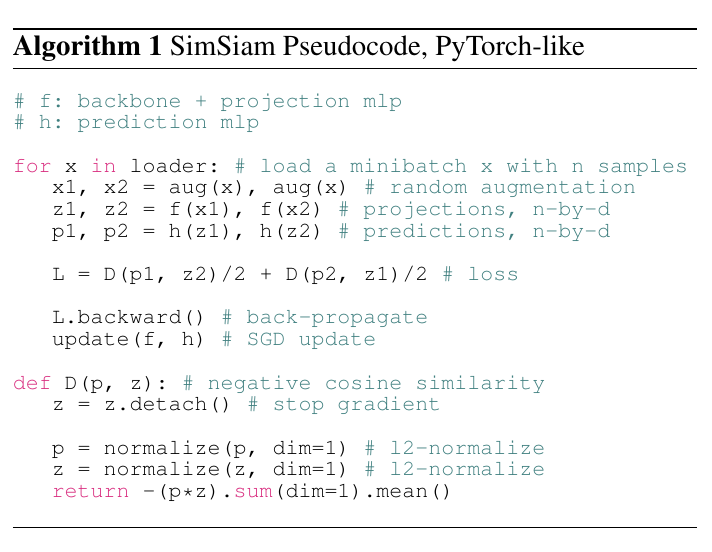

# <!-- fit --> Exploring Simple Siamese Representation Learning

CVPR 2021\
\
\
Presenter: Hao-Ting Li

Date: 2021-09-24

----

## Background: Siamese Network

----

## Applications

- signature [4]
- face verification [34]
- tracking [3]
- one-shot learning [23]

----

## Problem

Trivial solution: all outputs "**collapsing**" to a constant

----

## Strategies for Preventing Siamese Networks from Collapsing

- Contrastive learning
  - **SimCLR**: repulses different images (negative pairs) while attracting the same image's two views (positive pairs). 
  The negative pairs preclude constant outputs from the solution space.
- Clustering
  - **SwAV**: incorporates online clustering into Siamese networks.
- **BYOL**: momentum encoder

----

## SimSiam: Overview

----

## SimSiam: Loss

- $p_1 \triangleq h(f(x_1))$
- $z_2 \triangleq f(x_2)$

Negative cosine similarity:
$$
\mathcal{D}\left(p_{1}, z_{2}\right)=-\frac{p_{1}}{\left\|p_{1}\right\|_{2}} \cdot \frac{z_{2}}{\left\|z_{2}\right\|_{2}}$$

Following [15], we define a  symmetrized loss as:
$$
\mathcal{L}=\frac{1}{2} \mathcal{D}\left(p_{1}, z_{2}\right)+\frac{1}{2} \mathcal{D}\left(p_{2}, z_{1}\right)
$$

----

## SimSiam: Stop-gradient

Symmetrized loss:
$$
\mathcal{L}=\frac{1}{2} \mathcal{D}\left(p_{1}, z_{2}\right)+\frac{1}{2} \mathcal{D}\left(p_{2}, z_{1}\right)
$$

Applied **stop-gradient** (`stopgrad`):

$$
\mathcal{L}=\frac{1}{2} \mathcal{D}\left(p_{1}, \text { stopgrad }\left(z_{2}\right)\right)+\frac{1}{2} \mathcal{D}\left(p_{2}, \text { stopgrad }\left(z_{1}\right)\right)
$$

----

## SimSiam: Algorithm

----

## Baseline Settings

### Optimizer

- SGD
- batch size: $512$
- learning rate: linear scaling [15]  ($lr \times \text{BatchSize} / 256$), with base learning rate $0.05$
- cosine decay schedule
- weight decay: $0.0001$
- momentum: $0.9$

----

## Baseline Settings

Projection MLP (encoder $f$): 3 layers MLP:
- (BN+fc+ReLU)*2+(BN+fc)
- Hidden layer: $2048$-d

Prediction MLP (predictor $h$): 2 layers MLP:
- (BN+fc+ReLU)*2+(BN+fc)
- Hidden layer: 
  - $z$ and $p$: $2048$-d
  - $h$: $512$-d (bottleneck structure)

----

## Experimental Setup

- do unsupervised pre-training on the 1000-class ImageNet training set without using labels
- evaluated by training a supervised linear classifier on frozen representations in the training set, and then testing it in the validation set, which is a common protocol

----

## Empirical Study: Stop-gradient

----

## Empirical Study: Predictor

----

## Empirical Study: Predictor

Symmetric loss:

$$
\mathcal{L}=\frac{1}{2} \mathcal{D}\left(p_{1}, \text {stopgrad}\left(z_{2}\right)\right)+\frac{1}{2} \mathcal{D}\left(p_{2}, \text {stopgrad}\left(z_{1}\right)\right)
$$

Without predictor:

$$
\mathcal{L}=\frac{1}{2} \mathcal{D}\left(z_{1}, \text {stopgrad}\left(z_{2}\right)\right)+\frac{1}{2} \mathcal{D}\left(z_{2}, \text {stopgrad}\left(z_{1}\right)\right)
$$
- The gradient has the same direction as the gradient of $\mathcal{D}(z_1, z_2)$

----

## Batch Size

- SimCLR and SwAV both require a large batch (e.g. $4096$).
- standard SGD optimizer does not work well when the batch is too large (even in supervised learning [14, 38]).
- Our results show that a specialized optimizer is not necessary for preventing collapsing.

----

## Batch Normalization

- (a) This variant does not cause collapse, although the accuracy is low ($34.6\%$). The low accuracy is likely because of optimization difficulty. 

----

## Similarity Function

We modify $\mathcal{D}$ as:

$$
\mathcal{D}\left(p_{1}, z_{2}\right)=-\operatorname{softmax}\left(z_{2}\right) \cdot \log \operatorname{softmax}\left(p_{1}\right)
$$

The cross-entropy variant can converge to a reasonable result without collapsing. 

This suggests that the collapsing prevention behavior is not just about the cosine similarity.

----

## Symmetrization

Symmetrized loss:

$$
\mathcal{L}=\frac{1}{2} \mathcal{D}\left(p_{1}, \text {stopgrad}\left(z_{2}\right)\right)+\frac{1}{2} \mathcal{D}\left(p_{2}, \text {stopgrad}\left(z_{1}\right)\right)
$$

Asymmetrized loss:

$$
\mathcal{D}\left(p_{1}, \text { stopgrad }\left(z_{2}\right)\right)
$$

$2 \times$ Asymmetrized loss: sampling 2 pairs for each image

----

## Hypothesis: Formulation

Our hypothesis is that SimSiam is an implementation of an Expectation-Maximization (EM) like algorithm.

We consider a loss function of the following form:

$$
\mathcal{L}(\theta, \eta)=\mathbb{E}_{x, \mathcal{T}}\left[\left\|\mathcal{F}_{\theta}(\mathcal{T}(x))-\eta_{x}\right\|_{2}^{2}\right]
$$
- $\mathcal{F}$: a network parameterized by $\theta$
- $\mathcal{T}$: a augmentation
- $x$: an image
- $\eta_x$: the representation of the image $x$

----

## Hypothesis: Formulation

$$
\mathcal{L}(\theta, \eta)=\mathbb{E}_{x, \mathcal{T}}\left[\left\|\mathcal{F}_{\theta}(\mathcal{T}(x))-\eta_{x}\right\|_{2}^{2}\right]
$$

With this formulation, we consider solving:

$$
\min _{\theta, \eta} \mathcal{L}(\theta, \eta)
$$

This formulation is analogous to k-means clustering [28]. 
- The variable $\theta$ is analogous to the clustering centers: it is the learnable parameters of an encoder. 
- The variable $\eta_x$ is analogous to the assignment vector of the sample $x$ (a one-hot vector in k-means): it is the representation of x.

----

## Hypothesis: Formulation

$$
\min _{\theta, \eta} \mathcal{L}(\theta, \eta)
$$

The problem can be solved by an alternating algorithm, fixing one set of variables and solving for the other set.

$$
\begin{aligned}
\theta^{t} & \leftarrow \arg \min _{\theta} \mathcal{L}\left(\theta, \eta^{t-1}\right) \\
\eta^{t} & \leftarrow \arg \min _{\eta} \mathcal{L}\left(\theta^{t}, \eta\right)
\end{aligned}
$$

----

## Solving for $\theta$

$$
\mathcal{L}(\theta, \eta)=\mathbb{E}_{x, \mathcal{T}}\left[\left\|\mathcal{F}_{\theta}(\mathcal{T}(x))-\eta_{x}\right\|_{2}^{2}\right]
$$

$$
\theta^{t} \leftarrow \arg \min _{\theta} \mathcal{L}\left(\theta, \eta^{t-1}\right)
$$

One can use SGD to solve the sub-problem (7). 

**The stop-gradient operation is a natural consequence**, because the gradient does not back-propagate to $η^{t−1}$ which is a constant in this subproblem.

----

## Solving for $\eta$

$$
\mathcal{L}(\theta, \eta)=\mathbb{E}_{x, \mathcal{T}}\left[\left\|\mathcal{F}_{\theta}(\mathcal{T}(x))-\eta_{x}\right\|_{2}^{2}\right]
$$

$$
\eta^{t} \leftarrow \arg \min _{\eta} \mathcal{L}\left(\theta^{t}, \eta\right)
$$
The sub-problem (8) can be solved independently for each $η_x$. Now the problem is to minimize:
$$
\eta_{x}^{t} \leftarrow \mathbb{E}_{\mathcal{T}}\left[\mathcal{F}_{\theta^{t}}(\mathcal{T}(x))\right]
$$

----

## One-step Alteration

$$
\eta_{x}^{t} \leftarrow \mathbb{E}_{\mathcal{T}}\left[\mathcal{F}_{\theta^{t}}(\mathcal{T}(x))\right]
$$

SimSiam can be approximated by one-step alternation between (7) and (8).

$$
\eta_{x}^{t} \leftarrow \mathcal{F}_{\theta^{t}}\left(\mathcal{T}^{\prime}(x)\right)
$$

Inserting it into the sub-problem (7), we have:

$$
\theta^{t+1} \leftarrow \arg \min _{\theta} \mathbb{E}_{x, \mathcal{T}}\left[\left\|\mathcal{F}_{\theta}(\mathcal{T}(x))-\mathcal{F}_{\theta^{t}}\left(\mathcal{T}^{\prime}(x)\right)\right\|_{2}^{2}\right]
$$
Now $\theta_t$ is a constant in this sub-problem, and $\mathcal{T}^\prime$ implies another view due to its random nature. => a Siamese network with stop-gradient

----

## Predictor

By definition, the predictor $h$ is expected to minimize:

$$
\mathbb{E}_{z}\left[\left\|h\left(z_{1}\right)-z_{2}\right\|_{2}^{2}\right]
$$

Optimal solution:

$$
h\left(z_{1}\right)=\mathbb{E}_{z}\left[z_{2}\right]=\mathbb{E}_{\mathcal{T}}[f(\mathcal{T}(x))] \quad \text{for any image } x
$$

In practice, it would be **unrealistic** to actually compute the expectation $\mathbb{E}_{\mathcal{T}}$. But it may be possible for a neural network (e.g., the preditor $h$) to learn to predict the expectation, while the sampling of $\mathcal{T}$ is implicitly distributed across multiple epochs.

----

## Symmetrization

Our hypothesis does not involve symmetrization. Symmetrization is like denser sampling $\mathcal{T}$.

Symmetrization is not necessary for our method to work, yet it is able to improve accuracy, as we have observed in Sec. 4.6.

----

## Multi-step Alternation

$$
\begin{aligned}
\theta^{t} & \leftarrow \arg \min _{\theta} \mathcal{L}\left(\theta, \eta^{t-1}\right) \\
\eta^{t} & \leftarrow \arg \min _{\eta} \mathcal{L}\left(\theta^{t}, \eta\right)
\end{aligned}
$$

In this variant, we treat $t$ in (7) and (8) as the index of an outer loop; and the sub-problem in (7) is updated by an inner loop of $k$ SGD steps. 

We use the same architecture and hyperparameters as SimSiam. The comparison is as follows:

This experiment suggests that the alternating optimization is a valid formulation, and SimSiam is a special case of it.

----

## Expectation over Augmentations

We consider another way to approximate this expectation, in which we find h is not needed.

In this variant, we do not update $\eta_x$ directly by the assignment (10); instead, we maintain a moving-average:
$$
\eta_{x}^{t} \leftarrow m * \eta_{x}^{t-1}+(1-m) * \mathcal{F}_{\theta^{t}}\left(\mathcal{T}^{\prime}(x)\right)
$$

This variant has $55.0\%$ accuracy without the predictor $h$. As a comparison, it fails completely if we remove $h$ but do not maintain the moving average (as shown in Table 1a).

This proof-of-concept experiment supports that the usage of predictor $h$ is related to approximating $\mathbb{E}_{\mathcal{T}} [\cdot]$.

----

## Discussion (*)

Our hypothesis is about what the optimization problem can be. It does not explain why collapsing is prevented.

The alternating optimization provides a different trajectory, and the trajectory depends on the initialization.

----

## Comparisons

- Result Comparisons
- Methodology Comparisons

----

## Result Comparisons: ImageNet

----

## Result Comparisons: Transfer Learning

----

## Methodology Comparisons

----

## Methodology Comparisons: Relation to SimCLR

SimCLR relies on negative samples ("dissimilarity") to prevent collapsing.

SimSiam $\approx$ "SimCLR without negatives"

----

## Methodology Comparisons: Relation to SwAV

SimSiam $\approx$ "SwAV without online clustering"

----

## Methodology Comparisons: Relation to BYOL

SimSiam $\approx$ "BYOL without the momentum encoder"

The momentum encoder may be beneficial for accuracy (Table 4), but it is not necessary for preventing collapsing. 

Although not directly related, the momentum encoder also produces a smoother version of $\eta$. We believe that other optimizers for solving (8) are also plausible, which can be a future research problem.

----

## Summary

SimSiam: Siamese networks with simple design
- predictor $h$
- stop-gradient
- symmetrized loss
