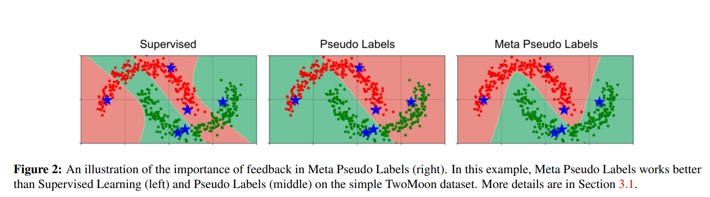
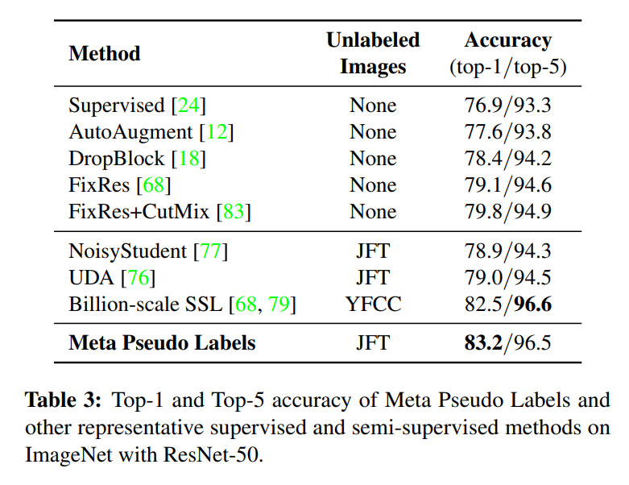
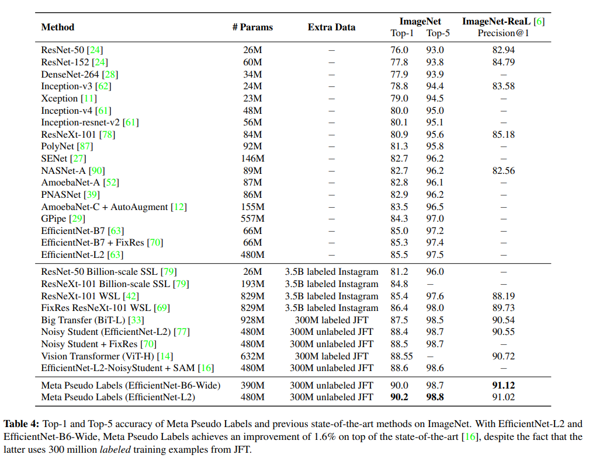

# Meta Pseudo Labels

CVPR 2021

Presented by Hao-Ting Li (李皓庭)

2021-07-20

---

## Outline

- **Introduction**
- Method: Meta Pseudo Labels
- Experiments
- Related Works
- Conclusion

----

## Introduction

- Task: image classification
- Pseudo Labels
  - Drawback of Pseudo Labels
- Meta Pseudo Labels

----

## Pseudo Labels

Pseudo Labels methods work by having a pair of networks, one as a teacher and one as a student.

The teacher generates pseudo labels on unlabeled images.

These pseudo labeled images are then combined with labeled images to train the student.

Thanks to the abundance of pseudo labeled data and the use of regularization methods such as data augmentation, the student learns to become better than the teacher [77].

----

## Drawback of Pseudo Labels

If the pseudo labels are inaccurate, the student will learn from inaccurate data.

As a result, the student may not get significantly better than the teacher.

This drawback is also known as the problem of confirmation bias in pseudo-labeling [2].

----

<!-- _footer: ARAZO, Eric, et al. Pseudo-labeling and confirmation bias in deep semi-supervised learning. In: *2020 International Joint Conference on Neural Networks (IJCNN)*. IEEE, 2020. p. 1-8. -->

## Confirmation Bias 

Network predictions are, of course, sometimes incorrect. This situation is reinforced when incorrect predictions are used as labels for unlabeled samples, as it is the case in pseudo-labeling.

Overfitting to incorrect pseudo-labels predicted by the network is known as confirmation bias. It is natural to think that reducing the confidence of the network on its predictions might alleviate this problem and improve generalization.

----

## Meta Pseudo Labels

In this paper, we design a *systematic mechanism* for the teacher to correct the bias by observing how its pseudo labels would affect the student.

We propose **Meta Pseudo Labels**, which utilizes the feedback from the student to inform the teacher to generate better pseudo labels.

---

## Outline

- Introduction
- **Method: Meta Pseudo Labels**
- Experiments
- Related Works
- Conclusion

----

## Method: Meta Pseudo Labels

- Overview
- Notations
- Pseudo Labels
- Meta Pseudo Labels
  - Practical approximation
  - Teacher's auxiliary loss

----

## Overview

----

## Notations

- $T, S$: the teacher network and the student network respectively
- $\theta_T, \theta_S$: their corresponding parameters
- $(x_l, y_l)$: a batch of images and their corresponding labels
- $x_u$: a batch of unlabeled images
- $T(x_u; \theta_T)$: the *soft* predictions of the teacher network on the batch $x_u$ of unlabeled images
    - hard: `[  0,   1,    0,    0]`
    - soft: `[0.1, 0.8, 0.05, 0.05]`
- $S(x_l; \theta_S), S(x_u; \theta_S)$: (likewise for student)
- $\text{CE}(q, p)$: the cross-entropy loss between two distributions $q$ and $p$
    - if $q$ is a label then it is understood as a one-hot distribution
    - if $q$ and $p$ have multiple instances in them 
    then $\text{CE}(q, p)$ is understood as the average of all instances in the batch.
      - e.g. $\text{CE}(y_l, S(x_l; \theta_S))$ is the canonical cross-entropy loss in supervised learning.

----

## Pseudo Labels

**Pseudo Labels** (PL) trains the student model to minimize the cross-entropy loss on unlabeled data: 

$$
\theta_{S}^{\mathrm{PL}}=\underset{\theta_{S}}{\argmin}\underbrace{\mathbb{E}_{x_{u}}\left[\operatorname{CE}\left(T\left(x_{u} ; \theta_{T}\right), S\left(x_{u} ; \theta_{S}\right)\right)\right]}_{:=\mathcal{L}_{u}\left(\theta_{T}, \theta_{S}\right)}
$$
- the pseudo target $T(x_u; θ_T)$ is produced by a well pre-trained teacher model with fixed parameter $θ$

----

## Meta Pseudo Labels (1)

Given a good teacher, the hope of **Pseudo Labels** is that the obtained $\theta_S^{\text{PL}}$ would ultimately achieve a low loss on labeled data, i.e.

$$
\mathbb{E}_{x_{l}, y_{l}}\left[\mathrm{CE}\left(y_{l}, S\left(x_{l}; \theta_{S}^{\mathrm{PL}}\right)\right)\right]:=\mathcal{L}_{l}\left(\theta_{S}^{\mathrm{PL}}\right)
$$

The ultimate student loss on labeled data $\mathcal{L}_{l}\left(\theta_{S}^{\mathrm{PL}}\left(\theta_{T}\right)\right)$ is also a "function" of $\theta_T$.

Therefore, we could further optimize $\mathcal{L}_l$ with respect to $\theta_T$:

$$\begin{aligned}
\min _{\theta_{T}} & \mathcal{L}_{l}\left(\theta_{S}^{\mathrm{PL}}\left(\theta_{T}\right)\right) \\
\text { where } & \theta_{S}^{\mathrm{PL}}\left(\theta_{T}\right)=\underset{\theta_{S}}{\operatorname{argmin}} \mathcal{L}_{u}\left(\theta_{T}, \theta_{S}\right) .
\end{aligned}$$

----

## Meta Pseudo Labels (2)

Intuitively, by optimizing the teacher’s parameter according to the performance of the student on labeled data, the pseudo labels can be adjusted accordingly to further improve student’s performance.

However, the dependency of $\theta_{S}^{\mathrm{PL}}$ on $\theta_T$ is extremely complicated, as computing the gradient $\nabla_{\theta_T} \theta_S^{\text{PL}}(\theta_T)$ requires unrolling the entire student training.

----

## Practical Approximation (1)

To make **Meta Pseudo Labels** feasible, we borrow ideas from previous work in **meta learning** [40, 15] and approximate the multi-step $\argmin_{θ_S}$ with the one-step gradient update of $\theta_S$:

$$\theta_{S}^{\mathrm{PL}}\left(\theta_{T}\right) \approx \theta_{S}-\eta_{S} \cdot \nabla_{\theta_{S}} \mathcal{L}_{u}\left(\theta_{T}, \theta_{S}\right)$$

- $\eta_{S}$: the learning rate

The practical teacher objective in **Meta Pseudo Labels**:

$$\min _{\theta_{T}} \quad \mathcal{L}_{l}\left(\theta_{S}-\eta_{S} \cdot \nabla_{\theta_{S}} \mathcal{L}_{u}\left(\theta_{T}, \theta_{S}\right)\right)$$

----

## Practical Approximation (2)

Note that, if soft pseudo labels are used, i.e. $T(x_u; θ_T)$ is the full distribution predicted by teacher, the objective above is fully differentiable with respect to $θ_T$ and we can perform standard back-propagation to get the gradient.

However, in this work, we sample the hard pseudo labels from the teacher distribution to train the student. We use hard pseudo labels because they result in smaller computational graphs which are necessary for our large-scale experiments in Section 4.

----

## Practical Approximation (3)

For smaller experiments where we can use either soft pseudo labels or hard pseudo labels, we do not find significant performance difference between them.

A caveat of using hard pseudo labels is that we need to rely on a slightly modified version of REINFORCE to obtain the approximated gradient of $\mathcal{L}_l$ in Equation 3 with respect to $θ_T$.
- We defer the detailed derivation to Appendix A.

----

## Practical Approximation (4)

More interestingly, the student’s parameter update can be reused in the one-step approximation of the teacher’s objective, which naturally gives rise to an alternating optimization procedure between the student update and the teacher update

- Student: draw a batch of unlabeled data $x_u$, then sample $T(x_u; θ_T)$ from teacher’s prediction, and optimize objective 1 with SGD:

    $$
    θ'_S = θ_S − \eta_S ∇_{θ_S} \mathcal{L}_u(θ_T , θ_S)
    $$

- Teacher: draw a batch of labeled data $(x_l, y_l)$, and “reuse” the student’s update to optimize objective 3 with SGD:

    $$
    \theta_{T}^{\prime}=\theta_{T}-\eta_{T}\nabla_{\theta_{T}} \mathcal{L}_{l}(\underbrace{\theta_{S}-\nabla_{\theta_{S}} \mathcal{L}_{u}\left(\theta_{T}, \theta_{S}\right)}_{=\theta_{S}^{\prime} \text{ reused from student's update }}).
    $$

----

## Teacher's Auxiliary Loss

**Meta Pseudo Labels** works even better if the teacher is jointly trained with other auxiliary objectives. Therefore, in our implementation, we augment the teacher’s training with a supervised learning objective and a semi-supervised learning objective.
1. For the supervised objective, we train the teacher on labeled data.
2. For the semi-supervised objective, we additionally train the teacher on unlabeled data using the **UDA** objective [76].
3. As the student in **Meta Pseudo Labels** only learns from unlabeled data with pseudo labels generated by the teacher, we can take a student model that has converged after training with Meta Pseudo Labels
4. And finetune student on labeled data to improve its accuracy.

<!-- _footer: 76: Qizhe Xie, Zihang Dai, Eduard Hovy, Minh-Thang Luong, and Quoc V. Le. Unsupervised data augmentation for consistency training. In *Advances in Neural Information Processing Systems*, 2020. 1, 3, 4, 5, 6, 8, 15, 17, 18 -->

---

## Outline

- Introduction
- Method: Meta Pseudo Labels
- **Experiments**
- Related Works
- Conclusion

----

## Experiments

- **Small Scale Experiments**
- CIFAR-10-4K, SVHN-1K, and ImageNet-10% Experiments
- ResNet-50 Experiment
- Large Scale Experiment

----

## Small Scale Experiments

- TwoMoon Dataset [7]
- Training details
- Results

----

## TwoMoon Dataset

For this experiment, we generate our own version of the **TwoMoon dataset**.
- 2000 examples form 2 clusters with 1000 examples.
  - 6 examples are labeled, 3 examples for each cluster.
  - the remaining examples are unlabeled.

----

## Training details

- Model (both the teacher and the student nets)
    - a feed-forward fully-connected neural network
        - with 2 hidden layers
        - each has 8 units
        - sigmoid non-linearity at each layer
        - initialized weights with $U(-0.1, 0.1)$
- Optimization
    - SGD
        - learning rate: 0.1

----

## Results (1)

----

## Results (2)

- Supervised Learning
  - finds a bad classifier which classifies the labeled instances correctly but fails to take advantage of the clustering assumption to separate the two "moons".
- **Pseudo Labels**
  - uses the bad classifier from Supervised Learning and hence receives incorrect pseudo labels on the unlabeled data. Pseudo Labels finds a classifier that misclassified half of the data, including a few labeled instances.
- **Meta Pseudo Labels**
    - uses the feedback from the student model’s loss on the labeled instances to adjust the teacher to generate better pseudo labels.
    - **Meta Pseudo Labels** finds a good classifier for this dataset.
    - In other words, **Meta Pseudo Labels** can address the problem of confirmation bias [2] of Pseudo Labels in this experiment.

----

## Experiments

- Small Scale Experiments
- **CIFAR-10-4K, SVHN-1K, and ImageNet-10% Experiments**
- ResNet-50 Experiment
- Large Scale Experiment

----

## CIFAR-10-4K, SVHN-1K, and ImageNet-10% Experiments

- Dataset
- Training details
  - Baselines
  - Additional baselines
- Results

---- 

## Dataset

| Dataset      	| Image Resolution 	| #-Labeled Examples 	| #-Unlabeled Examples 	| #-Test Set 	|
| :--------------:	|:------------------:	|--------------------:	|----------------------:	|------------:	|
| **CIFAR-10-4K**  	| 32x32            	| 4,000              	| 41,000               	| 10,000     	|
| **SVHN-1K**      	| 32x32            	| 1,000              	| 603,000              	| 26,032     	|
| **ImageNet-10%** 	| 224x224          	| 128,000            	| 1,280,000            	| 50,000     	|

----

## Training details (1)

- Model (both $T$ and $S$)
    - **CIFAR-10-4K**, **SVHN-1K**
        - **WideResNet-28-2** [84] (1.45 M parameters)
    - **ImageNet**
        - **ResNet-50** [24] (25.5 M parameters)
- Hyperparameters
    - use the default from previous work, except for a few modifications in **RandAugment** [13].

After training both the teacher and student with **Meta Pseudo Labels**, we finetune the student on the labeled dataset.

----

## Training details (2)

Finetuning phase:

  - SGD
  - Learning rate: $10^{-5}$
  - Batch size: $512$
  - Steps:
      - $2,000$ for **ImageNet-10%**
      - $1,000$ for **CIFAR-10** and **SVHN**

Since the amount of labeled examples is limited for all three datasets, we do not use any heldout validation set. Instead, we return the model at the final checkpoint.

----

## Baselines

To ensure a fair comparison, we only compare Meta Pseudo Labels against methods that use the same architectures and do not compare against methods that use larger architectures.

We also do not compare **Meta Pseudo Labels** with training procedures that include self-distillation or distillation from a larger teacher [8, 9].
- We enforce these restrictions on our baselines since it is known that larger architectures and distillation can improve any method, possibly including **Meta Pseudo Labels**.

----

## Additional baselines

- Label Propagation
- Self-Supervised

Since these methods do not share the same controlled environment, the comparison to them is not direct, and should be contextualized as suggested by [48].

<!-- _footer: Avital Oliver, Augustus Odena, Colin Raffel, Ekin D. Cubuk, and Ian J. Goodfellow. Realistic evaluation of deep semi-supervised learning algorithms. In Advances in *Neural Information Processing Systems*, 2018. 4, 5, 17
 -->

----

## Results

----

## Experiments

- Small Scale Experiments
- CIFAR-10-4K, SVHN-1K, and ImageNet-10% Experiments
- **ResNet-50 Experiment**
- Large Scale Experiment

----

## ResNet-50 Experiment

The purpose of this experiment is to verify if **Meta Pseudo Labels** works well on the widely used **ResNet-50** architecture [24] before we conduct more large scale experiments on **EfficientNet** (Section 4).

- Dataset
- Implementation details
- Baselines
- Results

----

## Dataset (1)

- Training set
    - **ImageNet**: 25,000 labeled for hyper-parameter tuning and model selection
    - **JFT dataset**: 12,800,000 unlabeled images
- Test set
    - **ILSVRC 2012** validation set

----

## Dataset (2)

**JFT dataset**

1. train a **ResNet-50** on the entire **ImageNet** training set
2. use the resulting **ResNet-50** to assign class probabilities to images in the **JFT dataset**
3. select 12,800 images of highest probability for each of the 1,000 classes of **ImageNet**. 
4. This selection results in 12.8 million images.

We also make sure that none of the 12.8 million images that we use overlaps with the **ILSVRC 2012** validation set of **ImageNet**. This procedure of filtering extra unlabeled data has been used by **UDA** [76] and **Noisy Student** [77].

----

## Implementation details

Training on **ImageNet** + **JFT**

- Batch size:
    - for labeled images: $4,096$
    - for unlabeled images: $32,768$
- #-steps: $500,000$ ($160$ epochs) for unlabeled dataset

Fintuning student

- SGD
- #-steps: $10,000$ steps
- Learning rate: $10^{-4}$

----

## Baselines

Supervised learning using ResNet-50
- **AutoAugment** [12]
- **DropBlock** [18]
- **CutMix** [83]

Semi-supervised learning
- **Billion-scale semi-supervised learning** [79] uses unlabeled data from the YFCC100M dataset [65]
- **UDA** [76] and **Noisy Student** [77] both use **JFT** as unlabeled data like Meta Pseudo Labels

----

## Results (1)

----

## Results (2)

This is particularly impressive since **Billion-scale SSL** pre-trains their **ResNet-50** on weakly-supervised images from Instagram.

---

## Experiments

- Small Scale Experiments
- CIFAR-10-4K, SVHN-1K, and ImageNet-10% Experiments
- ResNet-50 Experiment
- **Large Scale Experiment**

----

## Large Scale Experiment

- Dataset
- Model architecture
- Model parallelism
- Results
- A Lite Version of Meta Pseudo Labels

----

## Dataset

- Labeled data: **ImageNet**
- Unlabeled data: **JFT dataset**
    - 300M images and then filtered down to 130M images by **Noisy Student** using confidence thresholds and up-sampling [77].
    (same as **Noisy Student**)

----

## Model Architecture

- **EfficientNet-L2**
    - Image resolution: 512x512 (instead of 475x475)
        - We increase the input image resolution to be compatible with our model parallelism implementation
- **EfficientNet-B6-Wide** (**EfficientNet-B6** but has the width factor increased from 2.1 to 5.0)
    - hyper-parameter is the same as **EfficientNet-L2**

----

## Model Parallelism (1)

Due to the memory footprint of our networks, keeping two such networks in memory for the teacher and the student would vastly exceed the available memory of our accelerators.

We thus design a hybrid model-data parallelism framework to run **Meta Pseudo Labels**.

----

## Model Parallelism (2)

Specifically, our training process runs on a cluster of 2,048 TPUv3 cores.

We divide these cores into 128 identical replicas to run with standard data parallelism with synchronized gradients.

Within each replica, which runs on 2,048/128=16 cores, we implement two types of model parallelism.

----

## Model Parallelism (3)

Within each replica, which runs on 2,048/128=16 cores, we implement two types of model parallelism.

- First, each input image of resolution 512x512 is split along the width dimension into 16 patches of equal size 512x32 and is distributed to 16 cores to process.
    - Note that we choose the input resolution of 512x512 because 512 is close to the resolution 475x475 used by Noisy Student and 512 keeps the dimensions of the network’s intermediate outputs divisible by 16.
- Second, each weight tensor is also split equally into 16 parts that are assigned to the 16 cores.

----

## Model Parallelism (4)

We implement our hybrid data-model parallelism in the **XLA-Sharding framework** [37].

With this parallelism, we can fit a batch size of 2,048 labeled images and 16,384 unlabeled images into each training step. 

We train the model for 1 million steps in total, which takes about 11 days for **EfficientNet-L2** and 10 days for **EfficientNet-B6-Wide**. After finishing the **Meta Pseudo Labels** training phase, we finetune the models on our labeled dataset for 20,000 steps.

----

## Results (1)

----

## Results (2)

- both **Bit-L** and **Vision Transformer** pre-train on 300M labeled images from **JFT**, while our method only uses unlabeled images from this dataset.

----

## A Lite Version of Meta Pseudo Labels

Given the expensive training cost of **Meta Pseudo Labels**, we design a lite version of Meta Pseudo Labels, termed **Reduced Meta Pseudo Labels**. (Appendix E)

To avoid using proprietary data like **JFT**, we use the **ImageNet** training set as labeled data and the **YFCC100M dataset** [65] as unlabeled data. 

**Reduced Meta Pseudo Labels** allows us to implement the feedback mechanism of Meta Pseudo Labels while avoiding the need to keep two networks in memory.

We achieve 86.9% top-1 accuracy on the **ImageNet ILSRVC 2012** validation set with **EfficentNet-B7**.

---

## Outline

- Introduction
- Method: Meta Pseudo Labels
- Experiments
- **Related Works**
- Conclusion

----

## Related Works

- Pseudo Labels
- Self-supervised learning (SSL)
- Knowledge Distillation and Label Smoothing
- Bi-level optimization algorithms

----

## Pseudo Labels

**Pseudo Labels** applied to improve the tasks:

- image classification [79, 77]
- object detection
- semantic segmentation [89]
- machine translation [22]
- speech recognition [31, 49].

Vanilla **Pseudo Labels** methods keep a pre-trained teacher fixed during the student's learning, leading to a confirmation bias [2] when the pseudo labels are inaccurate.

----

## SSL (1)

Other typical SSL methods often train a single model by optimizing an objective function that combines a supervised loss on labeled data and an unsupervised loss on unlabeled data.

- The supervised loss is often the cross-entropy computed on the labeled data.
- The unsupervised loss is typically either a self-supervised loss or a label propagation loss.

----

## SSL (2) - Self-supervised Losses

Self-supervised losses typically encourage the model to develop a common sense about images, such as 

- in-painting [50]
- solving jigsaw puzzles [47]
- predicting the rotation angle [19]
- contrastive prediction [25, 10, 8, 9, 38]
- bootstraping the latent space [21]

----

## SSL (3) - Label Propagation Losses

Label propagation losses typically enforce that the model is invariant against certain transformations of the data such as 

- data augmentations
- adversarial attacks
- proximity in the latent space [35, 64, 44, 5, 76, 30, 71, 58, 32, 51, 20].

----

## SSL (4)

**Meta Pseudo Labels** is distinct from the aforementioned SSL methods in two notable ways.

- The student in **Meta Pseudo Labels** never learns directly from labeled data, which helps to avoid overfitting, especially when labeled data is limited.
- The signal that the teacher in **Meta Pseudo Labels** receives from the student’s performance on labeled data is a novel way of utilizing labeled data.

----

## Knowledge Distillation and Label Smoothing (1)

The teacher in **Meta Pseudo Labels** uses its softmax predictions on unlabeled data to teach the student.

These softmax predictions are generally called the soft labels, which have been widely utilized in the literature on knowledge distillation [26, 17, 86].

----

## Knowledge Distillation and Label Smoothing (2)

Outside the line of work on distillation, manually designed soft labels, have also been shown to improve models' generalization

- label smoothing [45]
- temperature sharpening or dampening [76, 77],

Both of these methods can be seen as adjusting the labels of the training examples to improve optimization and generalization.

Similar to other SSL methods, these adjustments do not receive any feedback from the student’s performance as proposed in this paper.

----

## Bi-level Optimization Algorithms (1)

We use *Meta* in our method name because our technique of deriving the teacher’s update rule from the student’s feedback is based on a **bi-level optimization problem** which appears frequently in the literature of meta-learning. 

Similar bi-level optimization problems have been proposed to optimize a model’s learning process, such as:

- learning the learning rate schedule [3]
- designing architectures [40]
- correcting wrong training labels [88]
- generating training examples [59]
- re-weighting training data [73, 74, 54, 53]

----

## Bi-level Optimization Algorithms (2)

**Meta Pseudo Labels** uses the same bi-level optimization technique in this line of work  to derive the teacher’s gradient from the student’s feedback. 

The difference between **Meta Pseudo Labels** and these methods is that **Meta Pseudo Labels** applies the bi-level optimization technique to improve the pseudo labels generated by the teacher model.

---

## Outline

- Introduction
- Method: Meta Pseudo Labels
- Experiments
- Related Works
- **Conclusion**

----

## Conclusion (1)

In this paper, we proposed the **Meta Pseudo Labels** method for semi-supervised learning. 

Key to **Meta Pseudo Labels** is the idea that the teacher learns from the student’s feedback to generate pseudo labels in a way that best helps student’s learning.

The learning process in **Meta Pseudo Labels** consists of two main updates:

- updating the student based on the pseudo labeled data produced by the teacher
- updating the teacher based on the student’s performance

----

## Conclusion (2)

Experiments on standard low-resource benchmarks such as **CIFAR-10-4K**, **SVHN-1K**, and **ImageNet-10%** show that Meta Pseudo Labels is better than many existing semi-supervised learning methods. 

Meta Pseudo Labels also scales well to large problems, attaining 90.2% top-1 accuracy on **ImageNet**, which is 1.6% better than the previous state-of-the-art [16]. 

The consistent gains confirm the benefit of the student’s feedback to the teacher.
