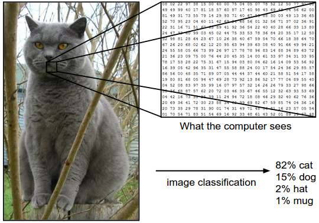

# <!-- fit --> Training Courses for Graduate Students

## Deep Learning and Computer Vision Applications

\
\
\
\
Date: 2021-09-04
Presenter: Hao-Ting Li (李皓庭)

----

## Outline

- History
- Image classification and its challenges
- Neural networks
- Cross-entropy loss
- Convolutional neural networks
- PyTorch

----

## History

- 1958: The **perceptron algorithm** was invented at the Cornell Aeronautical Laboratory by Frank Rosenblatt.
- 1967: The first general, working learning algorithm for supervised, deep, feedforward, multilayer perceptrons.
- 1971: Deep neural network with eight layers.
- 1986: The term **Deep Learning** was introduced to the machine learning community by Rina Dechter.
- 1989: Yann LeCun et al. applied the standard **backpropagation** algorithm to a deep neural network

----

## History

Simpler models that use task-specific handcrafted features such as **Gabor filters** and **support vector machines (SVMs)** were a popular choice in the 1990s and 2000s, because of artificial neural network's (ANN) computational cost and a lack of understanding of how the brain wires its biological networks.
- 1997: Many aspects of speech recognition were taken over by a deep learning method called **long short-term memory (LSTM)**, a recurrent neural network published by Hochreiter and Schmidhuber.
- 1998: **LeNet-5**, a pioneering 7-level convolutional network by LeCun et al. in 1998, that classifies digits, was applied by several banks to recognize hand-written numbers on checks digitized in 32x32 pixel images.

----

## History

- 2009: Andrew Ng determined that GPUs could increase the speed of deep-learning systems by about 100 times.
- 2012: Krizhevsky et al. won the large-scale ImageNet competition by a significant margin over shallow machine learning methods. (**AlexNet**)

Object detection:
- 2013: **R-CNN**. 2015: **Fast R-CNN**, **Faster R-CNN**
- 2016: YOLO, SSD
- 2017: **Mask R-CNN**. adds **instance segmentation**.
- 2019: **Mesh R-CNN** adds the ability to generate a 3D mesh from a 2D image.

----

## Image Classification

The task in Image Classification is to predict a single label (or a distribution over labels as shown here to indicate our confidence) for a given image. Images are 3-dimensional arrays of integers from 0 to 255, of size Width x Height x 3. The 3 represents the three color **channels** Red, Green, Blue.

----

## Challenges

----

## Neural Networks

----

## Neural Networks

Optimization problem:
$$
\min_{w, b} \mathcal{L}(y^\prime, y)
$$

- Loss function: cross-entropy loss
- Learnable parameters: $w, b$
- Update parameters: gradient descent
- Compute gradients: backpropagation

----

## Cross-entropy Loss

The cross-entropy of the distribution $q$ relative to a distribution $p$ over a given set is defined as follows:

$$
\begin{aligned}
H(p, q) &= -\mathbb{E}_{p} [\log q] \newline
&= -\sum_{x \in \mathcal{X}} p(x) \log q(x) \text{ (for discrete probability distributions)}
\end{aligned}
$$

----

## Example-1

- prediction $y^\prime = [0.1, 0.2, 0.7]$
- ground-truth label $y = [0, 0, 1]$ (hard-label)
- the cross-entropy loss is:
$$
\begin{aligned}
\mathcal{L}(y^\prime, y) 
&= -\sum_i y_i \log y^\prime_i \newline
&= -(0 \cdot \log 0.1 + 0 \cdot \log 0.2 + 1 \cdot \log 0.7) \newline
&= 0.5145
\end{aligned}
$$

----

## Example-2

- prediction $y^\prime = [0.7, 0.1, 0.2]$
- ground-truth label $y = [0, 0, 1]$
- the cross-entropy loss is:
$$
\begin{aligned}
\mathcal{L}(y^\prime, y) 
&= -\sum_i y_i \log y^\prime_i \newline
&= -(0 \cdot \log 0.7 + 0 \cdot \log 0.1 + 1 \cdot \log 0.2) \newline
&= 2.3219
\end{aligned}
$$

----

## LeNet-5

----

## LeNet-5

Contains:
- Convolutional layers
- Pooling layers
- Fully-connected layers
- Activation functions

Features:
- some degree of shift, scale, and distortion invariance
- local receptive fields
- share weights
- sub-sampling

----

## ConvNet Layers

- Convolutional layer
- Pooling layer
- Fully-connected layer
- Normalization layer
- Activation function

----

## Convolutional Layer

https://cs231n.github.io/convolutional-networks/

----

## Convolutional Layer

Given an input size $(C_1, W_1, H_1)$ and
- number of filters $K$
- kernal size $F$
- stride $S$
- amount of zero padding $P$

Output size is $(C_2, W_2, H_2)$, where
- $C_2 = K$
- $W_2 = \frac{(W_1 - F + 2P)}{S} + 1$
- $H_2 = \frac{(H_1 - F + 2P)}{S} + 1$

----

## Convolutional Layer

Given an input size $(C_1, W_1, H_1)$ and
- number of filters $K$
- kernal size $F$
- stride $S$
- amount of zero padding $P$

Number of parameters is 
- $F \cdot F \cdot C_1$ weights per filter
- $(F \cdot F \cdot C_1) \cdot K$ weights and $K$ biases in total

----

## Pooling Layer

- Max pooling
- Average pooling
- Min pooling

----

## Pooling Layer

Given an input size $(C_1, W_1, H_1)$ and
- kernal size $F$
- stride $S$

Output size is $(C_2, W_2, H_2)$, where
- $C_2 = C_1$
- $W_2 = \frac{(W_1 - F)}{S} + 1$
- $H_2 = \frac{(H_1 - F)}{S} + 1$

Number of parameters is $0$.

For Pooling layers, it is not common to pad the input using zero-padding.

----

## Fully-connected Layer

Neurons in a fully connected layer have full connections to all activations in the previous layer, as seen in regular Neural Networks. Their activations can hence be computed with a **matrix multiplication** followed by a bias offset.

----

## Normalization Layers

- Batch normalization (CNN)
- Layer normalization (RNN)
- Instance normalization (GAN)
- Group normalization (CNN, small batch-size)

Ref: [Wu, Y., & He, K. (2018). Group normalization. In Proceedings of the European conference on computer vision (ECCV) (pp. 3-19).](https://openaccess.thecvf.com/content_ECCV_2018/html/Yuxin_Wu_Group_Normalization_ECCV_2018_paper.html)

----

## Activation Functions

Rectified Linear Unit (ReLU)

Ref: https://stanford.edu/~shervine/teaching/cs-230/cheatsheet-convolutional-neural-networks

----

## Activation Functions

Softmax: takes as input a vector of scores $x \in \mathbb{R}^n$ and outputs a vector of probability $p \in \mathbb{R}^n$.

$$
p = \begin{bmatrix}
p_1 \\
\vdots \\
p_n
\end{bmatrix}, \text{where } p_i = \frac{e^{x_i}}{\sum_{j=1}^n e^{x_j}}
$$

The others: https://en.wikipedia.org/wiki/Activation_function

----

## Visualization

----

## Visualization

Ref: [Zeiler, M. D., & Fergus, R. (2014, September). Visualizing and understanding convolutional networks. In European conference on computer vision (pp. 818-833). Springer, Cham.](https://arxiv.org/abs/1311.2901)

----

## Further Reading

- https://stanford.edu/~shervine/teaching/cs-230/
- https://cs231n.github.io/convolutional-networks/
