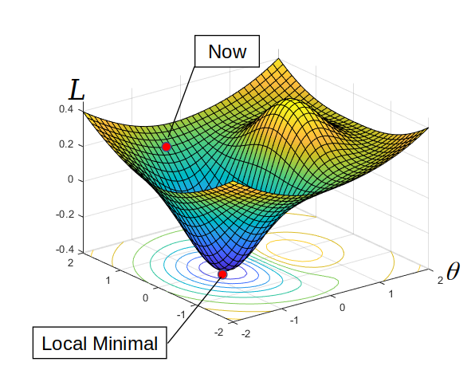
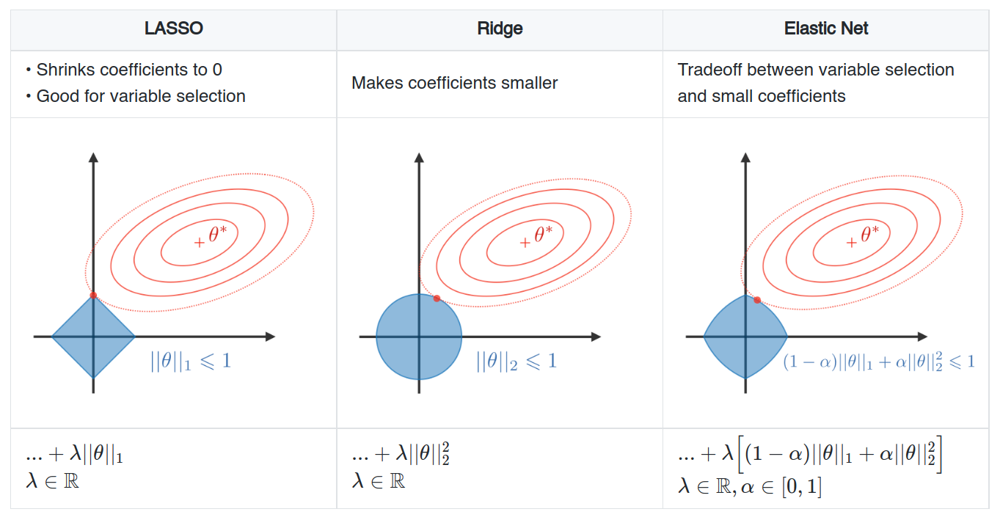

# <!-- fit --> Training Courses for Graduate Students

## Machine Learning Basics

\
\
\
\
Date: 2021-08-13
Presented by Hao-Ting Li (李皓庭)

----

## Definition

Machine Learning
- The study of computer algorithms that improve automatically through experience.
- It is seen as a part of artificial intelligence. 
- Machine learning algorithms build a model based on sample data, known as "training data", in order to make predictions or decisions without being explicitly programmed to do so.

----

## Why is Machine Learning Important?

Task: cat classification

- Hand-crafted vs data-driven

----

## Basic Machine Learning Paradigms

- Supervised Learning
  - Given a set of data points $\{x^{(1)}, \ldots, x^{(m)}\}$ associated to a set of outcomes $\{y^{(1)}, \ldots, y^{(m)}\}$, we want to build a classifier that learns how to predict $y$ from $x$.
- Unsupervised Learning
  - The goal of unsupervised learning is to find hidden patterns in unlabeled data $\{x^{(1)}, \ldots, x^{(m)}\}$.
- Reinforcement Learning
  - Reinforcement learning is learning what to do—how to map situations to actions—so as to maximize a numerical reward signal.

----

## Supervised Learning

Given a set of data points $\{x^{(1)}, \ldots, x^{(m)}\}$ associated to a set of outcomes $\{y^{(1)}, \ldots, y^{(m)}\}$, we want to build a classifier $f_{\theta}$ that learns how to predict $y$ from $x$.
1. $y \approx f(x; \theta)$
2. $\hat{y} = f(x; \theta)$ and $\hat{y} \approx y$
3. Loss function: $\mathcal{L}(y, \hat{y})$
4. Optimization: $\min_{\theta}{\mathcal{L}(y, \hat{y})}$
   - Solver: SGD, ...

----

## Types of Predictions in Supervised Learning

|              | Classification                        | Regression        |
| ------------ | ------------------------------------- | ----------------- |
| **Outcome**  | Class                                 | Continuous        |
| **Examples** | Logistic regression, SVM, Naive Bayes | Linear regression |

----

## Loss Functions

- Classification
  - Cross-entropy loss: $\mathcal{L}_{CE}(y, \hat{y}) = -\frac{1}{N} \sum_{i}^{N}{y_i \log \hat{y}_i}$
    - $y$: the true probability
    - $\hat{y}$: the prediction probability
    - $N$: the number of samples
  - Binary cross-entropy loss: 
    $\mathcal{L}_{CE}(y, \hat{y}) = -\frac{1}{N} \sum_{i}^{N}{\left[ y_i \log \hat{y}_i + (1 - y_i) \log (1 - \hat{y}_i) \right]}$
- Regression
  - Mean square error (MSE): $\mathcal{L}_{MSE} = \frac{1}{N}\sum_{i}^{N}{(y_i - \hat{y}_i)}^{2}$

----

## Visualization of a Loss Function

----

## Optimization: Gradient Descent

Steps:
1. Compute the gradient
2. Update the parameters $\theta$ in negative gradient direction

----

## Computing the Gradient

Backpropagation (a special case of reverse mode **automatic differentiation**)
- Forward
- Backward

See: https://aquastripe.github.io/slides/2021/training-courses-math/#28

----

## Mini-batch Stochastic Gradient Descent (SGD)

1. Choose an initial parameters $\theta$ and learning rate $\eta$
2. Repeat until an approximate minimum is obtainted:
   1. Randomly shuffle examples in the training set
   2. For $i = 1, \ldots, n$, do:
      1. Draw a mini-batch of examples
      2. Update the parameters:
$$
\theta_{i+1} = \theta_{i} - \eta \nabla \mathcal{L}(\theta)
$$

----

## SGD-series Algorithms

- SGD
- Momentum
- Nesterov Momentum
- Adagrad 
- RMSprop
- Adam
- AdamW
- ...

----

## Training, Validation, and Test Sets

- Training set
  A training set is a data set of examples used during the learning process and is used to fit the **parameters** (e.g., weights) of, for example, a classifier.
- Validation set
  A validation set is a data set of examples used to tune the **hyperparameters** (i.e. the architecture) of a classifier.
- Test set
  A test set is a data set that is independent of the training data set, but that follows the same probability distribution as the training data set.
  A test set is therefore a set of examples used only to **assess the performance** (i.e. generalization) of a fully specified classifier.

----

## Cross-Validation

- Holdout
  - Splitting randomly into training set and validation set, and evaluating the performance in a single run
- Leave-p-out
  - Training on $n-p$ observations and assessment on the $p$ remaining ones
  - Case $p=1$ is called leave-one-out cross-validation (LOOCV)
- *k*-fold cross validation
  - Training on $k-1$ folds and assessment on the remaining one
  - Generally $k = 5$ or $10$

----

## 5-Fold Cross-Validation

----

## Generalization Issues

Which one is better?

----

## Generalization

Generalization: the model's ability to adapt properly to new, previously unseen data, drawn from the same distribution as the one used to create the model.

Occam's razor: among competing hypotheses that explain known observations equally well, we should choose the "**simplest**" one.

----

## Overfitting and Underfitting

Capacity: the model complexity

See: [Machine Learning tips and tricks cheatsheet#Diagnostics](https://stanford.edu/~shervine/teaching/cs-229/cheatsheet-machine-learning-tips-and-tricks#diagnostics)

----

## Regularization

The regularization procedure aims at avoiding the model to overfit the data and thus deals with high variance issues. The following table sums up the different types of commonly used regularization techniques:

----

## References

- [CS 229 ― Machine Learning](https://stanford.edu/~shervine/teaching/cs-229/)
- [Goodfellow, I., Bengio, Y., & Courville, A. (2016). *Deep learning*. MIT press.](https://www.deeplearningbook.org/)
- [Leave-One-Out cross-validator](https://scikit-learn.org/stable/modules/generated/sklearn.model_selection.LeaveOneOut.html)

----

## Further Reading

- https://www.deeplearningbook.org/
- https://stanford.edu/~shervine/teaching/
- https://scikit-learn.org/stable/tutorial/index.html
