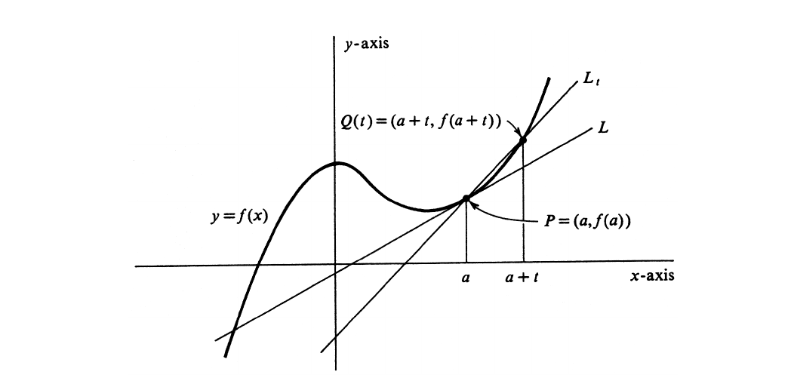
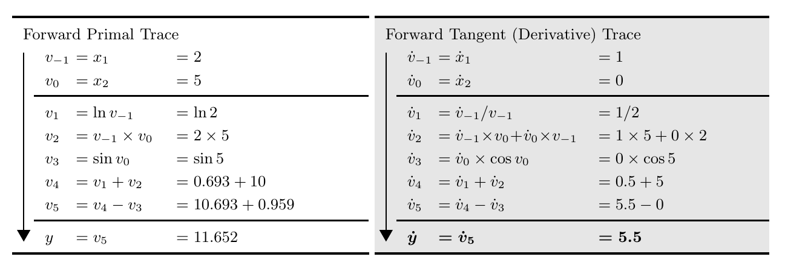
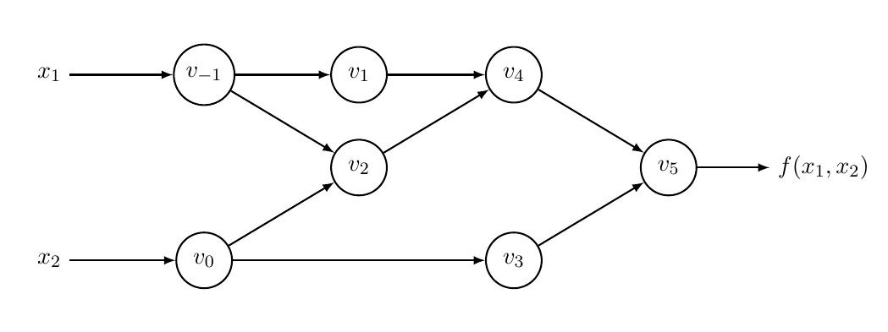
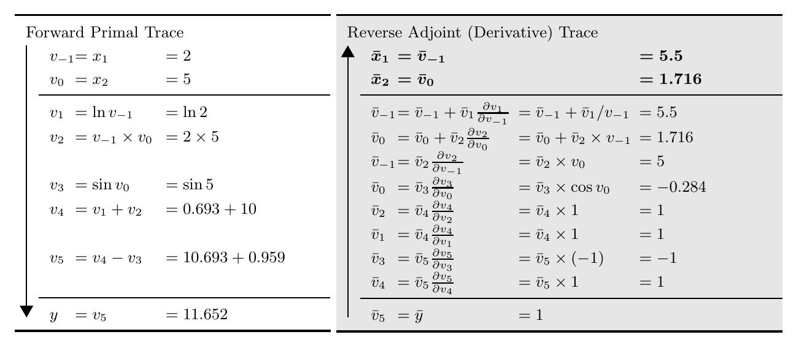

<style scoped>
  h2, p {
    text-align: center;
  }
</style>

# <!-- fit --> Training Courses for Graduate Students

## Basic Mathematics for Machine Learning

\
\
\
\
Date: 2021-08-07
Presented by Hao-Ting Li (李皓庭)

---

## Outline

- Linear Algebra
- Calculus
- <del>Probability and Information Theory</del>
- <del>Optimization</del>

---

## Linear Algebra

- Scalars, vectors, matrices and tensors
- Identity, Transpose, and Inverse
- Inner product, element-wise product, and matrix product
- Transformations
- Norms
- References

----

<style scoped>

li,ul {
  font-size: 90%;
}

</style>

## Scalars, Vectors, Matrices, and Tensors

- A scalar is just a single number.
  - $s \in \mathbb{R}^{}$
- A vector is an array of numbers.
  - $\mathbf{v} = \begin{bmatrix} \mathbf{v}_1 \\ \vdots \\ \mathbf{v}_n \end{bmatrix}, \mathbf{v} \in \mathbb{R}^{n}$
  - shape: $(n,)$
- A matrix is a 2-D array of numbers.
  - $\mathbf{M} = \begin{bmatrix} \mathbf{M}_{1,1} & \cdots & \mathbf{M}_{1, n} \\ \vdots & \ddots & \vdots \\ \mathbf{M}_{m, 1} & \cdots & \mathbf{M}_{m, n} \end{bmatrix}, \mathbf{M} \in \mathbb{R}^{m \times n}$
  - shape: $(m, n)$
- A tensor is a multi-dimension array. $\mathsf{T}$
  - Scalars are 0th-order tensors.
  - Vectors are 1th-order tensors.
  - Matrices are 2th-order tensors.

----

<style scoped>
p, li, ul {
  font-size: 90%
}
</style>

## Identity, Transpose, and Inverse

- The identity matrix of size $n$ is the $n \times n$ square matrix with $1$ on the main diagonal and $0$ elsewhere.
  $$
  \mathbf{I}_n = \begin{bmatrix} 1 & 0 & \cdots & 0 \\ 0 & 1 & \cdots & 0 \\ \vdots & \vdots & \ddots & \vdots \\ 0 & 0 & \cdots & 1 \end{bmatrix}
  $$
  - $\mathbf{I}_n \mathbf{A}_n = \mathbf{A}_n \mathbf{I}_n = \mathbf{A}_n$
- The transpose of a matrix is an operator which flips a matrix over its diagonal.
$$
(\mathbf{A}^\top)_{i,j} = \mathbf{A}_{j,i}
$$
- The inverse matrix of $\mathbf{A} \in \mathbb{R}^{n \times n}$ denoted as $\mathbf{A}^{-1}$ matrix is defined as the matrix such that
  $$
  \mathbf{A} \mathbf{A}^{-1} = \mathbf{A}^{-1} \mathbf{A} = \mathbf{I}_n
  $$

----

<style scoped>
p, li, ul {
  font-size: 90%
}
</style>
## Inner Product, Element-wise Product, and Matrix Product

- The inner product (or dot product) of two vectors $\mathbf{a} \in \mathbb{R}^{n}$ and $\mathbf{b} \in \mathbb{R}^{n}$ is defined as:
$$
\mathbf{a} \cdot \mathbf{b} = \sum_{i=1}^{n}a_i b_i = a_1 b_1 + a_2 b_2 + \cdots + a_n b_n
$$
- The element-wise product (or Hadamard product) of two matrices (or vectors) is defined as:
  $$
  \mathbf{C} = \mathbf{A} \odot \mathbf{B}
  $$
  - $C_{i,j} = A_{i,j} B_{i,j}$
- The matrix product of two matrices $\mathbf{A} \in \mathbb{R}^{m \times p}$ and $\mathbf{B} \in \mathbb{R}^{p \times n}$ is defined as:
  $$
  \mathbf{C} = \mathbf{A} \mathbf{B}
  $$
  - $\mathbf{C} \in \mathbb{R}^{m \times n}$
  - $C_{i,j} = \sum_{k} A_{i,k} B_{k,j}$
    - can be seen as the dot product

----

## Linear Transformation

Linear transformation (or linear mapping) is a mapping $T: \mathbf{V} \rightarrow \mathbf{W}$ between two vector spaces that preserves the operations of vector addition and scalar multiplication.
- Additivity: $T(\mathbf{u} + \mathbf{v}) = T(\mathbf{u}) + T(\mathbf{v})$
- Scalar multiplication: $T(c \mathbf{u}) = c T(\mathbf{u})$

Linear transformations can be represented by matrices. If $T: \mathbb{R}^{n} \rightarrow \mathbb{R}^{m}$ is a linear mapping and $\mathbf{x} \in \mathbb{R}^{n}$ is a column vector, then
$$
T(\mathbf{x}) = \mathbf{A}\mathbf{x}
$$
for some matrix $A \in \mathbb{R}^{m \times n}$, called the transformation matrix of $T$.

----

## Affine Transformation

Affine transformation is the composition of two functions: a linear transformation matrix $\mathbf{A}$ and a translation vector $\mathbf{b}$. It can be represented as:
$$
\mathbf{y} = T(\mathbf{x}) = \mathbf{A} \mathbf{x} + \mathbf{b}
$$

It can also be represented by  homogeneous coordinates as:
$$
\begin{bmatrix}
\mathbf{y} \\
1
\end{bmatrix}
=
\begin{bmatrix}
\mathbf{A} & \mathbf{b} \\
\mathbf{0} & 1
\end{bmatrix}
$$

----

<style scoped>
div.twocols {
  margin-top: 35px;
  column-count: 2;
}
div.twocols p:first-child,
div.twocols h1:first-child,
div.twocols h2:first-child,
div.twocols ul:first-child,
div.twocols ul li:first-child,
div.twocols ul li p:first-child {
  margin-top: 0 !important;
}
div.twocols p.break {
  break-before: column;
  margin-top: 0;
}
</style>

<!-- 
_footer: Illustration of the effect of applying various 2D affine transformation matrices on a unit square. (c) by Cmglee is licensed under CC-BY-SA 3.0
-->

## Affine Transformation Examples in 2-D

<div class="twocols">

- Stretching
- Squeezing
- Rotation
- Shearing
- Reflection
- Orthogonal projection

<p class="break"></p>


</div>

----

<style scoped>
p, li, ul {
  font-size: 90%;
}
</style>

## Norms

*p*-norm: Let $p \ge 1$ be a real number, the *p*-norm (also called $\ell_p$-norm) of vector $\mathbf{x} = [x_1, \ldots, x_n]$ is defined as:
$$
\| \mathbf{x} \|_p \coloneqq \left( \sum_{i=1}^{n}{ | x_i | }^p \right)^{1/p}
$$
- Taxicab norm or Manhattan norm: also called $\ell_{1}$-norm.
  $$
  \| \mathbf{x} \|_1 = \sum_{i=1}^{n}{ | x_i | }
  $$
- Euclidean norm: also called $\ell_{2}$-norm.
  $$
  \| \mathbf{x} \|_2 = \sqrt{\sum_{i=1}^{n}{ x_i^2 }}
  $$

----

## Norms

- Maximum norm (special case of: infinity norm, uniform norm, or supremum norm)
$$
\| \mathbf{x} \|_{\infty} = \max \left( |x_1|, \ldots, |x_n| \right)
$$
- $\ell_0$ "norm": defining $0^0=0$, the zero "norm" is the number of non-zero entries of a vector.
$$
\| \mathbf{x} \|_0 = |x_1|^0 + |x_2|^0 + \cdots + |x_n|^0
$$

----

## References

- [Goodfellow, I., Bengio, Y., & Courville, A. (2016). *Deep learning*. MIT press.](https://www.deeplearningbook.org/contents/linear_algebra.html)
- Boyd, S., & Vandenberghe, L. (2018). *Introduction to applied linear algebra: vectors, matrices, and least squares*. Cambridge university press.
- [Lecture slides for Introduction to Applied Linear Algebra: Vectors, Matrices, and Least Squares](https://http://vmls-book.stanford.edu/vmls-slides.pdf)
- https://en.wikipedia.org/wiki/Linear_algebra

---

## Calculus

- Derivative and differentiation
- Chain rule
- Gradient
- Automatic differentiation

----

<!-- 
_footer: Crowell and Slesnick's Calculus with Analytic Geometry. Copyright (C) 2008 Peter G. Doyle
-->

## Derivative and Differentiation



----

## Derivative and Differentiation

The slope of the tangent line to the graph of $f$ at $P$ can be express the limit of the slope of $L_t$:
$$
\lim _{t \rightarrow 0} m(P, Q(t)) = \lim _{t \rightarrow 0} \frac{f(a+t)-f(a)}{t}
$$

If the limit exists, then the $f$ is differentiable at $a$. 

The derivative of $f$ at $a$:
$$
f'(a) \coloneqq \lim _{t \rightarrow 0} \frac{f(a+t)-f(a)}{t}
$$

[Derivative rules](https://www.mathsisfun.com/calculus/derivatives-rules.html)

----

## Notations

- Lagrange's notation: $f'$
- Leibniz's notation: $\frac{df}{dx}$
- Newton's notation: $\dot{f}$
- Eular's notation: $D_x f(x)$

----

## Chain Rule

<style scoped>
p {
  font-size: 85%
}
</style>

If a variable $y$ depends on the variable $u$, whitch itself depends on the variable $x$, then $y$ depends on $x$ as well, via the intermediate variable $u$. The derivative is:
$$
\frac{dy}{dx} = \frac{dy}{du} \cdot \frac{du}{dx}
$$
e.g. Consider the function:
$$
y = e^{-x}
$$
It can be decomposed as:
$$
y = e^{u}, u = -x
$$
And the derivatives are:
$$
\frac{dy}{dx} = \frac{dy}{du} \cdot \frac{du}{dx} = e^{u} \cdot -1 = -e^{-x}
$$

----

## Gradient

For a scalar-valued differentiable function $f: \mathbb{R}^{n} \rightarrow \mathbb{R}$, its gradient \
 $\nabla f: \mathbb{R}^{n} \rightarrow \mathbb{R}^{n}$ is defined at the point $p=(x_1, \ldots, x_n)$ in *n*-dimensional space as the vector:
$$
\nabla f(p) = \langle \frac{\partial f}{\partial x_1}(p), \ldots, \frac{\partial f}{\partial x_n}(p) \rangle.
$$

e.g. Consider the function $f(x_1, x_2) = x_1^2 + 2x_2$, the gradient function is:
$$
\nabla f(p) = \langle \frac{\partial f}{\partial x_1}(p), \frac{\partial f}{\partial x_2}(p) \rangle = \langle 2x_1, 2 \rangle
$$

At a point $p=(0, 1)$, the gradient is:
$$
\nabla f(p) = 
\langle 2 \cdot 0, 2 \rangle = 
\langle 0, 2 \rangle
$$

----

## Computing Derivatives

To compute derivatives, there are some ways:
- Numerical differentiation
- Symbolic differentiation
- Automatic differentiation

----

## Numerical Differentiation

The derivative of $f: \mathbb{R}^n \rarr \mathbb{R}$:
$$
\begin{aligned}
  \frac{\partial f(\mathbf{x})}{\partial x_i} & \coloneqq \lim _{t \rightarrow 0} \frac{f(\mathbf{x} + t \mathbf{e}_i) - f(\mathbf{x})}{t}\\
  & \approx \frac{f(\mathbf{x} + t \mathbf{e}_i) - f(\mathbf{x})}{t} \quad \text{(choose a small } t \text{)}
\end{aligned}
$$

- Approximate solution
- Drawbacks
  - $O(n)$ evaluations
  - Truncation error (if $t$ is too large)
  - Rounding error (if $t$ is too small)

----

## Symbolic Differentiation

- Computer Algebra Systems (CAS)
  - [Sympy](https://www.sympy.org/en/index.html)
- Exact solution
- Drawbacks
  - Need to implement in CAS
  - Can't perform a function including a control flow statement
  - Expression swell, e.g.
    ```python
    ([(x0, x**2),
      (x1, (3*x + x0 + 4)**2),
      (x2, (9*x + 3*x0 + x1 + 16)**2),
      (x3, (27*x + 9*x0 + 3*x1 + x2 + 52)**2),
      (x4, (81*x + 27*x0 + 9*x1 + 3*x2 + x3 + 160)**2)],
    [729*x + 243*x0 + 81*x1 + 27*x2 + 9*x3 + 3*x4 + (243*x + 81*x0 + 27*x1 + 9*x2 + 3*x3 + x4 + 484)**2 + 1456])
    ```

----

## Automatic Differentiation

Two modes:
- Forward mode
- Reverse mode

----

## Three-part Notation

A function $f: \mathbb{R}^{n} \rarr \mathbb{R}^{m}$ is constructed using intermediate variables $v_i$ such that
$$
\begin{cases}
  v_{i-n} = x_i,     & i=1, \ldots, n   &\text{ are the input variables}\\
  v_i,               & i=1, \ldots, n    &\text{ are the working (immediate) variables}\\
  y_{m-i} = v_{l-i}, & i=m-1, \ldots, 0 &\text{ are the output variables}
\end{cases}
$$

----

## Forward Mode

For computing the derivative of $f$ with respect to $x_1$, we start by associating with each intermediate variable $v_i$ a derivative

$$\dot{v_i} = \frac{\partial v_i}{\partial x_1}$$

----

<!-- 
_footer: Baydin, A. G., Pearlmutter, B. A., Radul, A. A., & Siskind, J. M. (2018). Automatic Differentiation in Machine Learning: a Survey. *Journal of Machine Learning Research*, 18, 1-43.
-->

## Example

Consider the evaluation trace of the function 
$$
y = f(x_1, x_2) = \ln(x_1) + x_1 x_2 - \sin(x_2)
$$


----

<!-- 
_footer: Baydin, A. G., Pearlmutter, B. A., Radul, A. A., & Siskind, J. M. (2018). Automatic Differentiation in Machine Learning: a Survey. *Journal of Machine Learning Research*, 18, 1-43.
-->

## Computation Graph



----

## Efficiency

For a function $f: \mathbb{R}^{n} \rarr \mathbb{R}^{m}$, it cost $n$ evaluations with the forward mode.
- It's efficient when $n \ll m$.

----

## Reverse Mode

The reverse mode propagates derivatives backward from a given output by complementing each intermediate variable $v_i$ with an adjoint

$$
\bar{v_i} = \frac{\partial y_j}{\partial v_i}
$$

e.g., the variable $v_0$ can affect $y$ through affecting $v_2$ and $v_3$, so its contribution to the change in $y$ is given by

$$
\frac{\partial y}{\partial v_{0}} = \frac{\partial y}{\partial v_{2}} \frac{\partial v_{2}}{\partial v_{0}} + \frac{\partial y}{\partial v_{3}} \frac{\partial v_{3}}{\partial v_{0}}
 \quad \text { or } \quad \bar{v}_{0}=\bar{v}_{2} \frac{\partial v_{2}}{\partial v_{0}}+\bar{v}_{3} \frac{\partial v_{3}}{\partial v_{0}} .
$$

----

## Example

Consider the evaluation trace of the function 
$$
y = f(x_1, x_2) = \ln(x_1) + x_1 x_2 - \sin(x_2)
$$



----

## Efficiency

For a function $f: \mathbb{R}^{n} \rarr \mathbb{R}^{m}$, it cost $m$ evaluations with the reverse mode.
- It's efficient when $m \ll n$.
- The cost of storage is growing in proportion to the number of operations in the evaluated function.

----

## References

- [Calculus with Analytic Geometry - Dartmouth Mathematics](https://math.dartmouth.edu/~doyle/docs/calc/calc.pdf)
- [Baydin, A. G., Pearlmutter, B. A., Radul, A. A., & Siskind, J. M. (2018). Automatic Differentiation in Machine Learning: a Survey. *Journal of Machine Learning Research*, 18, 1-43.](https://arxiv.org/abs/1502.05767)
- Ayres Jr, F., & Mendelson, E. (2013). *Schaum's Outline of Calculus*. McGraw-Hill Education.
- http://theoryandpractice.org/stats-ds-book/autodiff-tutorial.html
- https://en.wikipedia.org/wiki/Automatic_differentiation
