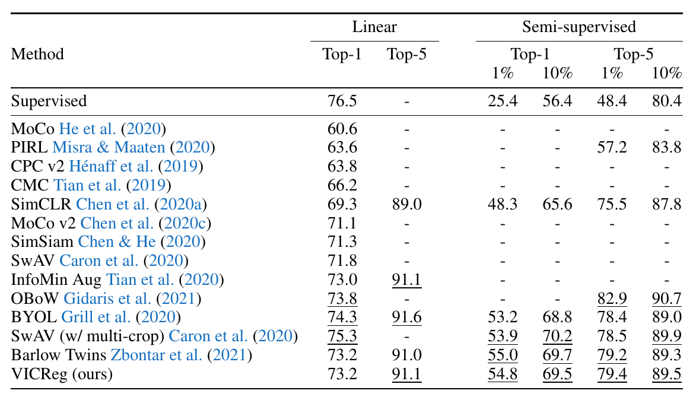
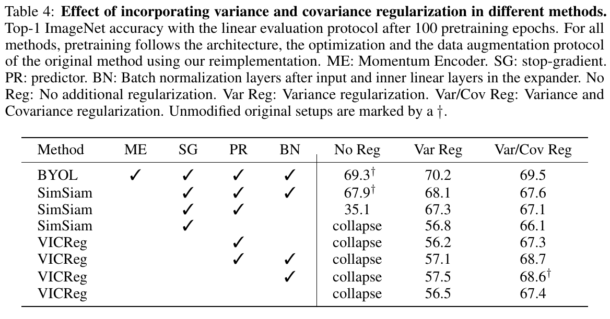

# <!-- fit --> VICReg: Variance-Invariance-Covariance Regularization for Self-Supervised Learning

(Rejected from NeurIPS 2021)\
\
\
Presenter: Hao-Ting Li

Date: 2021-10-15

----

## Story

https://www.facebook.com/yann.lecun/posts/10157921242067143

----

## Story

https://www.facebook.com/yann.lecun/posts/10157921242067143

----

## Background

- Task: self-supervised methods for image representation learning
  - joint embedding learning with **siamese networks**

----

## Background

- Task: self-supervised methods for image representation learning
  - joint embedding learning with **siamese networks**
- **Collapse problem**
  - trivial solution: the encoder outputs constant vectors

----

## Related Work

- Contrastive learning
  - rely on an expensive mining procedure of negative pairs
  - are costly and require large batch sizes or memory banks
- Clustering methods
  - require negative comparisons at the cluster level
- Asymmetric networks methods
  - not well understood and rely on architectural tricks difficult to interpret
- Redundancy reduction methods
  - remove redundant information in some input data
  - W-MSE: requires inverting the covariance matrix of the embeddings and is therefore computationally expensive and unstable

----

## Overview

----

## Formulation

Given an image $i \sim \mathcal{D}$, two transformations $t$ and $t'$ are sampled from a distribution $\mathcal{T}$ to produce two different views $x = t(i)$ and $x' = t'(i)$ of $i$.
- $y = f_{\theta}(x), y' = f_{\theta}(x')$
  - $f$: encoder
- $z = h_{\phi}(y), z' = h_{\phi}(y')$
  - $h$: projector
- $Z = [z_1, \ldots, z_n] \in \mathbb{R}^{n \times d}, Z' = [z_1', \ldots, z_n'] \in \mathbb{R}^{n \times d}$
  - $n$: batch size

----

## Regularization

- Variance regularization
- Invariance regularization
- Covariance regularization

----

## Variance Regularization

Variance regularization: enforce the variance inside the current batch to be $\gamma$ to prevent collapsing solutions where all the inputs are mapped to the same vector.

$$
v(Z)=\frac{1}{d} \sum_{j=1}^{d} \max \left(0, \gamma-\sqrt{\operatorname{Var}\left(Z_{:, j}\right)+\epsilon}\right)
$$

- $\gamma$: a target value for the standard deviation, fixed to $1$ in our experiments
- $\epsilon$: small scalar preventing numerical instabilities
- $\operatorname{Var}$: the unbiased variance estimator given by:

$$
\operatorname{Var}(x)=\frac{1}{n-1} \sum_{i=1}^{n}\left(x_{i}-\bar{x}\right)^{2}
$$

----

## Covariance Regularization

Covariance regularization: decorrelate the different dimensions of the projections and preventing these dimensions from encoding similar information

$$
C(Z)=\frac{1}{n-1} \sum_{i=1}^{n}\left(Z_{i}-\bar{Z}\right)\left(Z_{i}-\bar{Z}\right)^{T}, \quad \text { where } \bar{Z}=\frac{1}{n} \sum_{i=1}^{n} Z_{i}
$$

Inspired by Barlow Twins [49], we can then define the covariance regularization term $c$:

$$
c(Z)=\frac{1}{d} \sum_{i \neq j} C(Z)_{i, j}^{2}
$$

----

## Invariance Regularization

$$
s\left(Z, Z^{\prime}\right)=\frac{1}{n} \sum_{i}\left\|Z_{i}-Z_{i}^{\prime}\right\|_{2}^{2}
$$

----

## Total Loss

$$
\ell\left(Z, Z^{\prime}\right)=\lambda s\left(Z, Z^{\prime}\right)+\mu\left\{v(Z)+v\left(Z^{\prime}\right)\right\}+\nu\left\{c(Z)+c\left(Z^{\prime}\right)\right\}
$$
- $\lambda, \mu, \nu$: hyperparameters

$$
\mathcal{L}=\sum_{I \in \mathcal{D}} \sum_{t, t^{\prime} \sim \mathcal{T}} \ell\left(Z^{I}, Z^{\prime I}\right)
$$

----

## Experiments

- Evaluation on ImageNet
- Transfer learning on downstream tasks
- Ablation study

----

## Evaluation on ImageNet

ImageNet [13] linear evaluation protocol: train a **linear classifier** on top of the **frozen** representations of our **ResNet-50 backbone** pretrained with VICReg.

----

## Transfer to Other Downstream Tasks

Train on:

- the Places205 [50] scene classification dataset
- the VOC07 [16] multi-label image classification dataset
- the INaturalist2018 [26] fine-grained image classification dataset

Evaluate on:

- VOC07+12 [16] and COCO [31] object detection using Faster R-CNN [36] with a R50-C4 backbone
- COCO [31] instance segmentation using Mask-R-CNN [23] with a R50-FPN backbone.

----

## Transfer to Other Downstream Tasks

----

## Ablations

----

## Results

- Without VR: collapse
- VR + PR: not lead to a significant change of performance, which indicates that PR is redundant with VR.
- Without BN: poor performance
- ME, SG, PR, BN are useless

----

## Batch Size

----

## Ablations: Var/Cov Reg and Normalization

Batch normalization is still an important component that helps stabilize the training when used in the inner layers of the projector.

----

## Discussion

- Relation to Barlow Twins [49]
- Relation to W-MSE [15]
- Relation to BYOL and SimSiam [21, 11]
- Relation to SimCLR and SwAV [8, 7]

----

## Relation to Barlow Twins [49]

- VICReg uses the same **decorrelation** mechanism as Barlow Twins
  - Barlow Twins uses the cross-correlation matrix where each entry in the matrix is a cross-correlation between two vectors $Z_{:,i}$ and $Z_{:,j}'$
  - VICReg use the covariance matrix of each branch individually
- The variance term of VICReg allows us to **get rid of standardization**
- There is an undesirable phenomenon happening in Barlow Twins, the embeddings before standardization can shrink and become constant to numerical precision, which could cause **numerical instabilities** and is solved by adding a constant scalar in the denominator of standardization.

----

## Relation to W-MSE [15]

- The whitening operation of W-MSE consists in computing the **inverse covariance matrix** of the projections and use its square root as a whitening operator on the projections.
- Downsides:
  - matrix inversion is a very **costly** and unstable operation which requires a lot of care for the matrix to always be invertible
  - as mentioned in [15] the whitening operator is constructed over several consecutive iteration batches and therefore might have a high variance, which biases the estimation of the mean-squared error
    - This issue is overcome by a batch slicing strategy, where the whitening operator is computed over randomly constructed sub-batches.

----

## Relation to BYOL and SimSiam [21, 11]

- The stop-gradient operation: also has a decorrelation effect

----

## Relation to SimCLR and SwAV [8, 7]

- Contrastive and clustering based self-supervised algorithms rely on direct comparisons between elements of negative pairs.
- Drawbacks:
  - requires large batch sizes
  - negative comparisons

----

## Summary

VICReg is a simple approach to self-supervised image representation learning with three regularizations:

- Variance regularization
- Invariance regularization
- Covariance regularization

VICReg achieves results *on par with* the state of the art on many downstream tasks, pushing forward the boundaries of non-contrastive self-supervised learning.
