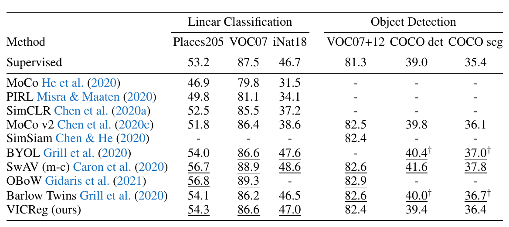
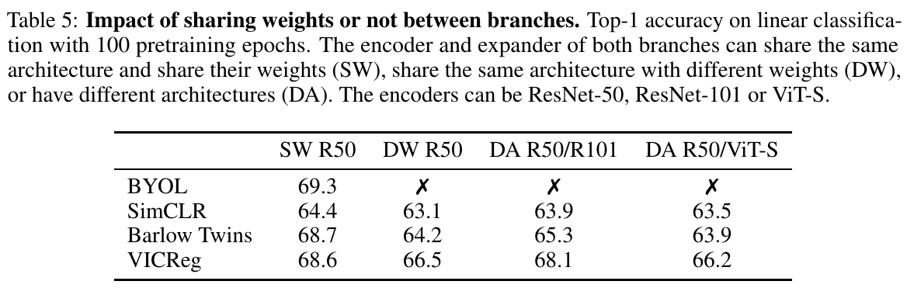

# <!-- fit --> VICReg: Variance-Invariance-Covariance Regularization for Self-Supervised Learning

(Rejected from NeurIPS 2021)

Presenter: Hao-Ting Li
Date: 2021-11-16

----

## Preamble

https://www.facebook.com/yann.lecun/posts/10157921242067143

----

## Preamble

https://www.facebook.com/yann.lecun/posts/10157921242067143

----

## Preamble

https://twitter.com/ylecun/status/1443324182213898240

----

## Task

Self-supervised methods for image representation learning
- joint embedding learning with **siamese networks**

----

## Collapse Problem

Self-supervised methods for image representation learning
- joint embedding learning with siamese networks
- **Collapse problem**
  - trivial solution: the siamese network outputs constant vectors

----

## Collapse Problem

<!-- _footer: Chen, X., & He, K. (2021). Exploring simple siamese representation learning. In *Proceedings of the IEEE/CVF Conference on Computer Vision and Pattern Recognition* (pp. 15750-15758). -->

----

## Related Work

- Contrastive learning
- Clustering methods
- Distillation methods
- Redundancy reduction methods

----

## Related Work - Contrastive Learning

In contrastive SSL methods applied to joint embedding architectures, the output embeddings for a sample and its distorted version are brought close to each other, while other samples and their distortions are pushed away.
- **InfoNCE loss**: The repulsive force is larger for contrastive samples that are closer to the reference.
  - require large amounts of contrastive pairs in order to work well.
- **MoCo**: Contrastive pairs are sampled from a memory bank.
- **SimCLR**: Contrastive pairs are given by the current batch of data.
  - requires large batch sizes or memory banks

----

## Related Work - Clustering Methods

Instead of viewing each sample as its own class, clustering-based methods group them into clusters based on some similarity measure.
- **DeepCluster**: uses k-means assignments of representations from previous iterations as pseudo-labels for the new representations
  - requires an expensive clustering phase done asynchronously and makes the method hard to scale up
- **SwAV**: mitigates this issue by learning the clusters online
- **Sinkhorn-Knopp transform**: by maintaining a balanced partition of the assignments 
  - requires a lot of negative comparisons to work well

----

## Related Work - Distillation Methods

- **BYOL**, **SimSiam**: train a student network to predict the representations of a teacher network, for which the weights...
  1. **BYOL**: are a running average of the student network's weights, or
  2. **SimSiam**: are shared with the student network, but no gradient is back-propagated through the teacher
     - These methods are effective, but there is no clear understanding of why and how they avoid collapse.
- **OBoW**: The images can be represented as bags of word over a dictionary of visual features, which effectively prevents collapse. The dictionary is obtained by off-line or on-line clustering.

----

## Related Work - Information Maximization Methods

A principle to prevent collapse is to maximize the information content of the embeddings.
- **W-MSE**: An extra module transforms the embeddings into the eigenspace of their covariance matrix (whitening or Karhunen-Loève transform), and forces the vectors thereby obtained to be uniformly distributed on the unit sphere.
- **Barlow Twins**: A loss term attempts to make the normalized cross-correlation matrix of the embedding vectors from the two branches to be close to the identity.
- Both methods attempt to produce embedding variables that are decorrelated from each other, thus preventing an informational collapse in which the variables carry redundant information.

----

## Overview of VICReg

----

## VICReg: Detailed Description

Our architecture may be completely symmetric or completely asymmetric with no shared structure or parameters between the two branches.

The role of the expander is twofold:
- eliminate the information by which the two representations differ
- expand the dimension in a non-linear fashion so that decorrelating the embedding variables will reduce the dependencies (not just the correlations) between the variables of the representation vector.

After pretraining, the expander is discarded and the representations of the encoder are used for downstream tasks.

----

## Intuition

The basic idea is to use a loss function with three terms:
- **Invariance**: the mean square distance between the embedding vectors.
- **Variance**: forces the embedding vectors of samples within a batch to be different.
- **Covariance**: decorrelates the variables of each embedding and prevents an *informational collapse* in which the variables would vary together or be highly correlated.

----

## Formulation

Given an image $i \sim \mathcal{D}$, two transformations $t$ and $t'$ are sampled from a distribution $\mathcal{T}$ to produce two different views $x = t(i)$ and $x' = t'(i)$ of $i$. 
- $y = f_{\theta}(x), y' = f_{\theta}(x')$
  - $f$: encoders
  - $y$ and $y'$: *representations*
- $z = h_{\phi}(y), z' = h_{\phi}(y')$
  - $h$: expanders
  - $z$: *embeddings*
- $Z = [z_1, \ldots, z_n] \in \mathbb{R}^{n \times d}, Z' = [z_1', \ldots, z_n'] \in \mathbb{R}^{n \times d}$
  - $n$: batch size
  - $z^j$: the vector composed of each value at dimension $j$ in all vectors in $Z$.

----

## Variance Regularization

$$
v(Z)=\frac{1}{d} \sum_{j=1}^{d} \max \left(0, \gamma-S\left(z^{j}, \epsilon\right)\right)
$$
- $\gamma$: a target value for the standard deviation, fixed to $1$ in our experiments
- $\epsilon$: small scalar preventing numerical instabilities
- $S$: regularized standard deviation:
$$
S(x, \epsilon)=\sqrt{\operatorname{Var}(x)+\epsilon}
$$
$$
\operatorname{Var}(x)=\frac{1}{n-1} \sum_{i=1}^{n}\left(x_{i}-\bar{x}\right)^{2}
$$

----

## Variance Regularization

$$
v(Z)=\frac{1}{d} \sum_{j=1}^{d} \max \left(0, \gamma-S\left(z^{j}, \epsilon\right)\right)
$$

Using the standard deviation and not directly the variance is crucial.

Indeed, if we take $S(x) = \text{Var}(x)$ in the hinge function, the gradient of $S$ with respect to $x$ becomes close to $0$ when $x$ is close to $\bar{x}$. In this case, the gradient of $v$ also becomes close to $0$ and the embeddings collapse.

----

## Covariance Regularization

We define the covariance matrix of $Z$ as:
$$
C(Z)=\frac{1}{n-1} \sum_{i=1}^{n}\left(z_{i}-\bar{z}\right)\left(z_{i}-\bar{z}\right)^{T}, \quad \text { where } \bar{z}=\frac{1}{n} \sum_{i=1}^{n} z_{i}
$$

Inspired by Barlow Twins [49], we can then define the covariance regularization term $c$:
$$
c(Z)=\frac{1}{d} \sum_{i \neq j} [C(Z)]^{2}_{i, j}
$$

----

## Invariance Regularization

We finally define the invariance criterion $s$ between $Z$ and $Z'$ as the mean-squared euclidean distance between each pair of vectors, without any normalization:
$$
s\left(Z, Z^{\prime}\right)=\frac{1}{n} \sum_{i}\left\|Z_{i}-Z_{i}^{\prime}\right\|_{2}^{2}
$$

----

## Total Loss

$$
\ell\left(Z, Z^{\prime}\right)=\lambda s\left(Z, Z^{\prime}\right)+\mu\left\{v(Z)+v\left(Z^{\prime}\right)\right\}+\nu\left\{c(Z)+c\left(Z^{\prime}\right)\right\}
$$
- $\lambda, \mu, \nu$: hyperparameters
  - set $\nu = 1$
  - perform a grid search on the values of $\lambda$ and $\mu$ with the base condition
$\lambda = \mu \gt 1$

The overall objective function taken on all images over an unlabelled dataset $\mathcal{D}$ is given by:
$$
\mathcal{L}=\sum_{I \in \mathcal{D}} \sum_{t, t^{\prime} \sim \mathcal{T}} \ell\left(Z^{I}, Z^{\prime I}\right)
$$

----

## Implemetation Details

- $\lambda = 25, \mu = 25, \nu = 1$
- $\epsilon = 0.0001$
- The encoder network $f_{\theta}$ is ResNet-50 backbone with 2048 output units.
- The expander $h_{\phi}$ is composed of two fully-connected layers with batch normalization (BN) and ReLU, and a third linear layer.
- The sizes of all 3 layers were set to 8192.
  - As with Barlow Twins, performance improves when the size of the expander layers is larger than the dimension of the representation.
- LARS optimizer: run for 1000 epochs with a weight decay of $10^{−6}$ and a learning rate $lr = {batch\_size}/256 × base\_lr$, where $batch\_size$ is set to 2048 by default and $base\_lr$ is a base learning rate set to 0.2. 
  - cosine decay schedule: starting from 0 with 10 warmup epochs and with final value of 0.002.

----

## Experiments

In this section, we evaluate the representations obtained after self-supervised pretraining of a ResNet50  backbone with VICReg during 1000 epochs, on the training set of ImageNet, using the training protocol described in section 4. We also pretrain and evaluate on the ESC-50 audio classification dataset.
- Evaluation on ImageNet
- Transfer learning on downstream tasks
- Pretraining and evaluation on ESC-50 audio classification
- Analysis

----

## Evaluation on ImageNet

Evaluation of the representations obtained with a ResNet-50 backbone pretrained with VICReg on:
- linear classification on top of the frozen representations from ImageNet
  - linear evaluation protocol: train a **linear classifier** on top of the **frozen** representations of our **ResNet-50 backbone** pretrained with VICReg.
- semi-supervised classification on top of the fine-tuned representations from $1\%$ and $10\%$ of ImageNet samples

----

## Table 1: Evaluation on ImageNet

----

## Transfer Learning on Downstream Tasks

Train a linear classifier on top of the frozen representations learnt by our pretrained ResNet-50 backbone on:
- the Places205 scene classification dataset
- the VOC07 multi-label image classification dataset
- the INaturalist2018 fine-grained image classification dataset

Evaluate on:
- VOC07+12 and COCO object detection using Faster R-CNN with a R50-C4 backbone
- COCO instance segmentation using Mask-R-CNN with a R50-FPN backbone.

----

## Table 2: Transfer to Other Downstream Tasks

- VICReg learns representations that are more invariant to transformation, but eliminates more low-level information about the images than the other methods.

----

## Pretraining and Evaluation on ESC-50 Audio Classification

ESC-50 audio dataset: is an environmental sound classification dataset with 50 classes.

We jointly embedded a raw audio time-series representation on one branch, with its corresponding time-frequency representation on the other branch. The raw audio is processed by a 1-dimensional ResNet-18. We compute the mel spectrogram of the raw audio and process it with a standard ResNet-18.

Table 3 reports the performance of a linear classifier trained one the frozen representations obtained with VICReg and Barlow Twins to a simple supervised baseline where we train a ResNet-18 on the time-frequency representation in a supervised way.

----

## Table 3: Evaluation on ESC-50 Audio Classification

----

## Pretraining and Evaluation on ESC-50 Audio Classification

Current best approaches that report around $95\%$ accuracy on this task uses tricks such as heavy data augmentation or pretraining on larger audio and video datasets.

With this experiment, our purpose is not to push the state of the art on ESC-50, but merely to demonstrate the applicability of VICReg to settings with multiple architectures and input modalities.

----

## Analysis

In this section we study how the different components of our method contribute to its performance, as well as how they interact with components from other self-supervised methods.

All reported results are obtained on the linear evaluation protocol, using a ResNet-50 backbone if not mentioned otherwise, and 100 epochs of pretraining, which gives results consistent with those obtained with 1000 epochs of pretraining.

----

## Table 4: Effect of Incorporating Variance and Covariance Regularization in Different Methods

----

## Table 4: Effect of Incorporating Variance and Covariance Regularization in Different Methods

- Without VR: collapse
- VR + PR: not lead to a significant change of performance, which indicates that PR is redundant with VR.
- Without BN: poor performance
- ME, SG, PR, BN are useless

----

## Table 5: Impact of Sharing Weights or Not Between Branches

----

## Table 5: Impact of Sharing Weights or Not Between Branches

VICReg has several unique properties:
- weights do not need to be shared between the branches, each branch’s weights are updated independently of the other branch’s weights;
- the branches are regularized independently, the variance and covariance terms are computed on each branch individually;
- no predictor is necessary unlike with methods where one branch predicts
outputs of the other branch.

The ability of VICReg to function with different parameters, architectures, and input modalities for the branches widens the applicability to joint-embedding SSL to many applications, including multi-modal signals.

----

## Conceptual Comparison Between Different Self-Supervised Methods

----

## Conceptual Comparison Between Different Self-Supervised Methods

----

## Relation to Other Self-Supervised Methods

- Relation to Barlow Twins
- Relation to W-MSE
- Relation to BYOL and SimSiam
- Relation to SimCLR and SwAV

----

## Relation to Barlow Twins

VICReg uses the same **decorrelation** mechanism as Barlow Twins.
- Barlow Twins uses the cross-correlation matrix where each entry in the matrix is a cross-correlation between two vectors $z^i$ and $z'^j$.
- VICReg use the covariance matrix of each branch individually.

The variance term of VICReg allows us to **get rid of standardization**

There is an undesirable phenomenon happening in Barlow Twins, the embeddings before standardization can shrink and become constant to numerical precision, which could cause **numerical instabilities** and is solved by adding a constant scalar in the denominator of standardization.

----

## Relation to W-MSE

Whitening operation of W-MSE consists in computing the **inverse covariance matrix** of the projections and use its square root as a whitening operator on the projections.
- Matrix inversion is a very **costly** and unstable operation which requires a lot of care for the matrix to always be invertible.
- As mentioned in Ermolov et al. (2021) the whitening operator is constructed over several consecutive iteration batches and therefore might have a high variance, which biases the estimation of the mean-squared error.
  - This issue is overcome by a batch slicing strategy, where the whitening operator is computed over randomly constructed sub-batches.

----

## Relation to BYOL and SimSiam

- The stop-gradient operation also has a decorrelation effect.

----

## Relation to SimCLR, SwAV, and OBoW

Contrastive and clustering based self-supervised algorithms rely on direct comparisons between elements of negative pairs.
- requires large batch sizes
- negative comparisons

----

## Discussion

VICReg is a simple approach to self-supervised image representation learning with three regularizations:

- **Variance**: avoiding collapse of the representations
- **Invariance**: learning invariance to different views
- **Covariance**: maximizing the information content of the representation

VICReg achieves results *on par with* the state of the art on many downstream tasks, pushing forward the boundaries of non-contrastive self-supervised learning.

Limitations: The time and memory costs of VICReg are dominated by the computation of the covariance matrix for each processed batch, which is quadratic in the dimension of the embeddings.
