

# <!-- fit --> Grid Anchor based Image Cropping: A New Benchmark and An Efficient Model

 
 
 
 

TPAMI 2020; CVPR 2019

Presenter: Hao-Ting Li (李皓庭)

----

## Image Cropping

Image cropping is the removal of unwanted outer areas from a photographic or illustrated image

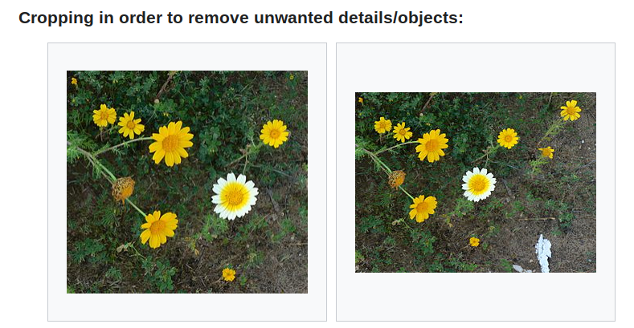

[Contributed to Wikipedia](https://en.wikipedia.org/wiki/Cropping_(image)) by MathKnight and Zachi Evenor / CC BY-SA 3.0

----

## Issues

- IoU and BDE metrics are **unreliable** to evaluate the performance of image cropping models.
- The two baselines (no cropping and central cropping) have achieved better performance than recent works.
- Good crops can vary significantly under different requirements of aspect ratio and/or resolution.
  - Existing cropping databases are difficult to learn reliable and robust cropping models.

----

## IoU is Unreliable (1)

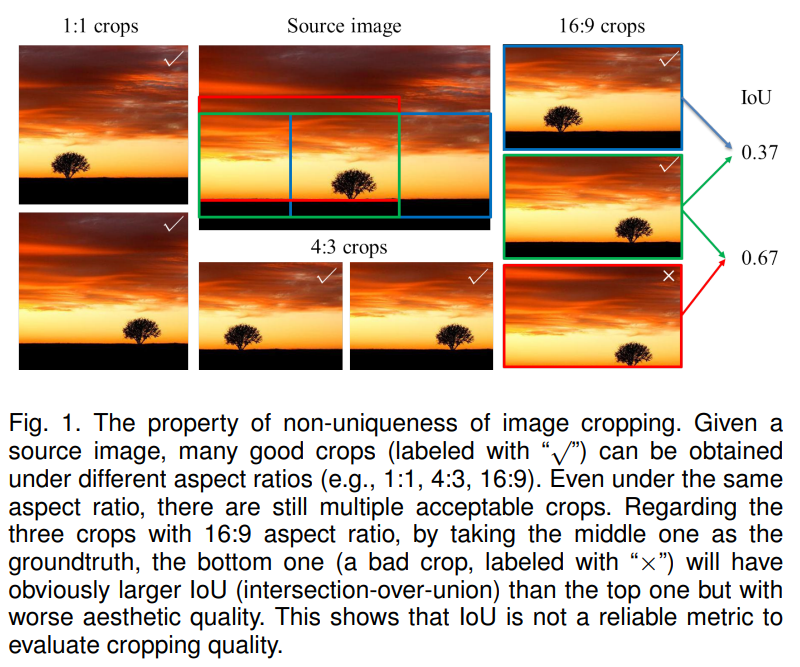

----

## IoU is Unreliable (2)

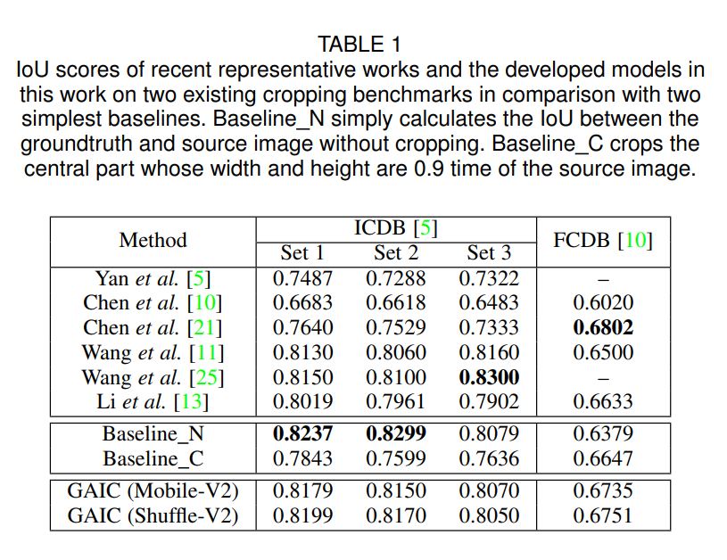

----

## Contributions

This work:
- proposes a grid anchor based formulation for image cropping
    - reduces the number of candidate crops
- constructs new image cropping dataset
    - 106,860 annotated candidate crops
    - each crop is annotated by 7 experienced human
    - proposes new types of metrics
- designs an effective and efficient image cropping model
    - extracts multi-scale features
    - performs 200 FPS on a GTX 1080 Ti and 12 FPS on CPU

----

## Related Work: Image Cropping Datasets and Metrics

IoU and BDE metrics:
- Yan et al. [5]
  - 950 images, cropped by three photographers
- Feng et al. [6]
  - 500 images, cropped by 10 experts

Randomly generated or generated from previous cropping methods:
- Chen et al. [10] 
  - 1,743 images and 31,430 annotated pairs of subviews
- Wei et al. [24] (CPC dataset)
  - more than 1M view pairs

----

## Related Work: Image Cropping Methods

- Attention-driven
    - [2, 15, 16, 18] resort to a saliency detection algorithm (e.g. [31])
    - However, a crop with high attention value may not necessarily be aesthetically pleasing.
- Aesthetic-driven
    - [5, 6, 32-37] design a set of hand-crafted features to characterize the image aesthetic properties or composition rules.
    - However, the hand-crafted features are not strong enough to predict the complicated image aesthetics [20].
- Data-driven
    - [10, 11, 13, 20, 22, 23, 25] train an aesthetic classifier on image aesthetic datasets. (AVA [38], CUHKPQ [39])
    - However, a general aesthetic classifier trained on full images may not be able to reliably evaluate the crops within one image [21], [24].

----

## Related Work: Image Cropping Efficiency

Two types of efforts to improve the efficiency:
- reduce the number of candidate crops
- decrease the computational complexity of cropping models
    - Wei et al. [25] detected the salient region of an image and generated 1000 crops around the salient region.
    - Wei et al. [24] employed the pre-defined 895 anchor boxes in the SSD.
    - recent cropping model are based on AlexNet [10, 21], VGG16 [11, 20, 24]
        - too heavy to be deployed on limited computational devices (e.g. mobile phones and drones)

----

## Method: Grid Anchor Based Image Cropping

Consider two practical requirements of a good image cropping system:
- a reliable cropping system should be able to return acceptable results for different settings (e.g., aspect ratio and resolution) rather than one single output.
- the cropping system should be lightweight and efficient to run on resource limited devices.

----

## Method: Formulation

Given an image with spatial resolution $H \times W$, a candidate crop can be defined using its top-left corner $(x_1, y_1)$ and bottom-right corner $(x_2, y_2)$, 
where $1 ≤ x_1 < x_2 ≤ H$ and $1 ≤ y_1 < y_2 ≤ W$.

The number of crops is $H(H-1)W(W-1)/4$. The search space is huge.

Properties of image cropping:
- local redundancy
- content preservation

----

## Local Redundancy

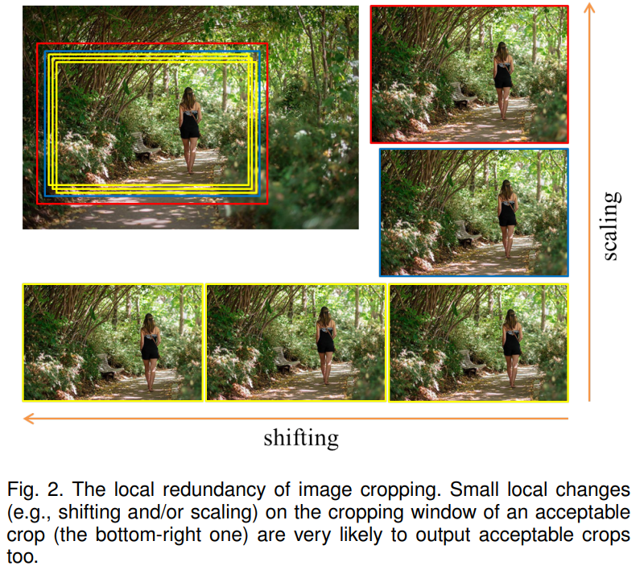

----

## Content Preservation

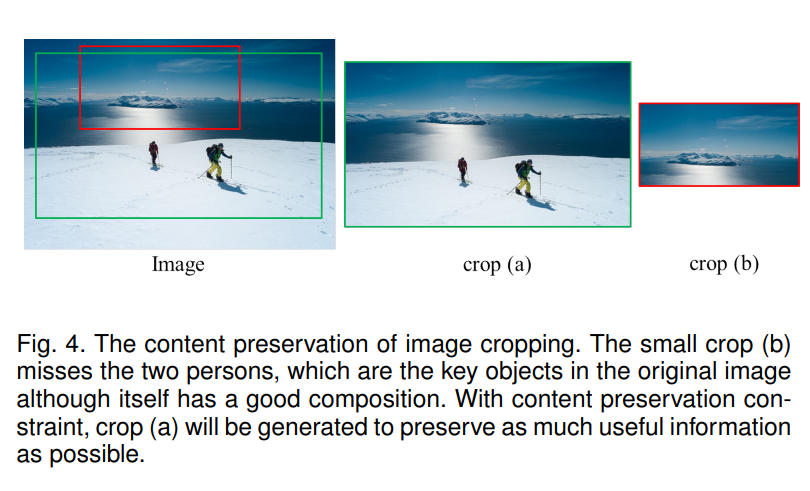

----

## Grid Anchor Based Formulation

- Constrain the anchor points with $m \times n$ bins
- The smallest possible crop covers $(M-2m+1)(N-2n+1)/MN$ grids of the source image; it may too small to preserve enough image content.
- Constrain the area of potential crops:
$$
S_{crop} \ge \lambda S_{image}, \\
\text{where }\lambda \in \Bigg[\frac{(M-2m+1)(N-2n+1)}{MN}, 1 \Bigg)
$$

----

## Illustration of Grid Anchor Based Formulation

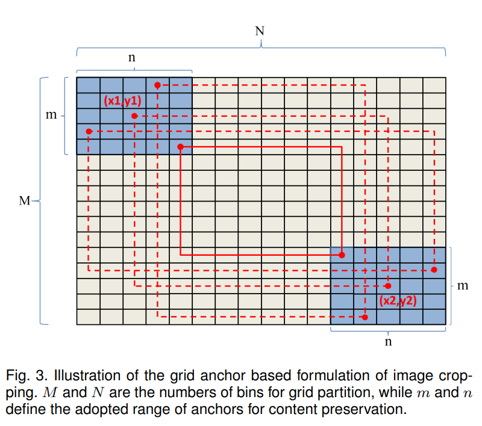

----

## Aspect Ratio

- The popular aspect ratios are 16:9, 4:3, and 1:1.
- Candidate crops which have uncommon aspect ratios may be inconvenient to display and can make people feel uncomfortable.
- constrain the aspect ratio:
    $$
    \alpha_{1} \leq \frac{W_{\text {crop }}}{H_{\text {crop }}} \leq \alpha_{2}
    $$
  - $\alpha_1=0.5, \alpha_2=2$

----

## Database Construction: Annotation

- developed an annotation toolbox
- the toolbox generates 4 crops
- each crop is generated with common aspect ratios (16:9, 3:2, 4:3, 1:1, 3:4, 2:3, and 9:16)
- annotator rate with five scores (bad, poor, fair, good, and excellent)

----

## Database Construction: Data

- crawled ~50000 images from the Flickr website
- manually selected 3000 images whose composition can be obviously improved, and 500 images with proper composition to ensure the generality of the GAICD
- property
    - various aspect ratios
    - cover a variety of scenes and lighting conditions

----

## Database Construction: Grid Sizes ($M,N,m,n$)

To evaluate the influence of $M, N, m, n$
- randomly selected 100 images with different contents and aspect ratios
- annotated by 15 experts
- calculated the mean opinion score (MOS) of each candidate crop

----

## Database Construction: Grid Sizes ($M,N,m,n$)

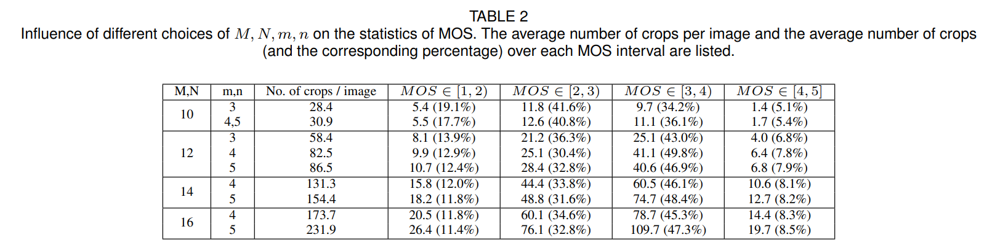

- Major considerations
    - the statistics of MOS
    - the annotation cost

----

## Evaludation Metrics

- Ranking correlation metrics
- Best return metrics
- Rank weighted best return metrics

----

## Ranking Correlation Metrics

- PCC: Pearson correlation coefficient [41]
    $$
    P C C\left(\mathbf{g}_{i}, \mathbf{p}_{i}\right)=\frac{\operatorname{cov}\left(\mathbf{g}_{i}, \mathbf{p}_{i}\right)}{\sigma_{\mathbf{g}_{i}} \sigma_{\mathbf{p}_{i}}}
    $$
    where $\mathbf{g}_i$ is the vector of MOS of all crops for image $i$
- SRCC: Spearman's rank-order correlation coefficient
    $$
    S R C C\left(\mathbf{g}_{i}, \mathbf{p}_{i}\right)=\frac{\operatorname{cov}\left(\mathbf{r}_{\mathbf{g}_{i}}, \mathbf{r}_{\mathbf{p}_{i}}\right)}{\sigma_{\mathbf{r}_{\mathbf{g}_{i}}} \sigma_{\mathbf{r}_{\mathbf{p}_{i}}}}
    $$
    where $\mathbf{r}$ is the ranking order of scores in x.

----

## Best Return Metrics

The cropping model can return the best crops.

$$
A c c_{K / N}=\frac{1}{T K} \sum_{i=1}^{T} \sum_{k=1}^{K} \operatorname{True}\left(c_{i k} \in S_{i}(N)\right)
$$
- $T$: the number of images
- $K$: the number of returned crops
- $S_i(N)$: the MOS rank top-$N$ set of image $i$
- $\{c_{ik}\}_{k=1}^{K}$: top-$K$ crops returned from the cropping model

----

## Rank Weighted Best Return Metrics

$$
A c c_{K / N}^w=\frac{1}{T K} \sum_{i=1}^{T} \sum_{j=1}^{K} \operatorname{True}\left(c_{i j} \in S_{i}(N)\right) \red{w_{ij}}
$$

- $w_{i j}=e^{\frac{-\beta\left(r_{i j}-j\right)}{N}}, \beta > 0$:
    - $r_{ij}$: the ranks among all the returned $K$ crops of image $i$ (sorted by MOS in descending order)
    - $\beta = 1$ in the experiment.

----

## Cropping Model

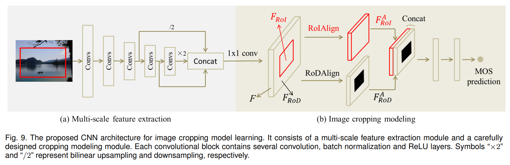

----

## Multi-scale Feature Extraction Module

- Efficient base model
  - A practical cropping model needs to be lightweight and efficient enough to be deployed on resource limited devices.
  - MobileNetV2, ShuffleNetV2
- Multi-scale features
  - It has been widely acknowledged that the shallower CNN layers tend to capture the local textures while the deeper layers model the entire scene [48].

----

## Cropping Module

- RoI and RoD
- Spatial Arrangement
- Reducing the channel dimension
- Loss function

----

## RoI and RoD

- One special property of image cropping is that we need to consider not only the region of interest (RoI) but also the region to be discarded (hereafter we call it region of discard (RoD)).
- The discarded information is unavailable to the cropping model if only the RoI is considered, while modeling the RoD can effectively solve this problem.

----

## Spatial Arrangement

The spatial arrangement of context and objects in an image plays a key role in image composition.
- The downsampling and pooling operations after the feature extraction stage can cause significant loss of spatial information.
- We employ a fully-connected layer with large kernel size to explicitly model the spatial arrangement of an image.

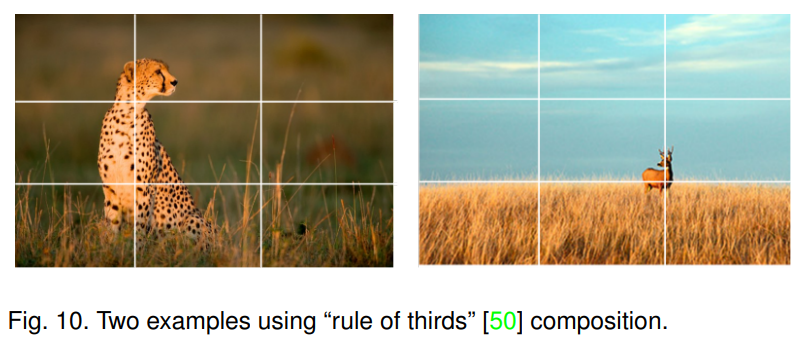

----

## Reducing the Channel Dimension

Image cropping does not need to accurately recognize the category of different objects or scenes, which allows us to significantly reduce the channel dimension of the feature map.

In practice, we found that the feature channel dimension can be reduced from several hundred to only 8 by using 1×1 convolution without sacrificing much the performance.

----

## Loss Function

Huber Loss
- robust to outliers
- $e_{ij} = g_{ij} - p_{ij}$
    - $g_{ij}$: the groundtruth MOS
    - $p_{ij}$: the prediction score
- $\mathcal{L}_{i j}=\left\{\begin{array}{l}\frac{1}{2} e_{i j}^{2}, \text { if }\left|e_{i j}\right| \leq \delta \\\delta\left|e_{i j}\right|-\frac{1}{2} \delta^{2}, \text { otherwise }\end{array}\right.$
    - $\delta$: is fixed to 1 in experiments

----

## Experiments

- Dataset: GAICD
  - 2,636 for training
  - 200 for validation
  - 500 for testing
- Optimizer: Adam
  - 40 epochs
  - learning rate: $1e^{-4}$
- Normalization
  - ImageNet
  - MOS: z-score

----

## Image Cropping Performance by Different Feature Extraction Modules on the Validation Set

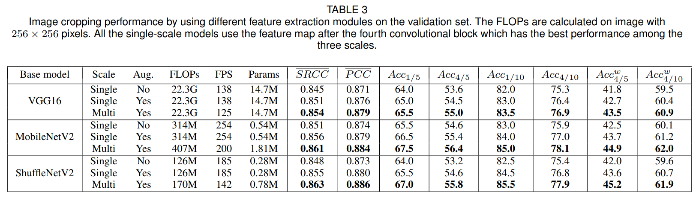

----

## Different Number and Size of Kernels in the Cropping Modeling Module

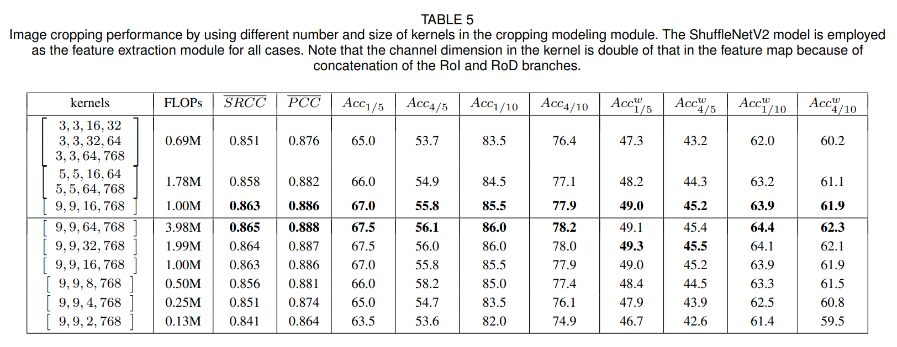

----

## Qualitative Comparison

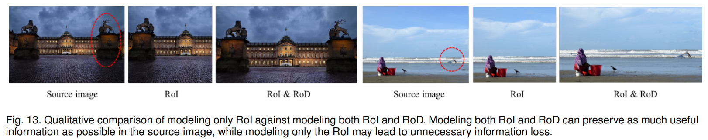

----

## Qualitative Comparison

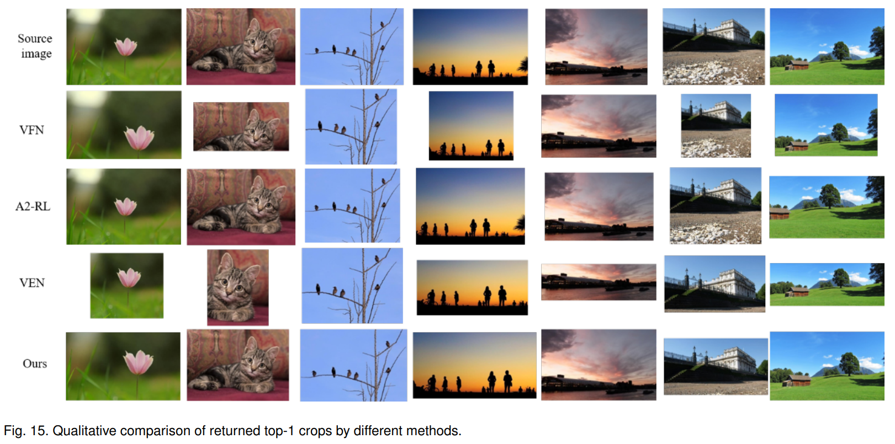

----

## Limitation

Two typical cases where the model may generate unsatisfactory results:
- the scenes are too complicated to detect the key object
- the model sometimes cannot fully remove the distracting elements in the boundary
  - adding some explicit constraints on the boundary of cropped images
  - annotating more images with distracting elements on the boundary

----

## Limitation

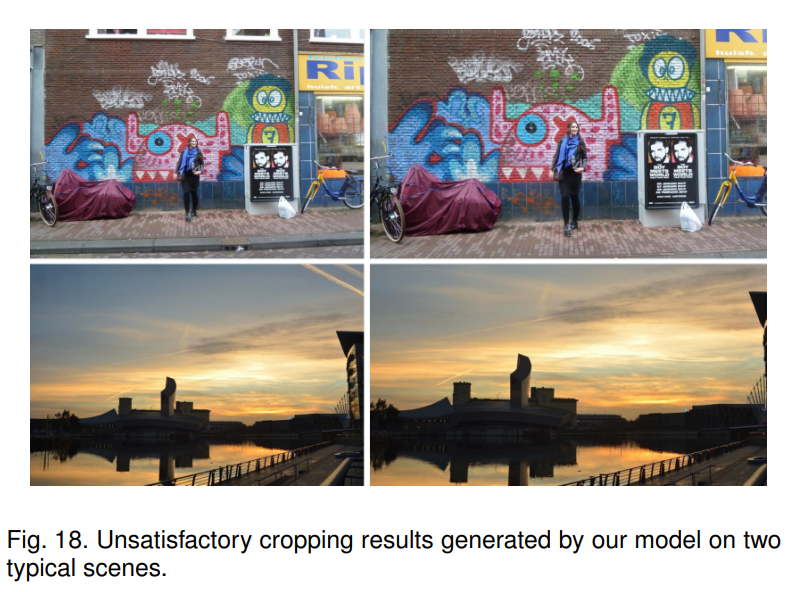

----

## Summary

- Task: image cropping
- Contributions:
  - new image cropping dataset and new evaluation metrics
  - effective and efficient image cropping model
    - grid anchor
    - RoI and RoD
    - FC layers with a large kernel size
    - Huber loss
