<!-- _class: title -->

# BLIP-2: Bootstrapping Language-Image Pre-training with Frozen Image Encoders and Large Language Models

     

Junnan Li, Dongxu Li, Silvio Savarese, Steven Hoi
Salesforce Research
**ICML 2023**

Presenter: Hao-Ting Li
Link: https://aquastripe.github.io/slides/2024/BLIP-2/

----

# Task: Vision-Language Models

- Most state-of-the-art vision-language models incur a **high computation cost** during pre-training, due to end-to-end training using large-scale models and datasets.
- Vision-language research sits at the intersection between vision and language, therefore it is naturally expected that vision-language models can harvest from the **readily available unimodal models** from the vision and natural language communities. 
- In this paper, we propose a generic and compute-efficient VLP method by bootstrapping from **off-the-shelf** pre-trained vision models and language models.
  - Pre-trained vision models offer high-quality visual representation. 
  - Pre-trained language models, in particular large language models (LLMs), offer strong language generation and zero-shot transfer abilities. 
  - To reduce computation cost and counteract the issue of catastrophic forgetting, the unimodal pre-trained models **remain frozen during the pre-training**.

----

# Cross-Modal Alignment

- In order to leverage pre-trained unimodal models for VLP, it is key to facilitate **cross-modal alignment**.
- However, since **LLMs have not seen images** during their unimodal pre-training, freezing them makes vision-language alignment in particular challenging. 
- In this regard, existing methods (e.g. Frozen (Tsimpoukelli et al., 2021), Flamingo (Alayrac et al., 2022)) resort to an **image-to-text generation loss**, which we show is insufficient to bridge the modality gap.

----

# Q-Former

- To achieve effective vision-language alignment with frozen unimodal models, we propose a Querying Transformer (Q-Former) pre-trained with a new two-stage pre-training strategy.
  - In the first pre-training stage, we perform **vision-language representation learning** which enforces the Q-Former to learn visual representation most relevant to the text.
  - In the second pre-training stage, we perform **vision-to-language generative learning** by connecting the output of the Q-Former to a frozen LLM, and trains the Q-Former such that its output visual representation can be interpreted by the LLM.

----

# Overview of BLIP-2's Framework (Figure 1)

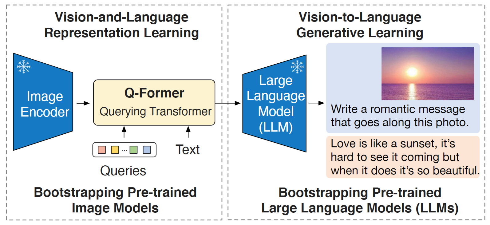

<!-- 
- Q-Former:
  - a lightweight Transformer
  - a set of learnable query vectors to extract visual features from the frozen image encoder
    - an information bottlenect between the frozen image encoder and the frozen LLM
 -->

----

# The Key Advantages of BLIP-2 (1/2)

- BLIP-2 effectively leverages both frozen pre-trained image models and language models. 
  - We **bridge the modality gap** using a Q-Former pre-trained in two-stages: representation learning stage and generative learning stage. 
  - BLIP-2 **achieves state-of-the-art performance** on various vision-language tasks including visual question answering, image captioning, and image-text retrieval.
- Powered by LLMs (e.g. OPT (Zhang et al., 2022), FlanT5 (Chung et al., 2022)), BLIP-2 can be prompted to perform **zero-shot image-to-text generation** that follows natural language instructions, which enables emerging capabilities such as visual knowledge reasoning, visual conversation, etc. (see Figure 4 for examples)

----

# The Key Advantages of BLIP-2 (2/2)

- Due to the use of frozen unimodal models and a lightweight Q-Former, BLIP-2 is more **compute-efficient** than exisiting state-of-the-arts. 
  - For example, BLIP-2 outperforms Flamingo (Alayrac et al., 2022) by 8.7% on zero-shot VQAv2, while using 54× fewer trainable parameters. 
  - Furthermore, our results show that BLIP-2 is a generic method that can harvest more advanced unimodal models for better VLP performance.

---

# Related Work

- End-to-end Vision-Language Pre-training
- Modular Vision-Language Pre-training

----

# End-to-end Vision-Language Pre-training (1/2)

- Vision-language pre-training aims to learn multimodal foundation models with improved performance on various visionand-language tasks. 
- Depending on the downstream task, different model architectures have been proposed
  - the dual-encoder architecture (Radford et al., 2021; Jia et al., 2021)
  - the fusion-encoder architecture (Tan & Bansal, 2019; Li et al., 2021)
  - the encoder-decoder architecture (Cho et al., 2021; Wang et al., 2021b; Chen et al., 2022b)
  - the unified transformer architecture (Li et al., 2022; Wang et al., 2022b) 

----

# End-to-end Vision-Language Pre-training (2/2)

- Various **pre-training objectives** have also been proposed over the years, and have progressively converged to a few time-tested ones: 
  - image-text contrastive learning (Radford et al., 2021; Yao et al., 2022; Li et al., 2021; 2022)
  - image-text matching (Li et al., 2021; 2022; Wang et al., 2021a)
  - (masked) language modeling (Li et al., 2021; 2022; Yu et al., 2022; Wang et al., 2022b)
- Most VLP methods perform end-to-end pre-training using large-scale **image-text pair datasets**. 
  - As the model size keeps increasing, the pre-training can incur an extremely **high computation cost**. 
  - Moreover, it is **inflexible** for end-to-end pre-trained models to leverage readily-available unimodal pre-trained models, such as LLMs (Brown et al., 2020; Zhang et al., 2022; Chung et al., 2022).

----

# Modular Vision-Language Pre-training (1/2)

- More similar to us are methods that leverage **off-the-shelf pre-trained models** and keep them frozen during VLP. 
- Some methods **freeze the image encoder** 
  - the early work which adopts a frozen object detector to extract visual features (Chen et al., 2020; Li et al., 2020; Zhang et al., 2021)
  - LiT (Zhai et al., 2022) which uses a frozen pre-trained image encoder for CLIP (Radford et al., 2021) pre-training
- Some methods **freeze the language model** to use the knowledge from LLMs for vision-to-language generation tasks (Tsimpoukelli et al., 2021; Alayrac et al., 2022; Chen et al., 2022a; Tiong et al., 2022; Guo et al., 2022). 

----

# Modular Vision-Language Pre-training (2/2)

- The key challenge in using a frozen LLM is to **align visual features to the text space**. 
  - Frozen (Tsimpoukelli et al., 2021) **finetunes an image encoder** whose outputs are directly used as soft prompts for the LLM. 
  - Flamingo (Alayrac et al., 2022) **inserts new cross-attention layers into the LLM** to inject visual features, and pre-trains the new layers on billions of image-text pairs. 
  - Both methods adopt the **language modeling loss**, where the language model generates texts conditioned on the image.
- Different from existing methods, BLIP-2 can effectively and efficiently leverage both **frozen image encoders and frozen LLMs** for various vision-language tasks, achieving stronger performance at a lower computation cost.

---

# Method

- Model Architecture
- Bootstrap Vision-Language Representation Learning from a Frozen Image Encoder
- Bootstrap Vision-to-Language Generative Learning from a Frozen LLM
- Model Pre-training

----

# Overview of BLIP-2's Framework (Figure 1)

<!-- 
- Q-Former:
  - a lightweight Transformer
  - a set of learnable query vectors to extract visual features from the frozen image encoder
    - an information bottlenect between the frozen image encoder and the frozen LLM
 -->

----

# Model Architecture: Q-Former (Figure 2-Left)

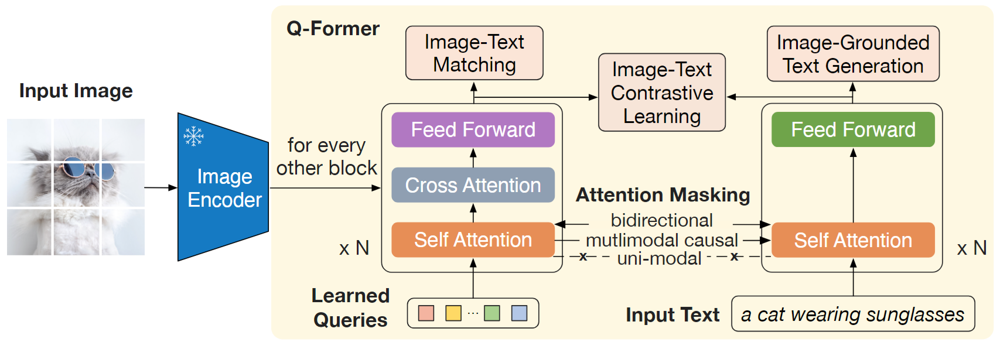

<!-- 
- Learnable queries:
  - interact with frozen image features through cross-attention layers (inserted every other transformer block) (every other: 每隔一個)
  - interact with the text through the same self-attention layers

 -->

----

# Model Architecture: Q-Former

- Depending on the pre-training task, we apply different self-attention masks to control query-text interaction. 
- We initialize Q-Former with the pre-trained weights of $\text{BERT}_{\text{base}}$ (Devlin et al., 2019), whereas the cross-attention layers are randomly initialized. 
- In total, Q-Former contains 188M parameters.
  - Note that the queries are considered as model parameters.
  - 32 queries
  - dimension of each query: 768
- The size of queries is much smaller than the size of frozen image features (e.g. 257×1024 for ViT-L/14). 
  - This bottleneck architecture works together with our pre-training objectives into forcing the queries to extract visual information that is most relevant to the text.

----

# <!-- fit --> Bootstrap Vision-Language Representation Learning from a Frozen Image Encoder

- We aim to train the Q-Former such that the queries can learn to **extract visual representation** that is most informative of the text.
- Optimization
  - Inspired by BLIP (Li et al., 2022), we jointly optimize three pre-training objectives that share the same input format and model parameters.
    - Image-text contrastive learning (ITC)
    - Image-grounded text generation (ITG)
    - Image-text matching (ITM)
  - Each objective employs a different attention masking strategy between queries and text to control their interaction (see Figure 2).

----

# <!--fit --> BLIP-2's First-Stage Vision-Language Representation Learning Objectives (Figure 2-Right) 

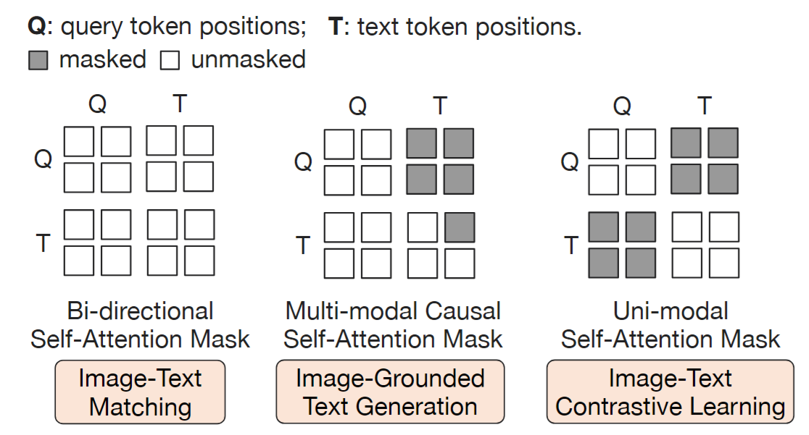

<!-- 
假設有兩個 query tokens 兩個 text tokens，序列的順序是從上到下、從左到右，傳入 Q-Former 以後進行 masking 的情形：
- Bi-directional Self-Attention Mask: 所有的 query tokens 與 text tokens 會互相計算 self-attention
- Multi-modal Causal Self-Attention Mask: 所有的 query tokens 互相計算 self-attention，text 則是會看到前面的 query token (因為它代表圖片) 以及比該 text token 出現更早的 text token (有順序性，因為它的 task 是 text generation)
- Uni-modal Self-Attention Mask: query tokens 可以看到所有 query tokens，text tokens 可以看到所有 text tokens，但是 query 與 text tokens 不會互相看到
 -->

----

# Image-Text Contrastive Learning (ITC)

- Image-Text Contrastive Learning (ITC) learns to **align image representation and text representation** such that their mutual information is maximized.
- We align the output query representation $Z$ from the image transformer with the text representation $t$ from the text transformer, where $t$ is the output embedding of the `[CLS]` token. 
- Since $Z$ contains multiple output embeddings (one from each query), we first compute the pairwise similarity between each query output and $t$, and then select the highest one as the image-text similarity.
- To avoid information leak, we employ a  **unimodal self-attention mask**, where the queries and text are not allowed to see each other. 
- Due to the use of a frozen image encoder, we can fit more samples per GPU compared to end-to-end methods. Therefore, we use **in-batch negatives** instead of the momentum queue in BLIP.

----

# Image-grounded Text Generation (ITG)

- Image-grounded Text Generation (ITG) loss trains the Q-Former to **generate texts**, given input images as the condition. 
- Since the architecture of Q-Former does not allow direct interactions between the frozen image encoder and the text tokens, the information required for generating the text must be first extracted by the queries, and then passed to the text tokens via self-attention layers.
- Therefore, the queries are forced to extract visual features that capture all the information about the text. 
- We employ a **multimodal causal self-attention mask** to control query-text interaction, similar to the one used in UniLM (Dong et al., 2019). The queries can attend to each other but not the text tokens. Each text token can attend to all queries and its previous text tokens. We also replace the `[CLS]` token with a new `[DEC]` token as the first text token to signal the decoding task.

----

# Image-Text Matching (ITM)

- Image-Text Matching (ITM) aims to learn **fine-grained alignment between image and text representation**. 
- It is a **binary classification task** where the model is asked to predict whether an image-text pair is positive (matched) or negative (unmatched). 
- We use a bi-directional self-attention mask where all queries and texts can attend to each other. The output query embeddings $Z$ thus capture multimodal information. 
- We feed each output query embedding into a **two-class linear classifier** to obtain a logit, and **average the logits** across all queries as the output matching score. 
- We adopt the **hard negative mining** strategy from Li et al. (2021; 2022) to create informative negative pairs.

----

# <!-- fit --> Bootstrap Vision-to-Language Generative Learning from a Frozen LLM (1/3)

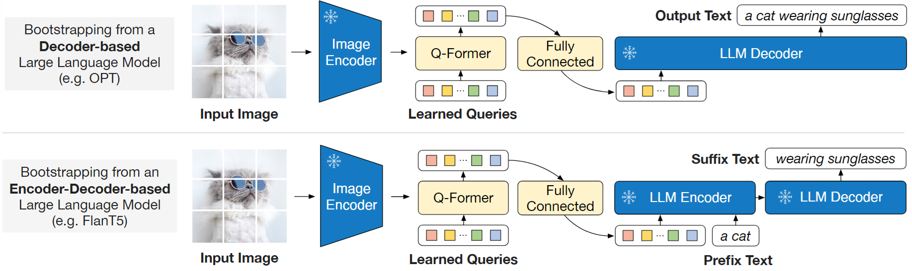

----

# <!-- fit --> Bootstrap Vision-to-Language Generative Learning from a Frozen LLM (2/3)

- We use a fully-connected (FC) layer to linearly project the output query embeddings $Z$ into the same dimension as the text embedding of the LLM. The projected query embeddings are then prepended to the input text embeddings. 
- They function as **soft visual prompts** that **condition the LLM on visual representation** extracted by the Q-Former.
- Since the Q-Former has been pre-trained to extract language-informative visual representation, it effectively functions as an **information bottleneck** that feeds the most useful information to the LLM while removing irrelevant visual information. 
- This reduces the burden of the LLM to learn vision-language alignment, thus mitigating the catastrophic forgetting problem.

----

# <!-- fit --> Bootstrap Vision-to-Language Generative Learning from a Frozen LLM (3/3)

- For decoder-based LLMs, we pre-train with the **language modeling loss**, where the frozen LLM is tasked to generate the text conditioned on the visual representation from Q-Former. 
- For encoder-decoder-based LLMs, we pre-train with the **prefix language modeling loss**, where we split a text into two parts. 
  - The prefix text is concatenated with the visual representation as input to the LLM’s encoder. 
  - The suffix text is used as the generation target for the LLM’s decoder.

----

# Pre-training Data (1/2)

- Pre-training data: 129M images
  - COCO (Lin et al., 2014)
  - Visual Genome (Krishna et al., 2017)
  - CC3M (Sharma et al., 2018)
  - CC12M (Changpinyo et al., 2021)
  - SBU (Ordonez et al., 2011)
  - 115M images from the LAION400M dataset (Schuhmann et al., 2021)

----

# Pre-training Data (2/2)

- Pre-training data: synthetic captions
  - We adopt the **CapFilt method** (Li et al., 2022) to create synthetic captions for the web images.
  - Specifically, we generate 10 captions using the $\text{BLIP}_\text{large}$ captioning model, and rank the synthetic captions along with the original web caption based on the image-text similarity produced by a CLIP ViT-L/14 model. 
  - We keep top-two captions per image as training data and randomly sample one at each pre-training step.

----

# Pre-trained Image Encoder and LLM

- For the frozen image encoder, we explore two state-of-the-art pre-trained vision transformer models: 
  - ViT-L/14 from CLIP (Radford et al., 2021) 
  - ViT-g/14 from EVA-CLIP (Fang et al., 2022). 
  - We **remove the last layer** of the ViT and **uses the second last layer’s output** features, which leads to slightly better performance. 
- For the frozen language model, we explore
  - the unsupervised-trained OPT model family (Zhang et al., 2022) for decoder-based LLMs
  - the instruction-trained FlanT5 model family (Chung et al., 2022) for encoder-decoder-based LLMs.

----

# Pre-Training Settings

- Training steps
  - We pre-train for 250k steps in the first stage and 80k steps in the second stage. 
- Batch size
  - We use a batch size of 2320/1680 for ViT-L/ViT-g in the first stage and a batch size of 1920/1520 for OPT/FlanT5 in the second stage.
- Model precision
  - During pre-training, we convert the frozen ViTs’ and LLMs’ parameters into **FP16**, except for FlanT5 where we use **BFloat16**. We found no performance degradation compared to using 32-bit models. 
  - Due to the use of frozen models, our pre-training is more computational friendly than existing large-scale VLP methods. 
  - For example, using a **single 16-A100(40G)** machine, our largest model with ViT-g and FlanT5-XXL requires less than 6 days for the first stage and less than 3 days for the second stage.

<!-- BFloat16: Brain floating point, was developed by Google Brain. Bfloat16 is used to reduce the storage requirements and increase the calculation speed of machine learning algorithms. -->

----

# Pre-Training Settings

- The same set of pre-training hyper-parameters are used for all models. 
- Optimizer
  - We use the AdamW (Loshchilov & Hutter, 2017) optimizer with $\beta_1 = 0.9$, $\beta_1 = 0.98$, and a weight decay of $0.05$. 
  - We use a **cosine learning rate decay** with a peak learning rate of 1e-4 and a linear warmup of 2k steps. 
  - The minimum learning rate at the second stage is 5e-5. 
- Image size and augmentation
  - We use images of size 224×224, augmented with **random resized cropping** and **horizontal flipping**.

---

# Experiments

- Overview of BLIP-2 results on various zero-shot vision-language tasks
- Instructed Zero-shot Image-to-Text Generation
- Image Captioning
- Visual Question Answering
- Image-Text Retrieval

----

# <!-- fit --> Overview Of Blip-2 Results On Various Zero-Shot Vision-Language Tasks

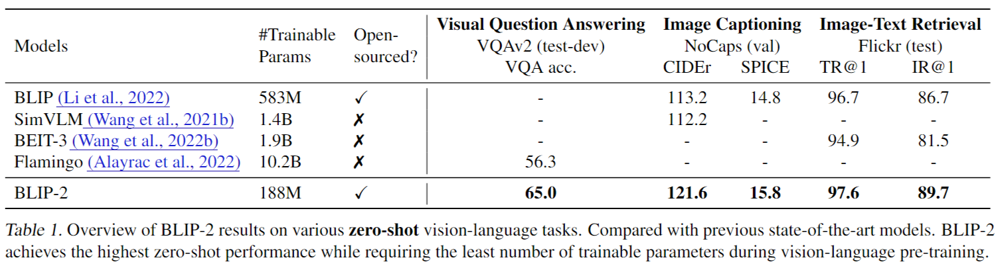

- trainable parameters
- performance

----

# Instructed Zero-shot Image-to-Text Generation (1/5)

Figure 4-1

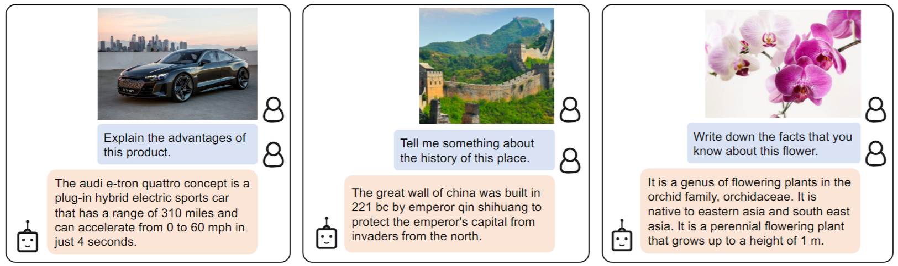

----

# Instructed Zero-shot Image-to-Text Generation (2/5)

Figure 4-2

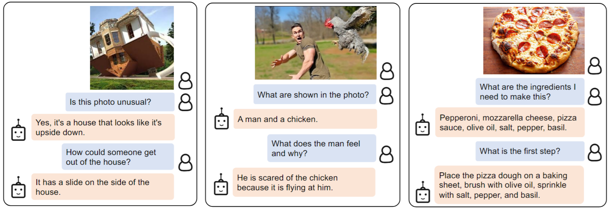

----

# Instructed Zero-shot Image-to-Text Generation (3/5)

Figure 4-3

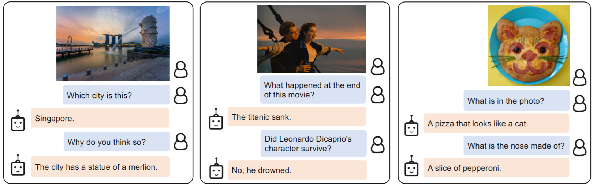

----

# Instructed Zero-shot Image-to-Text Generation (4/5)

Figure 4-4

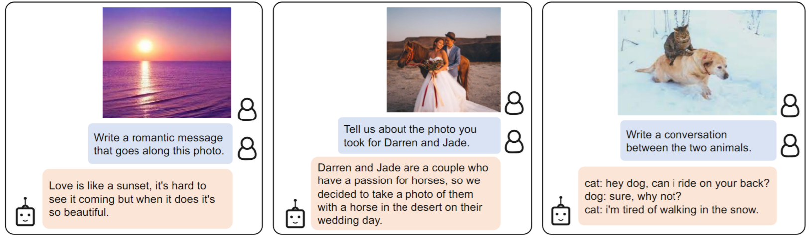

----

# Instructed Zero-shot Image-to-Text Generation (5/5)

- visual knowledge reasoning
- visual commensense reasoning
- visual conversation
- personalized image-to-text generation

----

# Zero-Shot Visual Question Answering: Settings

- Prompt
  - OPT models: `Question: {} Answer`
  - FlanT5: `Question: {} Short answer:`
- During generation, we use **beam search** with a beam width of 5.
  - [Beam Search Wikipedia](https://en.wikipedia.org/wiki/Beam_search)
- We also set the **length-penalty** to -1 which encourages shorter answers that align better with human annotation.

----

# Zero-Shot Visual Question Answering: Results

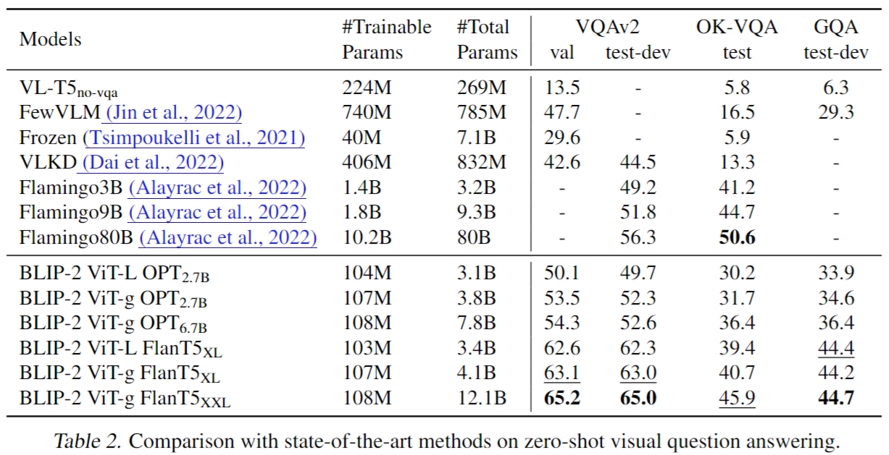

<!-- 

- BLIP-2 comes secondary to Flamingo80B. We hypothesis that this is because OK-VQA focuses more on open-world knowledge than visual understanding
  - 所以參數量較多的模型儲存更多的知識量
- 更強的 image encoder 或 LLM 會讓結果更好
 -->

----

# Effect of Vision-Language Representation Learning

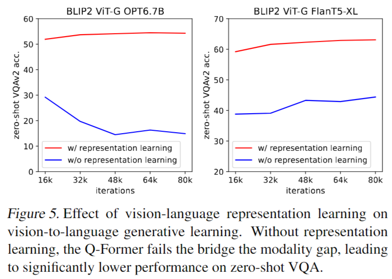

----

# Image Captioning

- Training: use the prompt `a photo of` as an initial input and language modeling loss
- We keep the LLM frozen during finetuning, and updates the parameters of the Q-Former together with the image encoder.

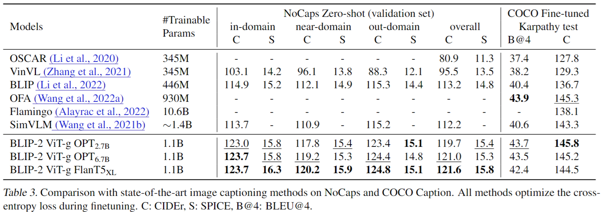

----

# Visual Question Answering: Settings

- Given annotated VQA data, we finetune the parameters of the Q-Former and the image encoder while keeping the LLM frozen.
- We finetune with the **open-ended answer generation loss**, where the LLM receives Q-Former’s output and the question as input, and is asked to generate the answer. 
- In order to extract image features that are more relevant to the question, we additionally condition Q-Former on the question.
  - Specifically, **the question tokens are given as input to the Q-Former** and interact with the queries via the self-attention layers, which can guide the Q-Former’s cross-attention layers to focus on more informative image regions.

----

# Visual Question Answering: Model Architecture

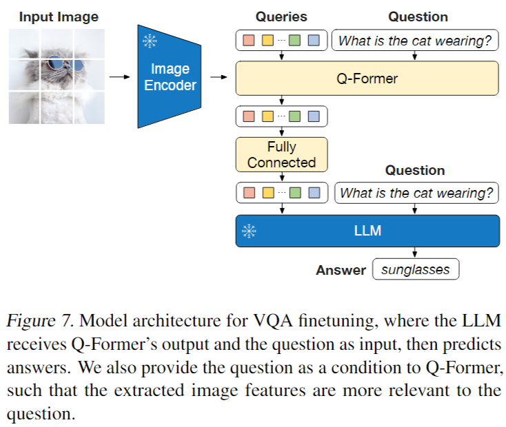

----

# Visual Question Answering: Results

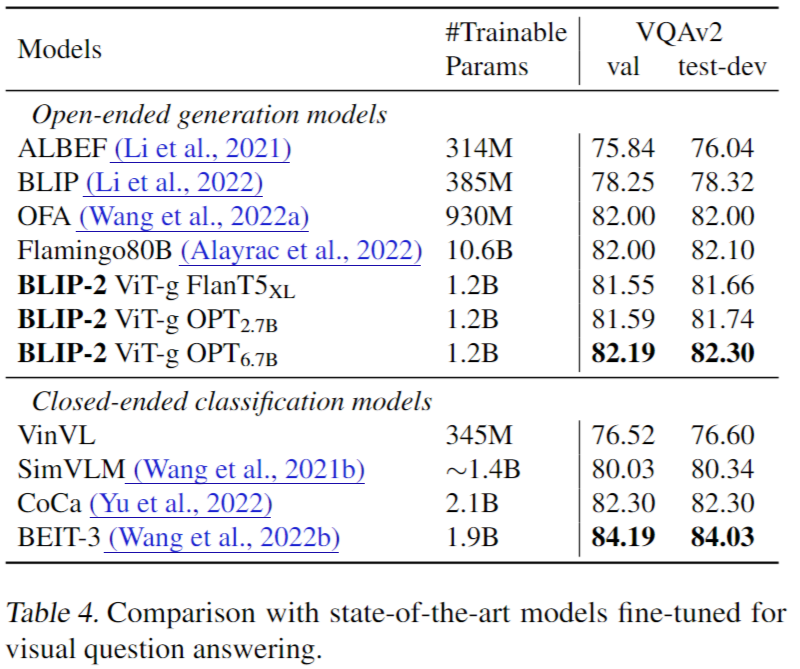

----

# Image-Text Retrieval: Settings

- Since image-text retrieval does not involve language generation, we directly finetune the first-stage-pretrained model w/o LLM.
  - Specifically, we finetune the image encoder together with Q-Former on COCO using the same objectives (i.e. ITC, ITM, and ITG) as pre-training. 
  - We then evaluate the model for both image-to-text retrieval and text-to-image retrieval on COCO and Flickr30K (Plummer et al., 2015) datasets. 
  - During inference, we follow Li et al. (2021; 2022) which first select k = 128 candidates based on the image-text feature similarity, followed by a re-ranking based on pairwise ITM scores. 
  - We experiment with both ViT-L and ViT-g as the image encoder.

----

# Image-Text Retrieval: Results

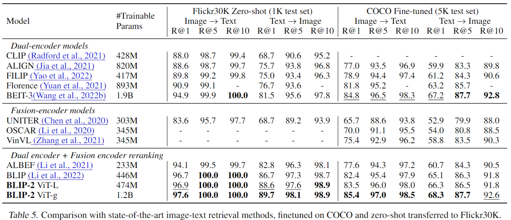

----

# Image-Text Retrieval: The Impact of ITG Loss

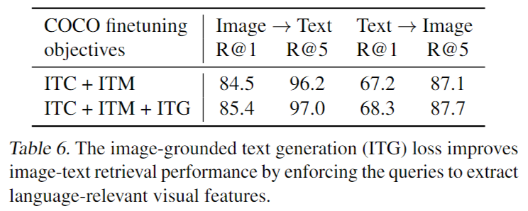

- This result supports our intuition in designing the representation learning objectives: the ITG loss enforces the queries to **extract visual features most relevant to the text**, thus improving vision-language alignment.

---

# Limitation (1/3)

- Recent LLMs can perform **in-context learning** given few-shot examples. 
- However, our experiments with BLIP-2 do not observe an improved VQA performance when providing the LLM with in-context VQA examples. 
- We attribute **the lack of in-context learning capability to our pre-training dataset**, which only contains a single image-text pair per sample.
- The LLMs cannot learn from it the correlation among multiple image-text pairs in a single sequence.
- The same observation is also reported in the Flamingo paper, which uses a close-sourced interleaved image and text dataset (M3W) with multiple image-text pairs per sequence.
- We aim to create a similar dataset in future work.

----

# Limitation (2/3)

- BLIP-2's image-to-text generation could have **unsatisfactory results** due to various reasons
  - inaccurate knowledge from the LLM
  - activating the incorrect reasoning path
  - not having up-to-date information about new image content
- Furthermore, due to the use of frozen models, BLIP-2 inherits the risks of LLMs
  - outputting offensive language
  - propagating social bias
  - leaking private information
- Remediation approaches include **using instructions to guide model's generation** or **training on a filtered dataset** with harmful content removed.

----

# Limitation (3/3)

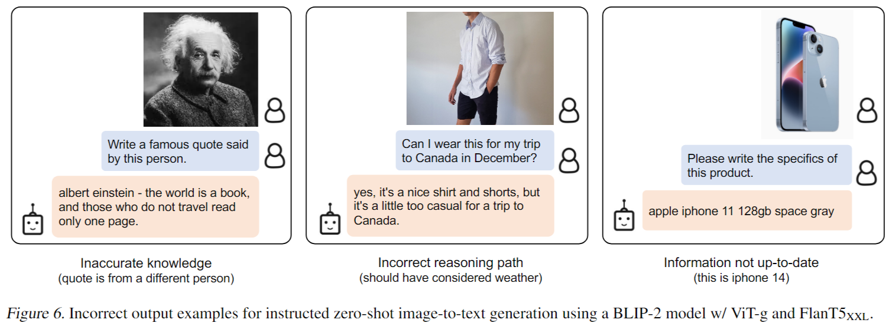

---

# Conclusion

- We propose BLIP-2, a **generic** and **compute-efficient** method for vision-language pre-training that leverages frozen pretrained image encoders and LLMs. 
- BLIP-2 achieves state-of-the-art performance on various vision-language tasks while having a small amount of trainable parameters during pre-training. 
- BLIP-2 also demonstrates emerging capabilities in zero-shot instructed image-to-text generation. 
- We consider BLIP-2 as an important step towards building a multimodal conversational AI agent.

---

# Summary

- BLIP-2
  - Two-stage training
    1. V+L representation learning
       - Image-Text Contrastive Learning
       - Image-grounded Text Generation
       - Image-Text Matching
    2. V+L generative learning
  - Q-Former
    - BERT
    - Learnable query embeddings
      - interact with frozen image features through cross-attention layers
      - interact with the text through the same self-attention layers
