<!-- _class: title -->

# Monitoring AI-Modified Content at Scale: A Case Study on the Impact of ChatGPT on AI Conference Peer Reviews

\
\
\
\
\

Weixin Liang$^{1*}$, Zachary Izzo$^{2*}$, Yaohui Zhang$^{3*}$, Haley Lepp$^4$, Hancheng Cao$^{1, 5}$, Xuandong Zhao$^6$, Lingjiao Chen$^1$, Haotian Ye$^1$, Sheng Liu$^7$, Zhi Huang$^7$, Daniel A. McFarland$^{4, 8, 9}$, James Y. Zou$^{1, 3, 7}$

$^1$ Department of Computer Science, Stanford University $^2$ Machine Learning Department, NEC Labs America \
$^3$ Department of Electrical Engineering, Stanford University $^4$ Graduate School of Education, Stanford University \
$^5$ Department of Management Science and Engineering, Stanford University \
$^6$ Department of Computer Science, UC Santa Barbara $^7$ Department of Biomedical Data Science, Stanford University \
$^8$ Department of Sociology, Stanford University $^9$Graduate School of Business, Stanford University

**ICML 2024**
Presenter: Hao-Ting Li
Link: https://aquastripe.github.io/slides/2024/Conf-Peer-Reviews/

---

# Introduction

- As of yet it has been impossible to precisely measure the scale of such (LLMs) use or evaluate the ways that the introduction of generated text may be affecting information ecosystems.
- To complicate the matter, it is increasingly difficult to distinguish examples of LLM-generated texts from human-written content (Gao et al., 2022; Clark et al., 2021).
  - In scientific research, for example, studies have found that ChatGPT-generated medical abstracts may frequently bypass AI-detectors and experts (Else, 2023; Gao et al., 2022).
  - In media, one study identified over 700 unreliable AI-generated news sites across 15 languages which could mislead consumers (NewsGuard, 2023; Cantor, 2023).

----

# Motivation

- Despite the fact that generated text may be indistinguishable on a case-by-case basis from content written by humans, studies of LLM-use at scale find corpus-level trends which contrast with at-scale human behavior.
  - The increased consistency of LLM output can amplify biases at the corpus-level in a way that is too subtle to grasp by examining individual cases of use.
  - Cao et al. find that prompts to ChatGPT in certain languages can reduce the variance in model responses, “flattening out cultural differences and biasing them towards  merican culture”; a subtle yet persistent effect that would be impossible to detect at an individual level.
- As LLM-generated content spreads to increasingly high-stakes information ecosystems, there is an urgent need for efficient methods which allow for comparable evaluations on real-world datasets which contain uncertain amounts of AI-generated text.

<!--
儘管在個別情況下，語言模型生成的文字沒辦法與人類寫的區分
但是，很多研究發現語言模型在語料庫層級的趨勢與人類的行為形成對比。意思就是說，我們可以從大規模的分析結果區分語言模型寫出來的文字與人類寫的文字
例如，語言模型一致性的輸出結果可能會在語料庫層級上放大了偏差，這個微妙的差異在個案來說是難以捕捉的
Cao 等人發現以某種語言下的 prompts 會減少模型輸出結果的變異性，結果會攤平文化差異並且趨向美國文化，這個微小的差異也是個案不可能發現的

語言模型所產生的內容擴散到越來越高風險的資訊生態系統中
我們迫切需要有效率的方法，在包含不確定 AI 生成文字數量的真實世界資料集進行評估
-->

----

# Inspiration

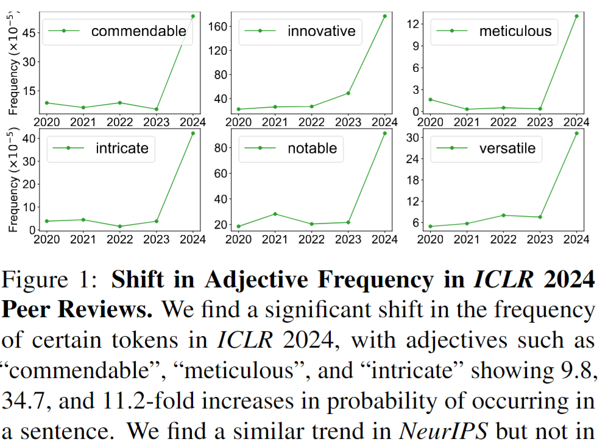

----

# Contributions

- We propose a simple and effective method for estimating the fraction of text in a large corpus that has been substantially modified or generated by AI (Section § 3). 
- We conduct a case study on reviews submitted to several top ML and scientific venues, including recent ICLR, NeurIPS, EMNLP, CoRL conferences, as well as papers published at Nature portfolio journals (Section § 4). Our method allows us to uncover trends in AI usage since the release of ChatGPT and corpus-level changes that occur when generated texts appear in an information ecosystem (Section § 4.7).

---

# Related Work

- Zero-shot LLM detection
- Training-based LLM detection
- LLM watermarking

----

# Zero-shot LLM Detection

- Zero-shot detection or “model self-detection” represents a major approach family, utilizing the heuristic that text generated by an LLM will exhibit distinctive probabilistic or geometric characteristics within the very model that produced it.
- Early methods relied on metrics, e.g.
    - entropy (Lavergne et al., 2008)
    - log-probability scores (Solaiman et al., 2019b)
    - perplexity (Beresneva, 2016)
    - uncommon n-gram frequencies (Badaskar et al., 2008)

----

# Zero-shot LLM Detection

- More recently
  - DetectGPT (Mitchell et al., 2023a) suggests that AI-generated text typically occupies regions with negative log probability curvature. 
  - DNA-GPT (Yang et al., 2023a) improves performance by analyzing n-gram divergence between reprompted and original texts.
  - Fast-DetectGPT (Bao et al., 2023)enhances efficiency by leveraging conditional probability curvature over raw probability. 
  - Tulchinskii et al. (2023) show that machine text has lower intrinsic dimensionality than human writing, as measured by persistent homology for dimension estimation. 

<!-- 
* DetectGPT: AI 生成的文字通常會佔據 "negative log probability" 曲率的區域
* DNA-GPT: 透過分析 reprompted 和原始文字的 n-gram 機率分布的差異來改進
* Fast-DetectGPT: 利用條件機率的曲率替代原始機率來提升效率
* Tulchinskii 說明生成的文字有比較低的 intrinsic dimensionality，可以用某種方式來測量
-->

----

# Zero-shot LLM Detection

- However, these methods are most effective when there is **direct access** to the internals of the specific LLM that generated the text. 
- Since many commercial LLMs, including OpenAI’s GPT-4, are **not open-sourced**, these approaches often rely on a proxy LLM assumed to be mechanistically similar to the closedsource LLM. 
- This reliance introduces compromises that, as studies by (Sadasivan et al., 2023; Shi et al., 2023; Yang et al., 2023b; Zhang et al., 2023) demonstrate, limit the robustness of zero-shot detection methods across different scenarios.

----

# Training-based LLM Detection

- An alternative LLM detection approach is to fine-tune a pretrained model on datasets with both human and AI-generated text examples in order to distinguish between the two types of text, by passing the need for original model access.
- Earlier studies have used classifiers to detect synthetic text in peer review corpora (Bhagat & Hovy, 2013), media outlets (Zellers et al., 2019), and other contexts (Bakhtin et al., 2019; Uchendu et al., 2020). 
- More recently, GPT-Sentinel (Chen et al., 2023) train the RoBERTa (Liu et al., 2019) and T5 (Raffel et al., 2020) classifiers on the constructed dataset OpenGPTText. 
- GPT-Pat (Yu et al., 2023) train a twin neural network to compute the similarity between original and re-decoded texts. 
- Li et al. (2023) build a wild testbed by gathering texts from various human writings and deepfake texts generated by different LLMs. 
- Notably, the application of contrastive and adversarial learning techniques has enhanced classifier robustness (Liu et al., 2022; Bhattacharjee et al., 2023; Hu et al., 2023a). 

----

# Training-based LLM Detection

- However, the recent development of several publicly available tools aimed at mitigating the risks associated with AI-generated content has sparked a debate about their effectiveness and reliability (OpenAI, 2019; Jawahar et al., 2020; Fagni et al., 2021; Ippolito et al., 2019; Mitchell et al., 2023b; Gehrmann et al., 2019; Heikkil  ̈a, 2022; Crothers et al., 2022; Solaiman et al., 2019a). 
- This discussion gained further attention with OpenAI’s 2023 decision to discontinue its AI-generated text classifier due to its “**low rate of accuracy**” (Kirchner et al., 2023; Kelly, 2023).

----

# Training-based LLM Detection

- A major empirical challenge for training-based methods is their tendency to overfit to both training data and language models. 
- Therefore, many classifiers show vulnerability to adversarial attacks (Wolff, 2020) and display bias towards writers of non-dominant language varieties (Liang et al., 2023a).
- The theoretical possibility of achieving accurate instance-level detection has also been questioned by researchers, with debates exploring whether reliably distinguishing AI-generated content from human-created text on an individual basis **is fundamentally impossible** (WeberWulff et al., 2023; Sadasivan et al., 2023; Chakraborty et al., 2023).

---

# Training-based LLM Detection

- Unlike these approaches to detecting AI-generated text at the document, paragraph, or sentence level, our method estimates the fraction of **an entire text corpus** which is substantially AI-generated. 
- Our extensive experiments demonstrate that by sidestepping the intermediate step of classifying individual documents or sentences, this method improves upon the stability, accuracy, and computational efficiency of existing approaches.

----

# LLM Watermarking

- Text watermarking introduces a method to detect AI-generated text by embedding unique, algorithmically-detectable signals -known as watermarks directly into the text.
- Early watermarking approaches modify pre-existing text by leveraging synonym substitution (Chiang et al., 2003; Topkara et al., 2006b), syntactic structure restructuring (Atallah et al., 2001; Topkara et al., 2006a), or paraphrasing (Atallah et al., 2002). 
- Increasingly, scholars have focused on integrating a watermark directly into an LLM’s decoding process. 
- Kirchenbauer et al. (2023) split the vocabulary into red-green lists based on hash values of previous n-grams and then increase the logits of green tokens to embed the watermark. 
- Zhao et al. (2023) use a global red-green list to enhance robustness. 
- Hu et al. (2023b); Kuditipudi et al. (2023); Wu et al. (2023) study watermarks that preserve the original token probability distributions. 
- Meanwhile, semantic watermarks (Hou et al., 2023; Fu et al., 2023; Liu et al., 2023) using input sequences to find semantically related tokens and multi-bit watermarks (Yoo et al., 2023; Fernandez et al., 2023) to embed more complex information have been proposed to improve certain conditional generation tasks.

---

# LLM Watermarking

- However, watermarking requires the involvement of the model or service owner, such as OpenAI, to implant the watermark.
- Concerns have also been raised regarding the potential for watermarking to degrade text generation quality and to compromise the coherence and depth of LLM responses (Singh & Zou, 2023). 
- In contrast, our framework operates independently of the model or service owner’s intervention, allowing for the monitoring of AI-modified content without requiring their adoption.

---

# Method: Notation & Problem Statement

- Let $x$ represent a document or sentence, and let $t$ be a token. 
- We write $t \in x$ if the token $t$ occurs in the document $x$. 
- We will use the notation $X$ to refer to a corpus (i.e., a collection of individual documents or sentences $x$) and $V$ to refer to a vocabulary (i.e., a collection of tokens $t$).
  - In all of our experiments in the main body of the paper, we take the vocabulary $V$ to be the set of all **adjectives**. 
  - We found this vocabulary choice to exhibit greater stability than using other parts of speech such as adverbs, verbs, nouns, or all possible tokens.  
- We removed technical terms by excluding the set of all technical keywords as self-reported by the authors during abstract submission on OpenReview. 

----

# Method: Notation & Problem Statement

- Let $P$ and $Q$ denote the probability distribution of documents written by scientists and generated by AI, respectively.
- Given a document $x$, we will use $P(x)$ (resp. $Q(x)$) to denote the likelihood of $x$ under $P$ (resp. $Q$). 
- We assume that the documents in the target corpus are generated from the mixture distribution 
    $$
    (1-\alpha)P + \alpha Q \quad (1)
    $$
    and the goal is to estimate the fraction $\alpha$ which are AI-generated.

----

# Overview of Our Statistical Estimation Approach

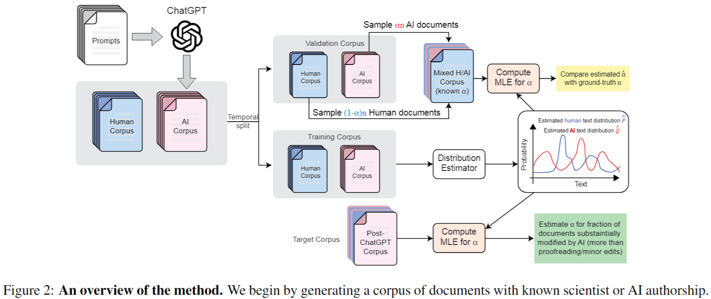

<!--
1. 蒐集 writing instructions 作為 prompts，然後產生 AI-generated documents
2. 使用這些 corpora 預測 P and Q 
3. 驗證方法的 performance，其中 alpha 是已知的
4. 基於這些對 PQ 的預測，使用 MLE 估計 alpha 的比例
 -->

----

# MLE Framework

- Given a collection of $n$ documents $\{x_i\}_{i=1}^n$ drawn independently from the mixture (1), the log-likelihood of the corpus is given by
$$
\mathcal L(\alpha) = \sum_{i=1}^n \log \left( (1-\alpha) P(x_i) + \alpha  Q(x_i) \right). \quad (2)
$$
- If $P$ and $Q$ are known, we can then estimate $\alpha$ via maximum likelihood estimation (MLE) on (2).
  - This is the final step in our method. It remains to construct accurate estimates for $P$ and $Q$.

----

# Generating the Training Data

- We require access to historical data for estimating $P$ and $Q$. 
- Human corpus
  - Specifically, we assume that we have access to a collection of reviews which are known to contain only human-authored text, along with the associated review questions and the reviewed papers. 
  - We refer to the collection of such *documents* as the *human corpus*.
- AI corpus
  - To generate the AI corpus, we prompt the LLM to generate a review given a paper.
  - The texts output by the LLM are then collected into the *AI corpus*. 
  - Empirically, we found that our framework exhibits moderate robustness to the distribution shift of LLM prompts.

<!--
在附錄中提到，如果只使用一個 prompt 進行訓練，再用另一種 prompt 進行測試，依然可以得到準確的驗證結果
 -->

----

# Estimating $P$ and $Q$ from Data

- The space of all possible documents is too large to estimate $P(x), Q(x)$ directly. Thus, we make some simplifying assumptions on the document generation process to make the estimation tractable.
- We represent each document $x_i$ as a list of *occurrences* (i.e., a set) of tokens rather than a list of token *counts*. 
- While longer documents will tend to have more unique tokens (and thus a lower likelihood in this model), the number of additional unique tokens is likely sublinear in the document length, leading to a less exaggerated down-weighting of longer documents.

----

# Estimating $P$ and $Q$ from Data

- The occurrence probabilities for the human document distribution can be estimated by
    $$
    \begin{align*}
    \hat{p}(t) &= \frac{\textrm{\# documents in which token } t \textrm{ appears}}{\textrm{total \# documents in the corpus}} \\[5pt]
    &= \frac{\sum_{x \in X} \mathbb{1}\{t \in x\}}{|X|},
    \end{align*}
    $$
    where $X$ is the corpus of human-written documents. 

----

# Estimating $P$ and $Q$ from Data

- The estimate $\hat{q}(t)$ can be defined similarly for the AI distribution. Using the notation $t \in x$ to denote that token $t$ occurs in document $x$, we can then estimate $P$ via
    $$
    P(x_i) = \prod_{t\in x} \hat{p}(t) \times  \prod_{t\not\in x} (1-\hat{p}(t))
    $$
    and similarly for $Q$. 
- Recall that our token vocabulary $V$ consists of all adjectives, so the product over $t \not \in x$ means the product only over all adjectives $t$ which were not in the document or sentence $x$.
- We validated both approaches using either a document or a sentence as the unit of $x$, and both performed well. We used a **sentence** as our main unit for estimates, as sentences perform slightly better.

----

# Validating the Method

- The steps described above are sufficient for estimating the fraction $\alpha$ of documents in a target corpus which are AI-generated. We also provide a method for validating the system's performance.
- We use the training partitions of the human and AI corpora to estimate $P$ and $Q$ as described above. To validate the system's performance, we do the following:
  1. Choose a range of feasible values for $\alpha$, e.g. $\alpha \in \{0, 0.05, 0.1, 0.15, 0.2, 0.25\}$.
  2. Let $n$ be the size of the target corpus. For each of the selected $\alpha$ values, sample (with replacement) $\alpha n$ documents from the AI validation corpus and $(1-\alpha)n$ documents from the human validation corpus to create a *target corpus*.
  3. Compute the MLE estimate $\hat{\alpha}$ on the target corpus. If $\hat{\alpha} \approx \alpha$ for each of the feasible $\alpha$ values, this provides evidence that the system is working correctly and the estimate can be trusted.
- Step 2 can also be repeated multiple times to generate confidence intervals for the estimate $\hat{\alpha}$.

---

# Experiments: Data

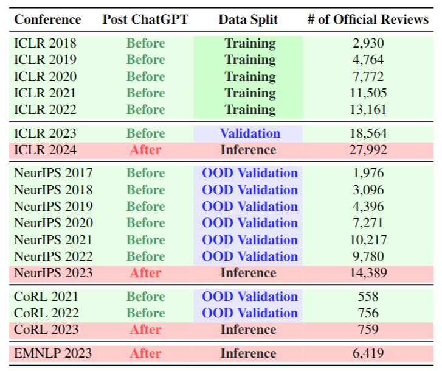

<!-- 
以及 Nature portfolio 共 15 個期刊
 -->

----

# Validation on Semi-Synthetic data

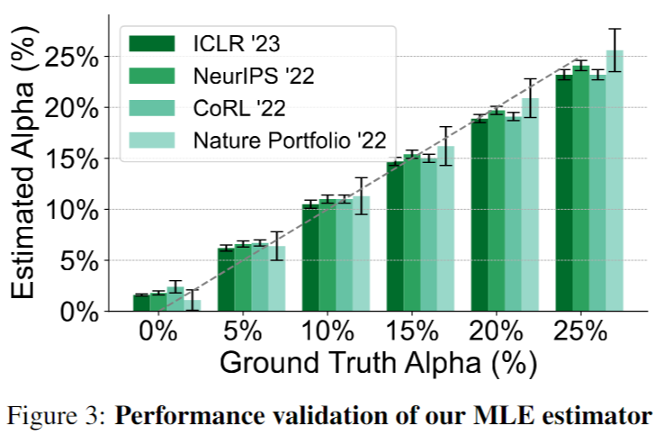

<!-- 
這個方法可以很可靠的辨識不同研究領域、論文格式
在持續更新生成模型的情況下可能依然適用，來維護 peer-review 誠信
 -->

----

# Comparison to Instance-Based Detection Methods: Our Model

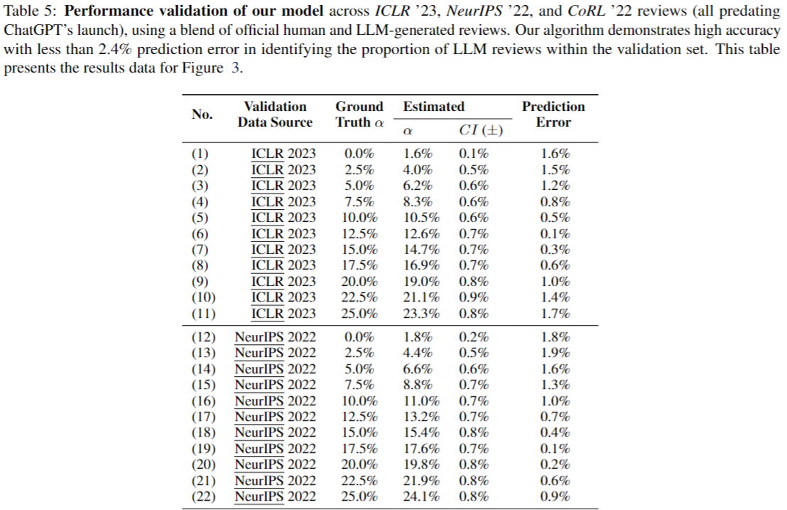

----

# Comparison to Instance-Based Detection Methods: Others

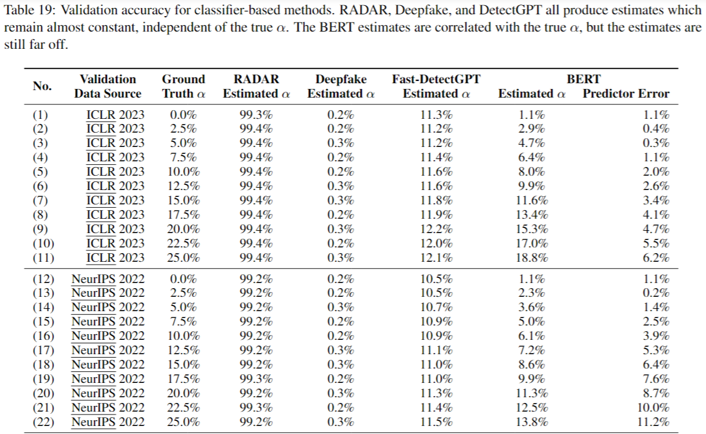

----

# Comparison to Instance-Based Detection Methods

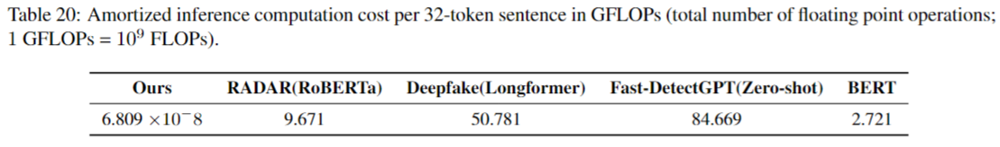

----

# Estimates on Real Reviews

- Next, we address the main question of our case study: what fraction of conference review text was substantially modified by LLMs, beyond simple grammar and spell checking? 
- We find that there was a significant increase in AI-generated sentences after the release of ChatGPT for the ML venues, but not for Nature (Appendix D.2). 
- The results are demonstrated in Figure 4, with error bars showing 95\% confidence intervals over 30,000 bootstrap samples.

----

# Estimates on Real Reviews

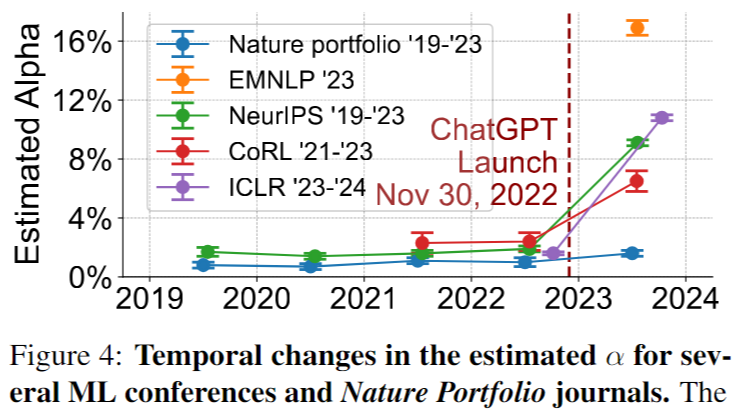

<!-- 
ICLR 上升快 10%
EMNLP 在之前是 unavailable 但是現在有最高的估計值，大約 16.9%
"這或許也不意外，因為 NLP 領域的學者更早接觸 LLM 的模型，有更多的了解"
 -->

----

# Robustness to Proofreading

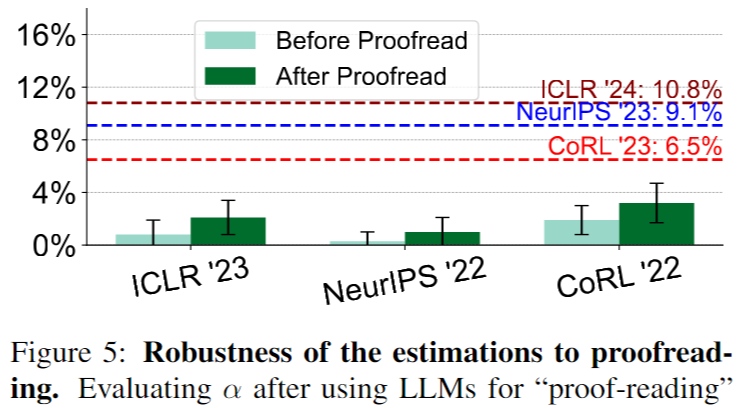

<!-- 
檢查錯字跟文法
 -->

----

# <!--fit--> Factors that Correlate With Estimated LLM Usage: Dead Line Effect

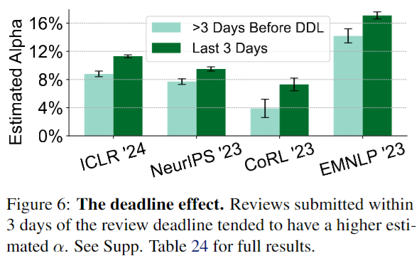

----

# <!--fit--> Factors that Correlate With Estimated LLM Usage: The Reference Effect

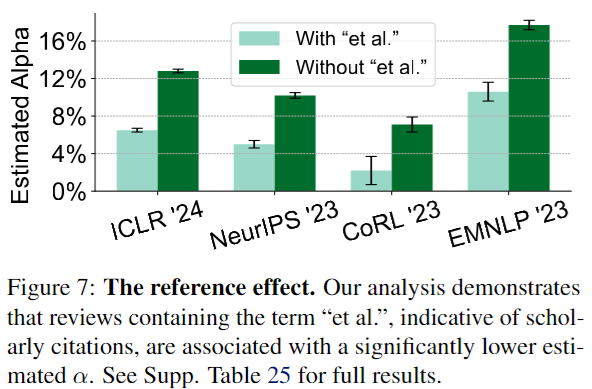

----

# <!--fit--> Factors that Correlate With Estimated LLM Usage: Lower Reply Rate Effect

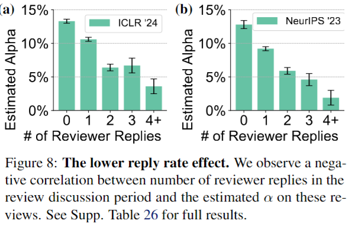

----

# <!--fit--> Factors that Correlate With Estimated LLM Usage: Homogenization Effect

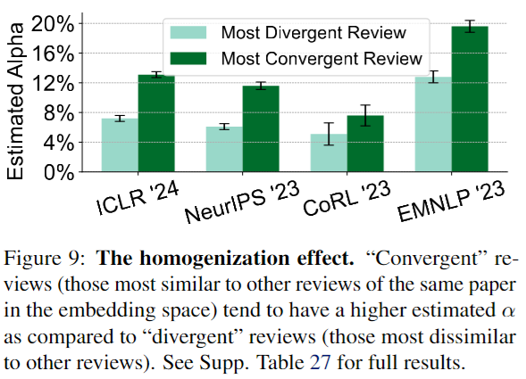

<!-- 
對每個 reviews 用 OpenAI text embeddings 產生 text embeddings
然後計算 embedding centroid
離 centroid 最近的標記為 convergent, 最遠的標記為 divergent
不斷重複這個過程

這個結果跟先前的研究結果一致
 -->

---

# Discussion

- In this work, we propose a method for estimating the fraction of documents in a large corpus which were generated primarily using AI tools.
- The method makes use of historical documents. The prompts from this historical corpus are then fed into an LLM (or LLMs) to produce a corresponding corpus of AI-generated texts. 
- The written and AI-generated corpora are then used to estimate the distributions of AI-generated vs. written texts in a mixed corpus. 
- Next, these estimated document distributions are used to compute the likelihood of the target corpus, and the estimate for $\alpha$ is produced by maximizing the likelihood. 
- We also provide specific methods for estimating the text distributions by token frequency and occurrence, as well as a method for validating the performance of the system.

----

# Discussion

- Applying this method to conference and journal reviews written before and after the release of ChatGPT shows evidence that roughly 7-15% of sentences in ML conference reviews were substantially modified by AI beyond a simple grammar check, while there does not appear to be significant evidence of AI usage in reviews for Nature.
- Finally, we demonstrate several ways this method can support social analysis. 
- First, we show that reviewers are more likely to submit generated text for last-minute reviews, and that people who submit generated text offer fewer author replies than those who submit written reviews. 
- Second, we show that generated texts include less specific feedback or citations of other work, in comparison to written reviews. Generated reviews also are associated with lower confidence ratings.
- Third, we show how corpora with generated text appear to compress the linguistic variation and epistemic diversity that would be expected in unpolluted corpora. 
- We should also note that other social concerns with ChatGPT presence in peer reviews extend beyond our scope, including the potential privacy and anonymity risks of providing unpublished work to a privately owned language model.

<!-- 
- 有 7-15% 比例的 comments 是用 AI 生成的，而且生成的內容已經不只是語法檢查，不過並沒有明顯的證據顯示 Nature 受到影響
- 最後這篇展示了這個方法可以用來支援社會分析
- reviewer 在截稿前會用 AI 生成 comments ，以及 AI 生成的 comments 會獲得較少的作者回應
- AI 生成的 comments 提供較少的具體回饋和引用其他論文
- AI 生成的 comments 關聯著較低的 confidence ratings
- 含有 AI 生成的語料庫是如何壓縮語言變化和認知多樣性的，而這些東西在未受汙染的語料庫中是可以預期的
- 我們應該也注意到 ChatGPT 在 peer reviews 中的存在引起的其他社會疑慮，包括向私有的語言模型提供未發表作品的潛在隱私和匿名風險
 -->
