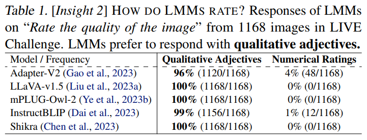
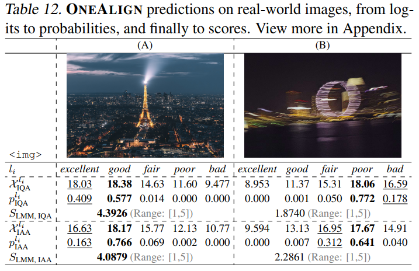

<!-- _class: title -->

# <!-- fit --> Q-Align: Teaching LMMs for Visual Scoring via Discrete Text-Defined Levels

Haoning Wu$^1$, Zicheng Zhang$^2$, Weixia Zhang$^2$, Chaofeng Chen$^1$, Liang Liao$^1$, Chunyi Li$^2$, Yixuan Gao$^1$$^2$, Annan Wang$^1$, Erli Zhang$^1$, Wenxiu Sun$^3$, Qiong Yan$^3$, Xiongkuo Min$^2$, Guangtao Zhai$^2$, Weisi Lin$^1$

$^1$Nanyang Technological University $^2$Shanghai Jiao Tong University $^3$Sensetime Research.

**ICML 2024**

Presenter: Hao-Ting Li (李皓庭)
Link: https://aquastripe.github.io/slides/2024/Q-Align/

---

# Introduction

- **Objective**:
  - Teach Large Multi-Modality Models (LMMs) for visual rating using discrete text-defined levels.
  - Unify Image Quality Assessment (IQA), Image Aesthetic Assessment (IAA), and Video Quality Assessment (VQA) into a single model.

---

# <!-- fit --> The Q-Align in Comparison with Its Baseline and Existing SOTA


---

# Limitations of Existing Methods: Traditional Methods

- Traditional visual scoring models often struggle with generalization, especially on out-of-distribution (OOD) data.
- They usually experience compromised performance while handling different scoring scenarios (e.g. mixing multiple datasets) together, making it challenging to train a unified model for different situations.
- Human raters typically use discrete text-defined levels (e.g., excellent, good) instead of exact scores, which are challenging for models to replicate.

---

# Limitations of Existing Methods: LMMs

- Large multi-modality models (LMMs) can well **understand high-level visual contents** (Liu et al., 2023a; Ye et al., 2023a), and **effectively perceive low-level visual attributes** (Zhang et al., 2023a), and more importantly **possess reasoning ability** benefited from their strong language decoder (Liu et al., 2023c).
- While these abilities are proved fundamental to a more accurate and robust visual scorer, existing studies (Wu et al., 2023e) have proven that they still fall short on accurately predicting scores that are consistent with human preferences. Therefore, in our study, we investigate the important one last mile for them:
    *How to teach LMMs to predict scores aligned with human?*

---

# Observations

- As observed by recent explorations (Wu et al., 2023e), LMMs have similar behaviour patterns to humans while instructed to score:
  - **Text-Defined Levels**: 
    - LMMs prefer responding with levels like     "good" or "poor".
  - **Numerical Scores**:
    - Accuracy is significantly lower when LMMs are asked to predict numerical scores.
- Therefore, it might not be optimal to directly tune LMMs to output scores.

---

# Contributions

- **An effective syllabus to teach LMMs to score**:
   - Emulating the human rating process.
   - Using discrete text-defined levels for training.
- **A family of more capable visual assessors (Q-Align)**:
  - The proposed Q-Align achieves state-of-the-art accuracy and generalization ability on multiple visual assessing tasks.
  - It also proves competitive performance with fewer data used, and can converge with fewer training iterations.
- **A unified model for visual scoring (OneAlign)**:
  - With IQA, IAA, and VQA effectively learned independently under the same structure, we further propose OneAlign, that unifies all three tasks under one model. 
  - We hope this may open a new paradigm for visual scoring tasks.

---

# Related Works: Image Quality Assessment (IQA)

Image quality assessment (IQA) mainly focuses on the impact of distortions and other quality issues in images on human perception. 
1. Hand-crafted features: following the prior knowledge of statistics disciplines (Wang et al., 2004; Mittal et al., 2012; 2013). 
2. Data-driven end-to-end deep neural networks: NIMA (Talebi & Milanfar, 2018), DBCNN (Zhang et al., 2020), and HyperIQA (Su et al., 2020). 
3. Transformers: MUSIQ (Ke et al., 2021) 
4. Vision-language models: CLIP (Radford et al., 2021). CLIP-IQA+ (Wang et al., 2022) designs a few-shot learning scheme via CoOp (Zhou et al., 2022), and LIQE (Zhang et al., 2023b) further develops a multi-task learning scheme based on CLIP. 

---

# Related Works: Image Quality Assessment (IQA)

- Nevertheless, they typically rely on **visual-text similarity** to predict quality scores, which limits their performance to be slightly inferior compared with pure visual methods.
- Instead, the proposed Q-Align can significantly advance state-of-the-arts on IQA, while simultaneously further improving OOD generalization ability.

---

# Related Works: Image Aesthetic Assessment (IAA)

In comparison with IQA, image aesthetic assessment (IAA) (Murray et al., 2012) is a more complicated task for visual scoring. While visual quality is also considered influential to visual aesthetics, the higher-level visual attributes, such as content, lighting, color, composition (Kong et al., 2016) are considered more important for IAA. 

1. Deep-neural-network-based methods: NIMA and MLSP (Hosu et al., 2019). 
2. VILA (Ke et al., 2023) advances IAA performance by learning vision-language correspondence between images and aesthetic comments (Ghosal et al., 2019) through a joint constrastive and captioning pretraining (Yu et al., 2022). 

Based on LMMs with rich prior knowledge, the proposed Q-Align can remarkably outperform CLIP-based approaches without extra pre-training.

---

# Related Works: Video Quality Assessment (VQA)

Named as video quality assessment (VQA), the focus of this task is also kind of complicated, that several studies have claimed that scores are not only affected by quality issues, but also contents (Li et al., 2019), and even aesthetics (Wu et al., 2023d). 

1. Traditional approaches on VQA are typically based on handcraft features: TLVQM (Korhonen, 2019), VIDEVAL (Tu et al., 2021a), and RAPIQUE (Tu et al., 2021b)
2. Deep-learning-based methods: VSFA (Li et al., 2019), BVQA (Li et al., 2022), DisCoVQA (Wu et al.), SimpleVQA (Sun et al., 2022), FASTVQA (Wu et al., 2022; 2023a) 

Nevertheless, while the goal of VQA is similar to IQA (or IAA), **the need to input videos has hindered methods** to tackle this task with the same modeling structure as image scoring approaches. 

---

# Related Works: Video Quality Assessment (VQA)

A typical example is the CLIP-based attempts: as CLIP is image-based, though it can achieve good zero-shot VQA capabilities through a frame-by-frame inference (Wu et al., 2023b), training CLIP-based methods on VQA datasets is extremely challenging (Wu et al., 2023c) and **performs worse than specially-designed VQA models**. 

In the proposed Q-Align, we utilize the language decoder to assemble videos as sequences of frames, so as to unify VQA with IQA/IAA under one structure, outperforming complicated specifically-designed architectures.

---

# Related Works: LMMs for Visual Scoring

Some recent investigations have discussed the possibilities for adopting Large Multimodality Models (LMMs) for visual scoring. 

1. The Q-Bench (Wu et al., 2023e) proposes a binary softmax strategy, enabling LMMs to predict quantifiable quality scores by extracting the softmax pooling result on logits of two frequent tokens (good/poor). 
2. Based on this strategy, the QInstruct (Wu et al., 2023f) notices that fine-tuning with text question-answering on related low-level queries can also improve visual scoring abilities of LMMs. 

---

# Related Works: LMMs for Visual Scoring

- Given insights from these studies, we design the Q-Align syllabus to systematically **emulate the human rating** and post-processing in visual scoring.
- Moreover, we demonstrate that the binary softmax strategy in Q-Bench is a simplified version equivalent to the collection process of MOS values from human ratings. 
- Our experiments prove that with appropriate alignment strategies, LMMs can be more capable and robust visual scorers with the same (and even less) data used.

---

# Methodology: Insights

- How do humans rate?
- How do LMMs rate?

---

# Insight 1: How Do Humans Rate?


---

# The Q-Align Syllabus


---

# Insight 2: How Do LMMs Rate?

- Theoretically, fundamentally designed to understand and generate humanlike text, LMMs should share similar behaviour patterns with humans.
- To validate this, we prompt five LMMs on the instruction as follows, and count their response statistics: ` Rate the quality of the image.`

---

# Insight 2: How Do LMMs Rate?



- Before specific alignment, LMMs predominantly respond with **qualitative adjectives**. 
- Thus, if we use scores as the learning objective for LMMs, they need to first formally learn to output scores, and then learn how to score accurately. 
- To avoid this additional formatting cost, we choose rating levels instead as the targets of Q-Align.

---

# Conversion between Rating Levels and Scores

- Training 
  - scores → rating levels
- Inference
  - rating levels → scores

---

# Training: Scores → Rating Levels

- **Equidistant Interval Partition**
  - Convert scores to levels using equidistant intervals:
  $$
  L(s)=l_i \text { if } \mathrm{m}+\frac{i-1}{5} \times(\mathrm{M}-\mathrm{m})<s \leq \mathrm{m}+\frac{i}{5} \times(\mathrm{M}-\mathrm{m}) \qquad (1)
  $$ 
  where $\left\{\left.l_i\right|_{i=1} ^5\right\}=\{\text { bad, poor, fair, good, excellent }\}$ are the standard text rating levels as defined by ITU (itu, 2000).

---

# Training: Scores → Rating Levels

- **Precision of the Conversion**
  
  - Considering that MOS values inherently have some randomness under such precision range, we believe that the converted rating levels are sufficiently accurate as training labels.

---

# Inference: Rating Levels → Scores

- After training, we need to convert the rating levels back to scores. 
- Primarily, simulating the post-processing on human ratings (Fig. 3 right), we first define the reverse mapping $G$ from text-defined rating levels back to scores, as follows:
  $$
  G: l_i \rightarrow i \qquad (2)
  $$

---

# Inference: Rating Levels → Scores

- For human opinion collection (Type 1), the MOS values are calculated via the weighted average of the converted scores and frequencies $f_{l_i}$ for each level: 
$$
\text{MOS} = \sum_{i=1}^5 f_{l_i} G(l_i).
$$

---

# Inference: Rating Levels → Scores

- For LMMs, we substitute the $f_{l_i}$ with the LMM-predicted probabilities for each rating level. 
- Given that the predicted `<LEVEL>` token of LMMs is the probability distribution (denoted as $\mathcal{X}$) on all possible tokens of the language model, we conduct a close-set softmax on $\{l_i |^5_{i=1}\}$ to get the probabilities $p_{l_i}$ for each level, that $p_{l_i}$ for all $l_i$ sum as $1$:
  $$
  p_{l_i} = \frac{e^{\mathcal{X}_{l_i}}}{\sum_{j=1}^{5} {e^{\mathcal{X}_{l_j}}}} \qquad (3)
  $$
  and the final predicted scores of LMMs are denoted as:
  $$
  \mathrm{S_{LMM}}=\sum_{i=1}^5 p_{l_i} G(l_i) = i \times  \frac{e^{\mathcal{X}_{l_i}}}{\sum_{j=1}^{5} {e^{\mathcal{X}_{l_j}}}} \qquad (4)
  $$

---

# Inference: Rating Levels → Scores

- The inference conversion is theoretically equivalent to the MOS collection process from a set of human ratings in levels. 
- Moreover, it represents the general expression form of the binary softmax strategy ($\mathrm{S_\text{Q-Bench}}=\frac{e^{\mathcal{X}_\textit{good}}}{{e^{\mathcal{X}_\textit{good}}}+{e^{\mathcal{X}_\textit{poor}}}}$) as proposed by Wu et al. (2023e), which can be considered as a simplified version of Eq. 4 with only two rating levels.

---

# Model Structure


---

# Model Structure

- The model structure of the Q-Align (Fig. 4) is based on the recently-published open-source LMM, **mPLUG-Owl-2** (Ye et al., 2023b), which has proven exceptional visual perception ability as well as good language understanding ability. 
- In the adopted structure, despite the visual encoder to convert images into embeddings, an additional visual abstractor further significantly reduces the token numbers per image ($1024\to64$). Under the $2048$ context length for LLaMA2 (Touvron et al., 2023), we can feed as much as **30 images** (**2** *without the abstractor*)  together during supervised fine-tuning (SFT). This allows us to input a video as **a sequence of images** to LMM, and unify image (IQA, IAA) and video (VQA) scoring tasks under one structure. 
- The Q-Align uses common GPT (Radford et al., 2019) loss, *i.e.* cross-entropy between labels and output logits.

---

# Examples of Conversation Formats

- Image Quality Assessment (IQA)
  ```
  #User:  Can you evaluate the quality of the image? 
  #Assistant: The quality of the image is <level>.
  ```
- Image Aesthetic Assessment (IAA)
  ```
  #User:  How is the aesthetics of the image? 
  #Assistant: The aesthetics of the image is <level>.
  ```
- Video Quality Assessment (VQA)
  ```
  #User:  Rate the quality of the video. 
  #Assistant: The quality of the video is <level>.
  ```
The user queries are randomly chosen from a group of paraphrases as an augmentation. Following Zheng et al. (2023), only the LMM responses (after *#Assistant:*) are supervised.

---

# Experiments

- Experimental Settings
- Datasets
- Results on Individual Tasks
- The OneAlign
- Cost Analysis
- Ablation Studies

---

# Experimental Setup

- Training Details:
  - Fine-tune from the pre-trained weights of mPLUG-Owl2 (Ye et al., 2023b)
  - Batch sizes: 64 for IQA/VQA, 128 for AVA.
  - Learning rate: $2 \times 10^{-5}$
  - Epochs: 2 for standard, 4 for few-shot settings
- Devices
  - Training: 4 NVIDIA A100 80G
  - Inference: RTX 3090 24G

---

# Datasets

- IQA: 
  - Training: KonIQ-10k (*in-the-wild*), SPAQ (11K, *in-the-wild*), KADID-10k (*synthetic*)
  - Testing: the same as the training sets and four unseen datasets, LIVE Challenge (1.1K,
*in-the-wild*), AGIQA-3K (AI-generated), LIVE and CSIQ (*both synthetic*)
- IAA: AVA dataset
  - Following Hou et al. (2023), we conduct experiments on the OFFICIAL train-test split with 236K training images and 19K test images.
- VQA: 
  - Training: LSVQ (28K)
  - Testing: LSVQ$_{\text{test}}$, LSVQ$_{\text{1080P}}$, KoNViD-1k, MaxWell

---

# Q-Align and Fewshot Q-Align on IQA


---

# Mix-Data Experiments for Q-Align on IQA


- Traditional IQA methods (Zhang et al., 2020; Ke et al., 2021; Zhang et al., 2023b) have reported to experience reduced accuracy.
- The Q-ALIGN is able to retain or improve the accuracy on individual datasets while mixing datasets.

---

# Q-Align Performance on IAA


---

# Q-Align Performance on VQA


- Sparse frame input (1 fps) yields superior results.
- Excellent OOD generalization, outperforming other VQA models.
- Since we haven’t yet input all frames of the video into the LMM, there is still room for future improvements.

---

# The OneAlign


- All multi-task variants have shown improved performance than single-task variants.
- The OneAlign remarkably improves OOD generalization on several unseen datasets.
- We hope that the OneAlign can be widely applied to realworld scenarios, pioneering the paradigm shift in this field.

---

# Cost Analysis: Training Cost


- The Q-Align can converge with fewer iterations than existing IQA methods, including CLIP-based methods.
  - in 2 epochs with batch size 64
- With 4*A100 80G GPU, it requires only 9 minutes to converge, which costs < 2 USD from most cloud GPU providers.

---

# Cost Analysis: Inference Latency


- Achieving 20× faster than real-time on videos, its low inference latency allows wider real-world applications of the LMM-based visual scorer.

---

# Ablation Studies: Q-Align vs Training with Scores


- $10\%$ improvements on cross-dataset (OOD)
- score-based alignment cannot surpass existing SOTA on any settings

---

# Qualitative Analysis



- finer-grained evaluations
- never predicts 1st and 2nd highest levels on non-adjacent ratings

---

# Conclusion

- In conclusion, our paper marks a significant stride in the realm of visual scoring by innovatively instructing Large Multi-modality Models (LMMs) with discrete text-defined levels (e.g., good, poor) rather than direct scores (e.g., 3.45, 1.77). 
- This syllabus, named the Q-Align, has achieved remarkable improvements over state-of-the-art IQA, IAA and VQA approaches under one general structure, and further unifies all the three tasks under one single model, the OneAlign.
- The Q-Align unlocks the potential of LMMs in predicting accurate and robust visual scores, pioneering a promising direction for future explorations.

<!-- 
* 這篇論文透過以離散的文字定義層級指導 LMMs 在視覺評分領域得到重大的進步
* 這篇叫做 Q-Align 的 syllabus 在三種 tasks 上面有顯著的改進，並且進一步的統一成一個 OneAlign 模型
* Q-Align 有很大的潛力，開啟了一個新的方向
-->

---

# Summary

- Adapt large language models to IQA, IAA, and VQA
- Observation: language models are sensitive to texts rather than numbers
- Q-Align: an LMM on regression tasks
  - training: label discretization (scores $\rightarrow$ rating levels)
  - inference: label digitization (rating levels $\rightarrow$ scores)

