<!-- _class: title -->

# <!-- fit --> Mamba: Linear-Time Sequence Modeling with Selective State Spaces

Albert Gu$^{\star^1}$ and Tri Dao$^{\star^2}$
$^1$Machine Learning Department, Carnegie Mellon University
$^2$Department of Computer Science, Princeton University

Presenter: Hao-Ting Li (李皓庭)

---

# Table of Contents

- **Introduction**
- State Space Models
- Selective State Space Models
- Empirical Evaluation
- Conclusion & Summary

---

# Introduction

Target of this paper: a new foundation model

Modern FMs are predominantly based on a single type of sequence model:
- the Transformer
- the attention layer

--- 

# Self-attention

The efficacy of self-attention is attributed to its ability to route information densely within a **context window**, allowing it to model complex data.

Drawbacks:
- an inability to model anything outside of a finite window
- quadratic scaling with respect to the window length

An enormous body of research has appeared on more efficient variants of attention to overcome these drawbacks, but often at the expense of the very properties that makes it effective. 
- As of yet, none of these variants have been shown to be empirically effective at scale across domains.

<!-- 
efficacy: /ˈefəkəsi/

context window: the maximum sequence length that a transformer can process at a time

 -->

---

# Structured State Space Sequence Models (SSMs)

Recently, structured state space sequence models (SSMs) have emerged as a promising class of architectures for sequence modeling.
- CNNs + RNNs
- inspiration from classical state space models (Kalman 1960)
- efficiently as either a recurrence or convolution, with linear or near-linear scaling in sequence length
- modeling long-range dependencies
- successful in domains involving continuous signal data such as audio and vision

However, they have been less effective at modeling discrete and information-dense data such as text.

---

# Improvements

We propose a new class of selective state space models, that improves on prior work on several axes to achieve the modeling power of Transformers while scaling linearly in sequence length.

- Selection Mechanism (+SSMs)
- Hardware-aware algorithm
- Architecture

---

# Contributions

Selective SSMs, and by extension the Mamba architecture, are **fully recurrent models** with key properties that make them suitable as the backbone of general foundation models operating on sequences.

- High quality
- Fast training and inference
- Long context

---

# Table of Contents

- Introduction
- **State Space Models**
- Selective State Space Models
- Empirical Evaluation
- Conclusion & Summary

---

# State Space Models

Structured state space sequence models (S4) are a recent class of sequence models for deep learning that are broadly related to RNNs, and CNNs, and classical state space models.

--- 

# State Space Models

A particular continuous system (1) that maps a 1-dimensional function or sequence $x(t) \in \mathbb{R} \mapsto y(t) \in \mathbb{R}$ through an implicit latent state $h(t) \in \mathbb{R}$.

$$
\begin{aligned}
h^{\prime}(t) &=\boldsymbol{A} h(t)+\boldsymbol{B} x(t) & \quad (\text{1a})\\
y(t) &=\boldsymbol{C} h(t) & \quad (\text{1b})
\end{aligned}
$$

Concretely, S4 models are defined with four parameters $(\Delta, \boldsymbol{A}, \boldsymbol{B}, \boldsymbol{C})$, which define a sequence-to-sequence transformation in two stages.
1. Discretization
2. Computation

---

# Discretization

The first stage transforms the continuous parameters $(\Delta, \boldsymbol{A}, \boldsymbol{B})$ to discrete parameters $(\overline{\boldsymbol{A}}, \overline{\boldsymbol{B}})$ through fixed formulas $\overline{\boldsymbol{A}} = f_{A}(\Delta, \boldsymbol{A})$ and $\overline{\boldsymbol{B}} = f_{B}(\Delta, \boldsymbol{A}, \boldsymbol{B}),$ where the pair $(f_A, f_B)$ is called a discretization rule.

Various rules can be used such as the **zero-order hold** (ZOH, 零階保持) defined in equation (4). 

$$
\overline{\boldsymbol{A}}=\exp (\Delta \boldsymbol{A}) \quad \overline{\boldsymbol{B}}=(\Delta \boldsymbol{A})^{-1}(\exp (\Delta \boldsymbol{A})-\boldsymbol{I}) \cdot \Delta \boldsymbol{B} \quad \text{(4)}
$$

---

# Properties of Discretization

- Discretization has deep **connections to continuous-time systems** which can endow them with additional properties such as resolution invariance and automatically ensuring that the model is properly normalized.
- It also has **connections to gating mechanisms of RNNs** which we will revisit in Section 3.5.
- However, from a mechanical point of view discretization can simply be viewed as the first step of the computation graph in the forward pass of an SSM.
- Alternate flavors of SSMs can **bypass the discretization step** and parameterize $(\overline{\boldsymbol{A}}, \overline{\boldsymbol{B}})$ directly instead, which may be easier to reason about.

---

# Computation

After the parameters have been transformed from $(\Delta, \boldsymbol{A}, \boldsymbol{B}, \boldsymbol{C}) \mapsto (\overline{\boldsymbol{A}}, \overline{\boldsymbol{B}}, \boldsymbol{C})$, the model can be computed in two ways:

**Linear recurrence**:
$$
\begin{aligned}
h_t &= \overline{\boldsymbol{A}} h_{t-1}+\overline{\boldsymbol{B}} x_t & \quad \text{(2a)} \\
y_t & = \boldsymbol{C} h_t & \quad \text{(2b)} \\
\end{aligned}
$$

**Global convolution**:
$$
\begin{aligned}
\overline{\boldsymbol{K}} & = \left(\boldsymbol{C} \overline{\boldsymbol{B}}, \boldsymbol{C} \overline{\boldsymbol{A B}}, \ldots, \boldsymbol{C} \overline{\boldsymbol{A}}^k \overline{\boldsymbol{B}}, \ldots\right) & \quad \text{(3a)} \\
y &= x * \overline{\boldsymbol{K}} & \quad \text{(3b)} \\
\end{aligned}
$$

- Hint: $y_k = \boldsymbol{C} \overline{\boldsymbol{B}} x_0 +  \boldsymbol{C} \overline{\boldsymbol{A B}} x_{1} + \ldots + \boldsymbol{C} \overline{\boldsymbol{A}}^k \overline{\boldsymbol{B}} x_{k}$

---

# Computation

**Linear recurrence**:
$$
\begin{aligned}
h_t &= \overline{\boldsymbol{A}} h_{t-1}+\overline{\boldsymbol{B}} x_t & \quad \text{(2a)} \\
y_t & = \boldsymbol{C} h_t & \quad \text{(2b)} \\
\end{aligned}
$$

**Global convolution**:
$$
\begin{aligned}
\overline{\boldsymbol{K}} & = \left(\boldsymbol{C} \overline{\boldsymbol{B}}, \boldsymbol{C} \overline{\boldsymbol{A B}}, \ldots, \boldsymbol{C} \overline{\boldsymbol{A}}^k \overline{\boldsymbol{B}}, \ldots\right) & \quad \text{(3a)} \\
y &= x * \overline{\boldsymbol{K}} & \quad \text{(3b)} \\
\end{aligned}
$$

- Convolutional mode: for efficient parallelizable training
  - where the whole input sequence is seen ahead of time
- Recurrent mode: for efficient autoregressive inference
  - where the inputs are seen one timestep at a time

---

# Linear Time Invariance

LTI (線性非時變):

- Linear:
  - $x(t) \mapsto y(t) \implies ax(t) \mapsto ay(t)$
  - $x(t) \mapsto y(t) \implies x(t) + c \mapsto y(t) + c$
- Time-invariant
  - $x(t) \mapsto y(t) \implies x(t-T) \mapsto y(t-T)$

An important property of equations (1) to (3) is that **the model's dynamics are constant through time**.
- $(\Delta, \boldsymbol{A}, \boldsymbol{B}, \boldsymbol{C})$ and $(\overline{\boldsymbol{A}}, \overline{\boldsymbol{B}})$ are fixed for all time-steps.

---

# Limitations of Linear Time Invariance

All structured SSMs have been LTI (e.g. computed as convolutions) because of **fundamental efficiency constraints**.
- Time-varying SSMs cannot use convolutions.

However, a core insight of this work is that LTI models have fundamental limitations in modeling certain types of data, and our technical contributions involve **removing the LTI constraint while overcoming the efficiency bottlenecks**.

---

# Structure and Dimensions

- $\boldsymbol{A} \in \mathbb{R}^{N \times N}$
- $\boldsymbol{B} \in \mathbb{R}^{N \times 1}$
- $\boldsymbol{C} \in \mathbb{R}^{1 \times N}$
- Input $x$
  - batch size $B$
  - length $L$
  - channels $D$
- Hidden state: $DN$ per input
- Computation complexity: $O(BLDN)$

---

# Table of Contents

- Introduction
- State Space Models
- **Selective State Space Models**
- Empirical Evaluation
- Conclusion & Summary

---

# Outline: Selective State Space Models

- motivation
- explanation of incorporating this mechanism into state space models
- overcoming the efficiency challenge with a  hardware-aware algorithm
- a simple SSM architecture without attention or even MLP blocks
- additional properties of selection mechanisms

---

# Motivation

Argument: a fundamental problem of sequence modeling is **compressing context into a smaller state**.

---

# Compressing Context into a Smaller State

- Transformers
  - Attention is both **effective and inefficient** because it explicitly **does not compress context** at all.
  - This can be seen from the fact that autoregressive inference requires explicitly storing the entire context (i.e. the KV cache), which directly causes the slow **linear-time inference** and **quadratic-time training** of Transformers.
- RNNs
  - Recurrent models are efficient because they have a finite state, implying **constant-time inference** and **linear-time training**.
  - However, their effectiveness is limited by how well this state has compressed the context.

<!-- 
Complexity:
* Transformer = linear time
* RNN = constant time
這裡指的應該是計算下一個 step 的計算量
RNN 只會從當前的 state 開始計算，因此只要 constant time complexity
-->

---

# Copying, Selective Copying, and Induction Heads Tasks

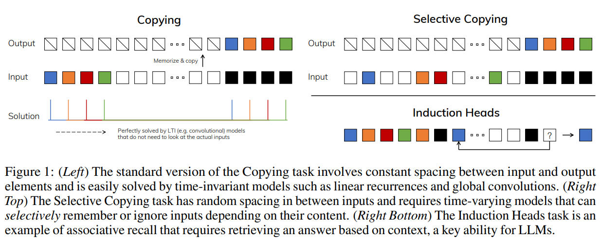
- The selective copying task: content-aware reasoning
- The induction heads task: context-aware reasoning

---

# The Failure Mode of LTI Models

- From the recurrent view, their **constant** dynamics (e.g. the $(\overline{\boldsymbol{A}}, \overline{\boldsymbol{B}})$ transitions in (2)) cannot let them select the correct information from their context, or affect the hidden state passed along the sequence in an input-dependent way.
- From the convolutional view, it is known that global convolutions can solve the vanilla Copying task because it only requires time-awareness, but that they have difficulty with the Selective Copying task because of lack of content-awareness. More concretely, the spacing between inputs-to-outputs is varying and cannot be modeled by static convolution kernels.

---

# The Failure Mode of LTI Models

Summary: The efficiency vs. effectiveness tradeoff of sequence models is characterized by how well they compress their state.
- Efficient models must have a small state.
- Effective models must have a state that contains all necessary information from the context.

---

# Improving SSMs with Selection

One method of incorporating a selection mechanism into models is by letting their parameters that affect interactions along the sequence be **input-dependent**. 
- This loses the equivalence to convolutions (3) with implications for its efficiency.

---

# Algorithm: SSM vs. SSM + Selection 

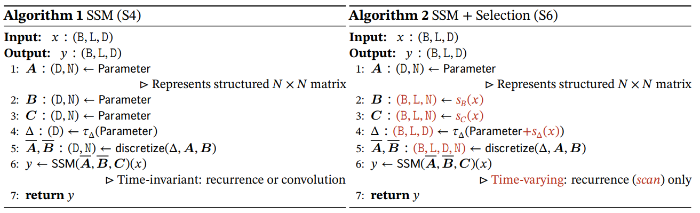
- $s_B(x) = \texttt{Linear}_N(x)$
- $s_C(x) = \texttt{Linear}_N(x)$
- $s_\Delta(x) = \texttt{Broadcast}_\Delta(\texttt{Linear}_1(x))$
- $\tau_\Delta = \texttt{softplus}$

---

# Efficient Implementation of Selective SSMs

Earlier works attempted to incorporate special cases of selection.
- e.g. letting $\Delta$ vary over time in recurrent SSMs

However, as previously mentioned a core limitation in the usage of SSMs is their computational efficiency, which was why S4 and all derivatives used LTI (non-selective) models, most commonly in the form of global convolutions.

The selection mechanism is designed to overcome the limitations of LTI models.

---

# Efficient Implementation: Observations

- Computation complexity
  - recurrent: $O(BLDN)$ FLOPs $\rightarrow$ lower constant factor
  - convolutional: $O(BLD \log L)$ FLOPs
  - Thus for long sequences and not-too-large state dimension $N$, the recurrent mode can actually use fewer FLOPs.
- The two challenges are the sequential nature of recurrence, and the large memory usage.
  - To address the latter, just like the convolutional mode, we can attempt to not actually materialize the full state $h$.

---

# Efficient Implementation: Main Idea

The main idea is to leverage properties of modern accelerators (GPUs) to materialize the state $h$ only in more efficient levels of the memory hierarchy.
- Most operations (except matrix multiplication) are bounded by **memory bandwidth**.
- This includes our scan operation, and we use **kernel fusion to reduce the amount of memory IOs**, leading to a significant speedup compared to a standard implementation.
  - scan: recurrent operation

---

# Efficient Implementation: Parallel Scan

Concretely, instead of preparing the scan input $(\overline{\boldsymbol{A}}, \overline{\boldsymbol{B}})$ of size $(\texttt{B}, \texttt{L}, \texttt{D}, \texttt{N})$ in GPU HBM (high-bandwidth memory),
1. we load the SSM parameters $(\Delta, \boldsymbol{A}, \boldsymbol{B}, \boldsymbol{C})$ directly from slow HBM to fast SRAM
2. perform the discretization and recurrence in SRAM
3. and then write the final outputs of size $(\texttt{B}, \texttt{L}, \texttt{D})$ back to HBM

To avoid the sequential recurrence, we observe that despite not being linear it can still be **parallelized** with a work-efficient parallel scan algorithm.

---

# Efficient Implementation: Recomputation

Finally, we must also avoid saving the intermediate states, which are necessary for backpropagation. 
- We carefully apply the classic technique of recomputation to reduce the memory requirements: **the intermediate states are not stored but recomputed in the backward pass when the inputs are loaded from HBM to SRAM**.
- As a result, the fused selective scan layer has the same memory requirements as an optimized transformer implementation with **FlashAttention**. (Appendix D)

---

# Mamba: A Simplified SSM Architecture

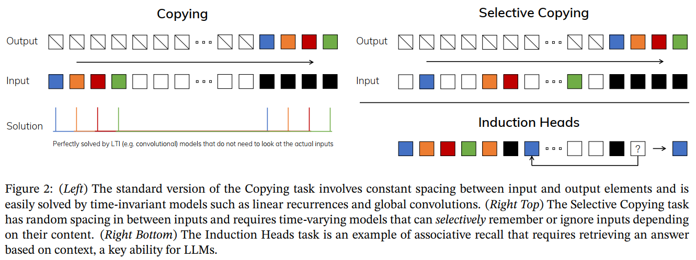

---

# Mamba: A Simplified SSM Architecture

- This architecture involves expanding the model dimension $D$ by a controllable expansion factor $E$. ($E=2$ in experiments)
- Most of the parameters $(3ED^2)$ are in the linear projections 
  - $2ED^2$ for input projections
  - $ED^2$ for output projection
- The inner SSM contributes less parameters.

<!-- 
缺乏說明 motivation?
 -->

---

# Properties of Selection Mechanisms

Properties
- Connection to Gating Mechanisms
- Interpretation of Selection Mechanisms
  - Variable spacing
  - Filtering context

---

# Theorem 1: Connection to Gating Mechanisms

When $N=1$, $A=-1$, $B=1$, $s_\Delta=\texttt{Linear}(x)$, and $\tau_\Delta = \texttt{softplus}$, then the selective SSM recurrence (Algorithm 2) takes the form

$$
\begin{aligned}
& g_k=\sigma\left(\texttt{Linear}\left(x_k\right)\right) \\
& h_k=\left(1-g_k\right) h_{k-1}+g_k x_k. \quad \text(5)
\end{aligned}
$$

- $g$: the gate

([softplus](https://pytorch.org/docs/stable/_images/Softplus.png))

---

# Variable Spacing

- Selectivity allows filtering out irrelevant noise tokens that may occur between inputs of interest.
- This is exemplified by the Selective Copying task, but occurs ubiquitously in common data modalities, particularly for discrete data — for example the presence of language fillers such as “um”. 
- This property arises because the model can mechanistically filter out any particular input $x_k$, for example in the gated RNN case (Theorem 1) when $g_k \rightarrow 0$.

---

# Filtering Context

- It has been empirically observed that many sequence models do not improve with longer context, despite the principle that more context should lead to strictly better performance.
- An explanation is that **many sequence models cannot effectively ignore irrelevant context when necessary**; an intuitive example are global convolutions (and general LTI models).
- On the other hand, selective models can simply **reset their state at any time to remove extraneous history**, and thus their performance in principle improves monotonicly with context length.

---

# Table of Contents

- Introduction
- State Space Models
- Selective State Space Models
- **Empirical Evaluation**
- Conclusion & Summary

---

# Empirical Evaluation

- Synthetic tasks
- Language Modeling
- DNA Modeling
- Audio

---

# Synthetic Tasks

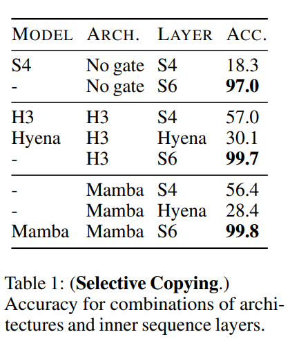
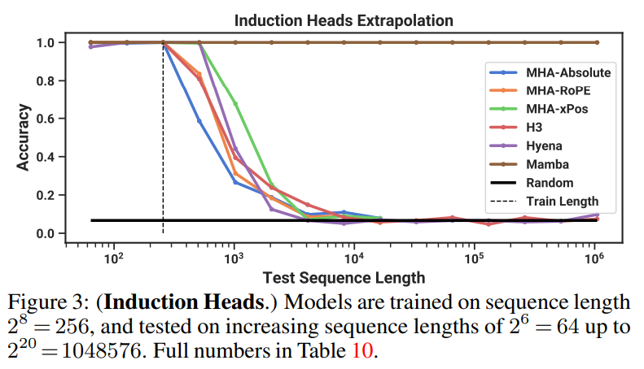

<!-- 
Hyena /haɪˈiːnə/
 -->

---

# Language Modeling: Scaling Laws

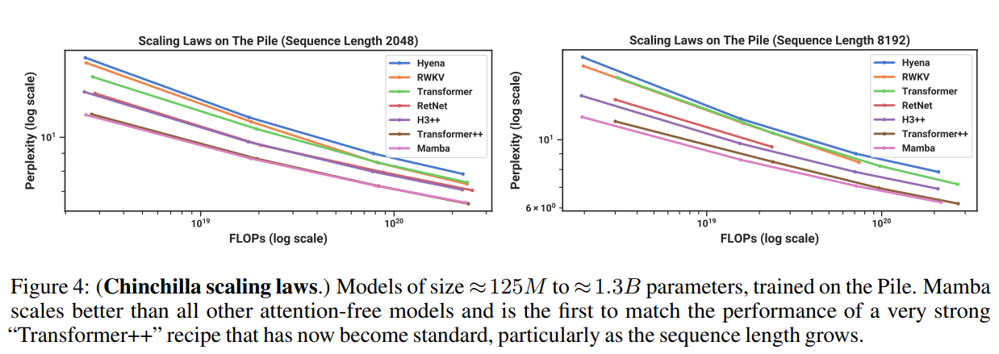

---

# Language Modeling: Downstream Evaluations

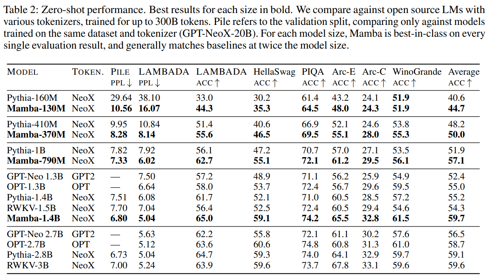

---

# DNA Modeling

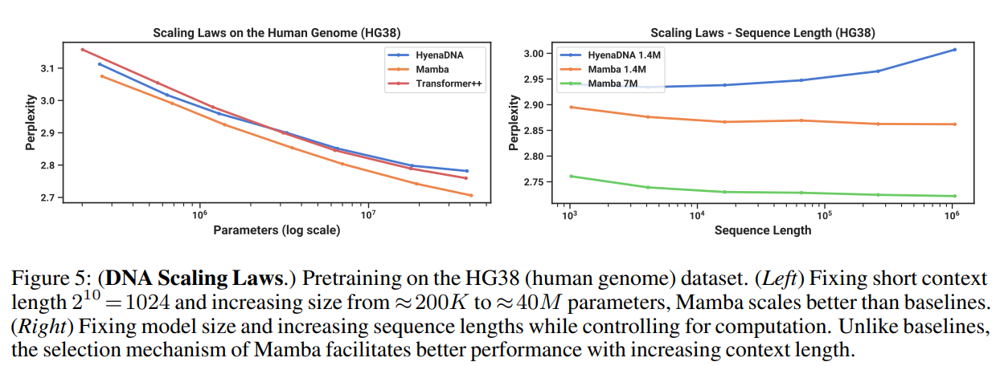

---

# DNA Classification

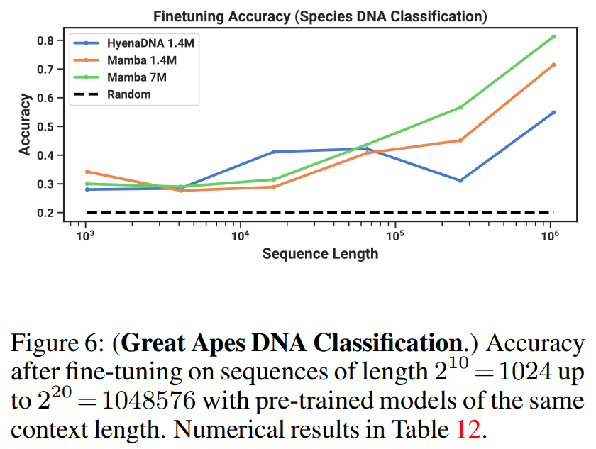

---

# Audio Modeling and Generation

For the audio waveform modality, we compare primarily to the SaShiMi architecture and training protocols (Goel et al., 2022).

The architecture is a UNet with alternating S4 and MLP blocks, which we consider replacing with Mamba.

---

# Long-Context Autoregressive Pretraining

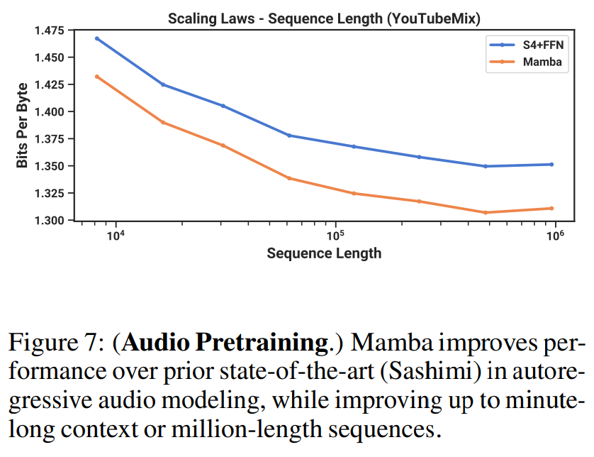

---

# Autoregressive Speech Generation

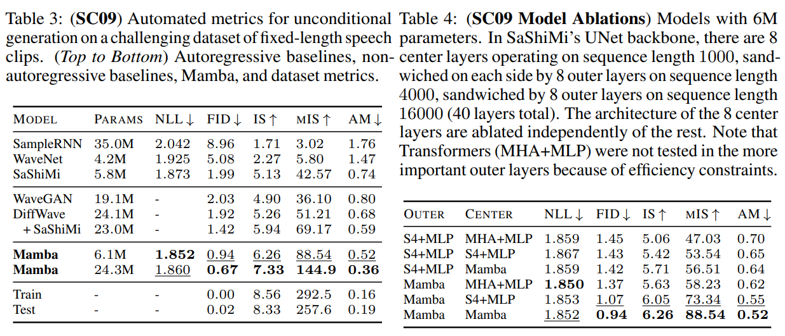

---

# Speed and Memory Benchmark

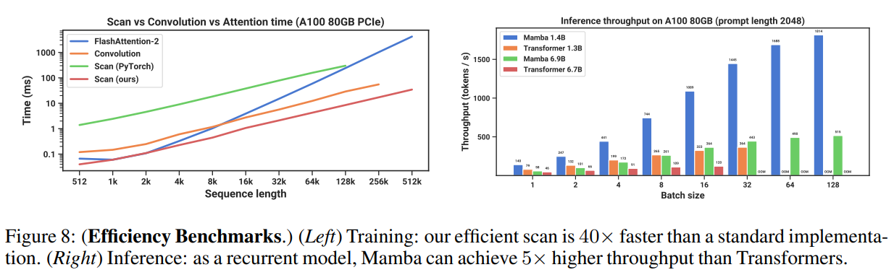
- Scan: 20-40$\times$ PyTorch implementation
- Mamba: 4-5$\times$ higher inference throughput than a Transformer of similar size

---

# Table of Contents

- Introduction
- State Space Models
- Selective State Space Models
- Empirical Evaluation
- **Conclusion & Summary**

---

# Conclusion

- We introduce a **selection mechanism** to structured state space models, allowing them to perform context-dependent reasoning while scaling linearly in sequence length.
- When incorporated into a simple attention-free architecture, **Mamba achieves state-of-the-art results** on a diverse set of domains: most notably language, where it matches or exceeds the performance of strong Transformer models. 
- We are excited about the **broad applications** of selective state space models to build foundation models for different domains, especially in emerging modalities requiring long context such as genomics, audio, and video.
- Our results suggest that Mamba is a strong candidate to be a **general sequence model backbone**.

---

# Summary

- An RNN-like foundation model (based on SSM)
- A new architecture (Mamba block)
- Selection mechanism for SSM
  - = gating mechanism in RNNs (e.g. LSTM)
- Hardware acceleration
  - IO bound
- Experimental results
  - linear scaling (performance vs. # parameters)
